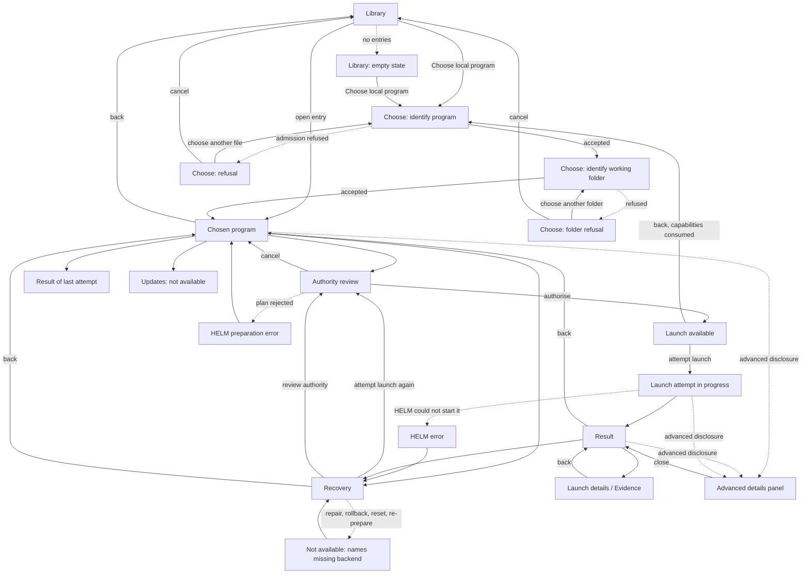

# HELM G2 — VISUAL PRODUCT KICKOFF

> **Status: G2-D1 to G2-D9 accepted by the owner on 2026-09-21. Docs only.**
> This document defines product intent, information architecture, interaction structure and
> capability labelling for the first visible HELM application. It authorises **no** GUI code, **no**
> toolkit, **no** backend work and **no** change to any accepted module. It is written in English
> under [ADR-0020](../adr/ADR-0020-documentation-language.md).

---

## 1. Authority and current product state

### 1.1 What is accepted today

| Item | State | Record |
|---|---|---|
| `helm-evidence` 0.1 | merged, owner-accepted | [PROJECT_STATE](../PROJECT_STATE.md) |
| `helm-app-spec` 0.1 | merged | [ADR-0021](../adr/ADR-0021-second-product-module.md) |
| `helm-observe` 0.1 | merged | [ADR-0022](../adr/ADR-0022-observation-authority.md) |
| `helm-bind` 0.1 | merged | [ADR-0023](../adr/ADR-0023-binding-authority.md) |
| `helm-launch` 0.1 (P1–P5) | **product-accepted 2026-09-21** | [decision record](../DECISIONS.md#helm-launch-0-1-product-accepted), [ADR-0024](../adr/ADR-0024-launch-authority.md) |
| helm-launch receipt 0.1 | published evidence contract | [receipt schema](HELM-LAUNCH-RECEIPT-0.1.md) |

### 1.2 What this phase is

G2 is the first real HELM desktop application, running as an ordinary application **inside a mature
existing Linux desktop environment**. Its job is to make HELM's existing concepts understandable and
operable through a graphical interface.

### 1.3 What this phase is not

G2 is not a custom desktop shell, not a compositor, not a new compatibility runtime, not Wine or
Proton integration, not a backend expansion milestone, not a chatbot interface and not a simulated
Windows desktop. Trial #4 is not authorised and no execution trial is proposed here.

### 1.4 Status of this document

**Accepted in part.** On 2026-09-21 the owner accepted gates G2-D1 to G2-D7 with four clarifications,
which are applied throughout this revision and summarised in section 20.2. G2-D8 (owner visual
direction) was accepted on the same date and is recorded in section 8.16. G2-D9 (toolkit selection)
was accepted on the same date: the selected technology is **GTK 4 + gtk-rs with selective
libadwaita**, recorded in the [UI toolkit decision](HELM-G2-UI-TOOLKIT-DECISION.md). Its bounded
fidelity spike was built and **accepted** on 2026-09-21. The owner then authorised the **first
real backend-connected G2 vertical**, which was **accepted on 2026-09-22 and integrated into
`main`**. That vertical drives the already-accepted `helm-launch` 0.1 through its public API only;
it accepts no production GUI, adds no persistence, and starts no G-1, G-2 or G-3. **This document
remains the product-semantic authority over anything the GUI draws.**

Where this document describes a screen, a state or a flow that current code cannot support, it says
so explicitly and carries a class label from section 3.2.

---

## 2. Repository capability audit

### 2.1 Method

The audit read the public surface of every workspace member at
`32dc808bc0b578f9f43b7de7af4092ee434caee9`: the crate root modules, the model and plan modules, the
authority and admission entry points, and the one binary target in the workspace. Roadmap language,
backlog entries and future-tense documentation were **not** treated as evidence of capability. A
capability counts as real only if a caller can reach it through a `pub` item that exists in a build.

Workspace members: `helm-evidence`, `helm-app-spec`, `helm-observe`, `helm-bind`, `helm-launch`.
There is no other product code, no orchestration crate, no daemon, no service, no persistence layer
and no installer anywhere in the repository. The only binary target in the workspace is
`helm-evidence verify <bundle-directory> [--json]`.

### 2.2 Public surface, module by module

#### `helm-app-spec` 0.1 — inert desired state

One entry point: `parse_spec(bytes) -> Result<ValidatedAppSpec, SpecErrors>`. Pure. No filesystem,
environment, clock, randomness or host discovery on any path. Input ceiling 64 KiB. Document
identity is SHA-256 of the exact supplied bytes, with no canonicalisation.

A validated specification carries exactly: `application` (identifier, version, source requirement of
size + SHA-256 + architecture), `runtime` (family, artifact requirements of role + size + SHA-256 +
optional label), `environment` (Windows architecture, prefix role, disabled DLL list), `entry_point`
(relative path, optional SHA-256) and zero or more verification definition references.

Product-relevant consequence: **a specification carries no display name and no icon.** It carries an
identifier and a version string. Paths and artifact references are inert data that are never opened
or resolved.

#### `helm-observe` 0.1 — actual filesystem facts at explicit targets

Flow: `parse_plan` produces an inert `ValidatedPlan`; `root_from_fd(id, fd)` and
`proc_fd_from_trusted_current_process(fd)` turn caller-owned descriptors into capabilities;
`authorize(plan, roots, reopen)` consumes the plan and produces an `AuthorizedScope`;
`observe(&scope)` produces an `ObservationArtifact`.

Exactly two observables exist: `directory_metadata` and `regular_file_sha256`. Per-target outcomes
are observed facts, `Absent`, `Rejected` with a reason, `Failed` with a reason, or a budget omission.

The crate **never enumerates a directory, never recurses, never searches, never consults `PATH`,
`HOME` or the current working directory, never discovers an installation and never executes
anything.** It compiles its observation backend only on Linux x86_64 and admits only ext-family
roots, which is a sanity guard and explicitly not proof of ext4.

Product-relevant consequence: **HELM has no discovery mechanism of any kind.** Something outside
HELM must already know the exact path of every object before HELM can say anything about it.

#### `helm-bind` 0.1 — pure comparison, no verdict

`parse_binding_plan` validates an explicit claim mapping; `bind(spec, binding_plan, observe_plan,
observation)` produces a `BindingReport`. Pure, platform-independent, byte-identical across hosts.

Five claim kinds can be mapped: source body, runtime artifact body, verification definition body,
entry-point presence and entry-point body. Each mapped claim resolves to one of ten states: `match`,
`mismatch`, `desired_value_unspecified`, `not_observed`, `unsupported_binding`, `absent`,
`observation_rejected`, `observation_failed`, `observation_omitted`, `observation_not_interpretable`.

There are two axes and **no verdict**: a contradiction flag, raised only by a mismatch of two known
values, and deterministic coverage counts. There is no satisfaction, compatibility, readiness or
success token anywhere in the crate.

Product-relevant consequence: **coverage is necessarily incomplete.** Four mandatory semantic
requirements of every valid specification — source architecture, runtime family, Windows
architecture and prefix role — have **no comparator at all** in 0.1, because `helm-observe` cannot
establish them. A GUI must never render a binding report as a green tick.

#### `helm-evidence` 0.1 — read-only bundle verification

`verify(root: &Path) -> Report`, plus the CLI `helm-evidence verify <bundle-directory> [--json]`.
Reads a `bundle.json` contract and the artifacts it declares, inside a bundle directory. Writes
nothing and executes nothing. Its `COMPLETE` reading applies **only to the supplied contract** and is
never a compatibility rating or an authentication of an author.

Product-relevant consequence: this verifies *evidence bundles*, not applications. It is not a
component of the launch path and nothing in the workspace parses a launch receipt semantically.

#### `helm-launch` 0.1 — the one way a process is created

Flow, Linux x86_64 only for everything after the first line:

```text
untrusted bytes            --parse_launch_plan--------> ValidatedLaunchPlan   intent only
caller-owned executable fd --admit_executable---------> ExecutableCapability
caller-owned cwd fd + id   --admit_working_directory--> WorkingDirectoryCapability
plan + executable + cwd    --authorize---------------->  AuthorizedLaunch
AuthorizedLaunch           --launch------------------->  process + LaunchOutcome
```

A validated plan declares: execution kind (`linux_exact_executable`, the only one), `argv`,
environment mode (`empty`, the only one), a working-directory identifier, stdin mode
(`closed_pipe_eof`, the only one), per-stream capture prefix bounds, a run timeout in milliseconds,
the first termination signal (`SIGTERM`, the only one), a grace period, and two optional asserted
context digests. The plan **names no executable** and holds no descriptor.

`admit_executable` takes an owned read-only descriptor and requires a regular file, no set-user-ID or
set-group-ID bits, a size within the module ceiling, an ELF in the supported cohort, and a stable
measurement sample. `admit_working_directory` requires a directory and a well-formed identifier.
`authorize` requires the plan's working-directory identifier to match the admitted one, and yields a
single-use `AuthorizedLaunch` that cannot be cloned, rebuilt from data or launched twice.

`launch` creates exactly **one** direct child, drives the accepted observation loop and returns a
`LaunchOutcome`. The outcome exposes the receipt, bounded in-memory stdout and stderr prefixes, a
per-stream truncation flag and the elapsed monotonic duration. It owns no descriptor and has no
public constructor.

Four facts about the child are established before `exec`: the working directory is changed to the
admitted directory, all descriptors outside the fixed set are closed, the child becomes its own
process-group leader, and `PR_SET_NO_NEW_PRIVS` is set. The environment pointer handed to `execveat`
is a single null — **the child receives a genuinely empty environment**.

The fact vocabulary is closed and carries no success reading, as recorded in section 12.

#### Constraints that decide G2 scope

Five properties of `helm-launch` 0.1 are load-bearing for every screen in this document.

1. **No `ExecSucceeded` value exists.** A clean exec-status end-of-file is
   `ExecStatus::Indeterminate(StatusEofWithoutRecord)` and nothing more.
2. **The environment is empty.** `EnvironmentMode` has one value, `Empty`; the `envp` handed to
   `execveat` is a single null; and every inherited descriptor outside the fixed set is closed. A
   launched subject therefore receives **no ordinary desktop-session discovery context** — no
   Wayland or X11 context, no session-bus context, no `HOME`, no `XDG_*`. This is gap **G-3** in
   section 18.
3. **Every launch attempt has a bounded lifecycle.** `MAX_TIMEOUT_MS` is 600000, and the accepted
   total bound is that timeout plus the spawn-confirmation, grace, post-kill and post-exit
   observation bounds. When the run deadline expires, `SIGTERM`, the grace period and `SIGKILL`
   follow. This is one half of gap **G-2** in section 18.
4. **`launch` is synchronous and there is no session handle.** It returns once, at the end of the
   attempt. There is no handle, no progress channel, no query API, no caller-invoked stop and no way
   to observe or influence the child while it runs. This is the other half of gap **G-2**.
5. **There is no containment.** No sandbox, no cgroup, no namespace, no process-tree supervision.
   The process-group sweep is best-effort cleanup only.

Constraints 3 and 4 together (**G-2**) and constraint 2 (**G-3**) are **two distinct blockers** for
an ordinary graphical desktop subject, and neither substitutes for the other. Section 18 keeps them
separate. Neither blocks building the HELM GUI itself — see section 16.6.

### 2.3 Capability matrix

`REAL NOW` means an accepted current public API supports the capability without inventing semantics.
`PARTIAL` means a real primitive exists but does not cover the product-level capability.
`NOT IMPLEMENTED` means no code in the workspace performs it.

| Capability | REAL NOW | PARTIAL | NOT IMPLEMENTED | Relevant API / module |
|---|:--:|:--:|:--:|---|
| Discover / import application | | | yes | none; `helm-observe` never enumerates or searches |
| Parse application metadata | yes | | | `helm_app_spec::parse_spec` |
| Observe filesystem facts | yes | | | `helm_observe::{parse_plan, authorize, observe}` |
| Compare desired against actual | | yes | | `helm_bind::bind`; four mandatory claims have no comparator |
| Install application | | | yes | none |
| Uninstall application | | | yes | none |
| Prepare environment | | | yes | none; no prefix, runtime or directory is ever created |
| Permissions / capabilities | | yes | | `admit_executable`, `admit_working_directory`, `authorize`; descriptor-level only, no user-facing model, no containment |
| Launch | yes | | | `helm_launch::launch`, Linux x86_64 |
| Observe running application | | yes | | internal to `launch`; no external handle, no live state |
| Terminate on user request | | yes | | `SIGTERM` and `SIGKILL` issued by the lifecycle on deadline expiry only; no caller-invoked stop |
| Capture output | yes | | | `LaunchOutcome::{stdout_prefix, stderr_prefix, prefix_truncated}` |
| Produce receipt / evidence | yes | | | `LaunchReceipt`, [receipt schema 0.1](HELM-LAUNCH-RECEIPT-0.1.md) |
| Verify an evidence bundle | yes | | | `helm_evidence::verify`, `helm-evidence verify` CLI |
| Update | | | yes | none |
| Repair | | | yes | none |
| Rollback / recovery | | | yes | none |
| Runtime selection | | | yes | none; `runtime.family` is a declared field nothing resolves |
| Wine / Proton | | | yes | none; explicitly out of scope in every accepted module |
| Web / PWA | | | yes | none |
| MicroVM fallback | | | yes | none |
| Durable application library / state | | | yes | none; no store, no database, no config directory |
| Application display name / icon | | | yes | a specification carries an identifier and a version, nothing else |
| Graphical application execution | | | yes | empty environment and closed descriptors preclude it |

### 2.4 What the audit rules out for G2

- A library that remembers programs across restarts requires new code (**G-1**). It is not a backend
  gap that can be papered over in the view layer, and no screen may imply that such a library exists.
- "Install" cannot be honestly offered. Nothing installs.
- A "Running" screen that reflects live, confirmed state cannot be built on `launch` as it exists.
  The GUI can know only that its own call to `launch` has not yet returned.
- A launched subject cannot draw anything on screen, and could not be given a usable long-lived
  session even if it could. Two separate gaps, **G-3** and **G-2**.
- No screen may present a HELM verdict about an application.

---

## 3. G2 scope and non-scope

### 3.1 Scope

G2 delivers a Linux desktop application that:

1. lets a person identify a local executable and a working directory without using a terminal;
2. shows, in plain language, exactly what HELM inspected and exactly what it is about to permit;
3. performs one real launch through the accepted `helm-launch` path;
4. presents the resulting facts without converting them into a verdict;
5. exposes the receipt and the full fact vocabulary behind an advanced disclosure;
6. explains, in place, every capability it does not yet have.

### 3.2 Three implementation classes

Every user-visible action in this document carries exactly one label.

| Label | Meaning |
|---|---|
| `REAL_NOW` | An accepted current backend supports the action without inventing semantics. |
| `REQUIRES_ORCHESTRATION` | The primitives exist; a product-level coordinator, store or API is missing. |
| `DESIGN_ONLY_FUTURE` | The backend capability itself does not exist. Designed, labelled, never shown as working. |

A `DESIGN_ONLY_FUTURE` action never appears as an enabled control that silently does nothing. It
either does not appear at all, or appears as an explicitly labelled not-yet-available entry that
states what is missing.

### 3.3 Non-scope

Custom shell, compositor, window management, Wine, Proton, MicroVM, PWA runtime, package management,
a store, accounts, telemetry, cloud sync, an updater, a sandbox, a containment claim, and any
execution trial. None of these are authorised by this document.

---

## 4. Product principles

These are the G2 interaction principles. Each follows from the accepted product contract, not from
general design taste.

1. **Intent before mechanism.** The primary line of every screen states what the person is trying to
   do. Descriptors, process groups and digests are consequences, and they live one level down.
2. **Authority is explicit and is shown before it is used.** HELM acts only on objects a person
   handed it. The permission screen states what was handed over, in the order it will be used, and
   the launch does not begin until that is confirmed.
3. **State is observable, and unobserved is a state.** Anything HELM did not observe is labelled as
   not observed. It is never rendered as absent, as fine, or as zero.
4. **Reverse what can be reversed; say so when nothing can.** Every step before `launch` is
   cancellable and leaves nothing behind. `launch` itself is not reversible, and the screen before it
   says that in those words.
5. **No opaque success.** HELM has no success token. Nothing in the interface may invent one.
   The strongest thing G2 can say about an attempt is what it observed.
6. **No security language without a subsystem behind it.** The words safe, sandboxed, contained,
   isolated, protected and trusted are prohibited in product copy. HELM 0.1 has no containment.
7. **Evidence is available, never compulsory.** The receipt and the full fact vocabulary are always
   reachable in two actions and never block an ordinary flow.
8. **Failure states separate the known from the unknown.** Every error tells the person what HELM
   observed, what it did not observe, and which of the two the message rests on.
9. **No terminal in the ordinary flow.** If a step needs a shell, that step is not finished.
10. **No accounts, no cloud coupling, no advertising, no telemetry by default.** G2 works offline and
    asks for nothing it does not need.
11. **HELM never claims more than its evidence supports**, including about itself: a screen that
    cannot yet do something says so rather than hiding the gap.

---

## 5. Information architecture

### 5.1 Operating modes

Three modes, not personas. Mode is a disclosure setting, not a permission level, and no fact is ever
altered by it — only whether it is shown by default.

| Mode | Who | Default content | Never |
|---|---|---|---|
| **Normal** | someone running something | plain-language state, the one action that matters now, plain-language outcome | raw kernel or process vocabulary unless a message is meaningless without it |
| **Advanced / troubleshooting** | someone whose attempt did not go as expected | everything in Normal, plus exact fact names, per-stream completeness, termination facts, error codes | a hidden or softened fact; Advanced never contradicts Normal, it refines it |
| **Developer / evidence** | someone checking HELM itself | everything in Advanced, plus receipt bytes, digests, plan identity, pre-exec measurement, backend identity | inference; this mode shows what was recorded and nothing derived |

Normal and Advanced differ only in what is on screen by default. Every Advanced fact is reachable
from Normal through one explicit disclosure control. Mode is a per-device preference,
`REQUIRES_ORCHESTRATION` to persist, and defaults to Normal.

### 5.2 Top-level product areas

The candidate structure was tested against section 2.3 and reduced. Four areas survive for G2.

| Area | Kept | Reason |
|---|---|---|
| **Library** | yes, **as architecture only** | the home surface and the return path from everything. **It does not imply that a durable library exists today** — see 5.2.1. |
| **Choose a local program** | yes, renamed | never "Install", and never "Add to HELM" while nothing persists — see 5.2.1 and section 8.3 |
| **Application** | yes | one program, with Authority, Result and Evidence as sections inside it |
| **Evidence** | yes, as a leaf | reached from a result, never a top-level destination |
| Permissions | not top-level | it is a step inside an attempt, never browsable state |
| Prepare | not a screen in G2 | nothing is prepared; the real work is admission, which belongs to the authority review — see section 8.5 |
| Update | not top-level | `DESIGN_ONLY_FUTURE`; appears only as a labelled section inside an application |
| Repair / Recovery | not a destination | recovery is a set of actions offered in context — see section 14 |
| Settings | **not in G2** | G2 has one preference, the disclosure mode, which belongs in a menu, not a screen |

A "Prepare" screen and a "Settings" screen were both rejected because desktop applications usually
have them, which is not a reason.

### 5.2.1 The Library implies no persistence (owner clarification 1)

The Library is **accepted as G2 information architecture**. It is the shape the product grows into.
It is **not** a claim that a durable application library exists, and nothing in G2 may imply one.

| | |
|---|---|
| What is accepted | the Library as the home surface, the card model of 8.2, and the return path from every screen |
| What is **not** established | that anything a person chooses survives the session, the window or a restart |
| What persistence requires | gap **G-1**, the durable store of section 18. Until G-1 exists, no entry persists. |
| What a prototype may do | hold selections **in memory for the session only**, provided the interface describes that plainly and in place — not in a footnote, a tooltip or release notes |

The wording follows from this. Where a label would imply that something was *added to HELM* and is
now *kept by HELM*, the first real slice uses **Choose local program** or **Open local program**
instead. "Add to HELM" is reserved for the point at which G-1 makes adding mean something, and is
used nowhere before then.

### 5.3 Structure

```text
Library  (session-only until G-1; see 5.2.1)
 |- empty state
 |- chosen-program card ---> Application
 '- Choose local program --> Choose (identify executable, identify working folder) --> Application

Application
 |- Overview        (what HELM knows, and what it does not)
 |- Authority       (what this attempt will be permitted to use)     --> Attempt
 |- Runtime         (environment facts; mostly what HELM does not do)
 |- Result          (the most recent attempt, if any)                --> Evidence
 |- Updates         (DESIGN_ONLY_FUTURE, labelled)
 '- Recovery        (the actions that exist, in context)

Attempt --> Result --> Evidence / Technical details
```

---

## 6. Primary journey

The canonical G2 journey. Every transition names the user action, the system action, the visible
state, cancel and back behaviour, the error route and the implementation class.

### T1 — Library to Choose

| | |
|---|---|
| User action | Activates **Choose local program** |
| System action | Opens the identification step. No filesystem access yet. |
| Visible state | *Choose local program* — nothing has been chosen |
| Cancel | Returns to Library. Nothing created. |
| Back | Same as cancel. |
| Error route | None possible. |
| Class | `REAL_NOW` for the step; **persisting** the result is `REQUIRES_ORCHESTRATION` (G-1), and until then the step is session-only per 5.2.1 |

### T2 — Identify the program

| | |
|---|---|
| User action | Chooses a file through the desktop file chooser |
| System action | Opens the file read-only and calls `admit_executable` on that descriptor |
| Visible state | *Checking the program* then *Program accepted*, showing size, file mode and ELF type |
| Cancel | Closes the descriptor and returns. Nothing retained. |
| Back | Returns to the chooser, previous choice discarded. |
| Error route | Admission refusal, section 10.3 — each refusal names its own reason and keeps the person on this step |
| Class | `REAL_NOW` — `helm_launch::admit_executable` |

**This step is not installation and is never labelled as such. It is also not persistence**: until
G-1, the chosen program is held for this session only, and the screen says so.

### T3 — Identify the working folder

| | |
|---|---|
| User action | Chooses a folder |
| System action | Opens it read-only, calls `admit_working_directory` with a generated identifier |
| Visible state | *Working folder accepted* |
| Cancel | Closes both descriptors, returns to Library. |
| Back | Returns to T2 with the program still chosen. |
| Error route | Not a directory, or the descriptor is unsuitable — section 10.3 |
| Class | `REAL_NOW` — `helm_launch::admit_working_directory` |

### T4 — Review the application

| | |
|---|---|
| User action | Opens the chosen-program entry |
| System action | None. Displays only what admission established. |
| Visible state | *Known* — see section 9 |
| Cancel | Not applicable. |
| Back | Library. |
| Error route | None. |
| Class | `REAL_NOW` for the content; `REQUIRES_ORCHESTRATION` (G-1) for reaching it from a **persisted** Library rather than a session-only one |

### T5 — Authority review

| | |
|---|---|
| User action | Activates **Review what this will be permitted to use** |
| System action | Builds a launch plan document and calls `parse_launch_plan`; nothing is executed |
| Visible state | *Authority review* — the four grants and the four non-grants of section 11 |
| Cancel | Discards the plan. Capabilities remain admitted, nothing ran. |
| Back | Chosen-program overview. |
| Error route | Plan rejection, section 10.4 — a HELM preparation error, never the person's fault |
| Class | `REAL_NOW` — `helm_launch::parse_launch_plan` |

### T6 — Authorise

| | |
|---|---|
| User action | Confirms |
| System action | `authorize(plan, executable, working_directory)`, consuming all three |
| Visible state | *Authorised — launch available* |
| Cancel | Still possible: an authorisation that is dropped never launches. |
| Back | Returns to T5, but the capabilities were consumed, so T2 and T3 are repeated. The screen says so before the person goes back. |
| Error route | Working-directory identifier mismatch — a HELM internal error, section 10.5 |
| Class | `REAL_NOW` — `helm_launch::authorize` |

The state is **Launch available**, never "Ready". Ready is a claim about the application; HELM has
established only that an authorisation exists.

### T7 — Attempt a launch

| | |
|---|---|
| User action | Activates **Attempt launch** |
| System action | `launch(authorized)` — one child, the accepted observation loop, then a `LaunchOutcome` |
| Visible state | *Launch attempt in progress* — the run bound and the deadline that will apply |
| Cancel | **Not available in G2, and the control says so before it is pressed.** `launch` is synchronous and exposes no handle. |
| Back | Unavailable while an attempt is active. |
| Error route | `LaunchError`, section 10.5 |
| Class | `REAL_NOW` for the launch; a cancellable or live-updating attempt is `REQUIRES_ORCHESTRATION` (G-2) |

The one thing the GUI knows here is that **its own call to `launch` has not yet returned.** That is
not confirmation that the subject is running. Section 12.8 governs the wording.

### T8 — Running observation

| | |
|---|---|
| User action | None. |
| System action | The parent loop observes the child under the accepted bounds. |
| Visible state | *Launch attempt in progress*, with the plan's run deadline shown as a bound, **not** as progress |
| Cancel | Unavailable, as T7. |
| Back | Unavailable. |
| Error route | Carried into the result. |
| Class | `PARTIAL` — the observation is real, its live visibility is `REQUIRES_ORCHESTRATION` (G-2) |

Nothing on this screen may claim the subject started. HELM has no such fact, and the GUI's own
knowledge that a call is outstanding is not one either.

### T9 — Result

| | |
|---|---|
| User action | None; the result appears |
| System action | Renders the receipt record through the mapping of section 12 |
| Visible state | *Ended*, *Observation indeterminate*, or *Attention required* |
| Cancel | Not applicable. |
| Back | Application. |
| Error route | The result **is** the error route; HELM errors and application facts are separated per section 10 |
| Class | `REAL_NOW` |

### T10 — Evidence

| | |
|---|---|
| User action | Activates **Launch details** |
| System action | Renders the receipt facts and exact bytes |
| Visible state | *Launch details* |
| Cancel | Not applicable. |
| Back | Result. |
| Error route | None. |
| Class | `REAL_NOW` — `LaunchOutcome::receipt`, [receipt schema 0.1](HELM-LAUNCH-RECEIPT-0.1.md) |

### T11 — Update, repair, recovery

| | |
|---|---|
| User action | Chooses a recovery action from the result or the application |
| System action | Only *Attempt launch again* and *Review authority* do anything. Everything else is labelled unavailable with its missing backend named. |
| Visible state | *Recovery* section |
| Cancel | Returns. |
| Back | Result. |
| Error route | As the retried action. |
| Class | retry `REAL_NOW`; re-prepare, repair, rollback, reset and update all `DESIGN_ONLY_FUTURE`; diagnostic export `REQUIRES_ORCHESTRATION` |

### 6.1 Terminal use

**Zero terminal steps.** T2 and T3 use the desktop file chooser, every other step is in-application.
The `helm-evidence verify` CLI is not part of this journey.

---

## 7. Screen map



Routes: the solid path from Library to Result and back to Library is the primary route; dotted edges
are error, recovery and advanced-disclosure routes. Every screen has an explicit return path to the
Library, and no screen is reachable only by going back.

---

## 8. Screen specifications

No screen below defines colour, typography, iconography, spacing or branding. This section is
interaction and product architecture.

### 8.1 Library

| | |
|---|---|
| **Purpose** | The home surface: everything HELM currently knows about, and the way to choose another program |
| **Primary user question** | "What can I do here, and is anything waiting for me?" |
| **Primary action** | Open a chosen-program entry |
| **Secondary actions** | Choose local program; switch disclosure mode |
| **Information shown** | Per entry: the name the person gave it, the program file name, the working folder name, the current state word from section 9, and the time of the last attempt. **Nothing else** — see 8.2. |
| **States** | Empty; Normal; Attention required; Launch attempt in progress; Observation indeterminate |
| **Error states** | An entry whose program or folder can no longer be opened shows *Attention required* with the reason, and its launch action is disabled with that reason stated |
| **Empty state** | "No program is open in HELM." One explanation sentence, one action: *Choose local program*. It states plainly that choosing is neither installing nor keeping. |
| **Back / cancel** | This is the root. No back. |
| **Advanced disclosure** | Per entry: the capability identifier of the working directory and the last receipt digest |
| **Backend classification** | `REQUIRES_ORCHESTRATION` (G-1) — the entries, their persistence and the last-attempt record all need a store that does not exist |

**Persistence statement.** Until G-1, the Library holds entries **for the current session only**,
and says so in place: a program chosen now is gone when HELM closes, and HELM has changed nothing on
disk. The statement is part of the surface, not a disclaimer tucked into Advanced mode.

### 8.2 The chosen-program card

Evaluated against what HELM can actually know.

| Candidate fact | In the card? | Why |
|---|---|---|
| Name | yes, **as given by the person** | HELM cannot know a display name; a specification has an identifier and a version only |
| Icon | **no** | HELM has no icon source. A generic placeholder that looks like an icon implies one exists. |
| Version | **no** in G2 | only present if a specification was supplied, which the first slice does not require |
| Source | yes, as the chosen file name | this is a fact the person supplied |
| Runtime | **no** | nothing selects or resolves a runtime |
| Environment | **no** | nothing prepares an environment |
| Last run | this session only, until G-1 | `REAL_NOW` within a session; `REQUIRES_ORCHESTRATION` to survive one |
| State needing attention | yes | see section 9 |
| Update availability | **no** | no updater exists; the field would always be a lie or always empty |
| Evidence status | yes, minimally: whether the last attempt produced a receipt | `REAL_NOW` per attempt, `REQUIRES_ORCHESTRATION` to persist |

The Library is a list of things a person can act on. It is not a settings dashboard and carries no
system-wide counters, health scores or summaries.

### 8.3 Choose local program

| | |
|---|---|
| **Purpose** | Turn a file and a folder the person chooses into admitted capabilities |
| **Primary user question** | "Which program, and where should it run?" |
| **Primary action** | Choose a program file |
| **Secondary actions** | Choose a working folder; name the entry for this session; cancel |
| **Information shown** | Chosen file path; after admission: exact size in bytes, file mode bits, ELF type. One sentence stating that HELM opened and measured the file and did not run, copy, modify or install anything. |
| **States** | Nothing chosen; Checking; Accepted; Refused |
| **Error states** | Each admission refusal is distinct and named — section 10.3 |
| **Empty state** | Nothing chosen: the explanatory sentence and the chooser |
| **Back / cancel** | Cancel closes every descriptor and leaves nothing behind. This is stated on the screen. |
| **Advanced disclosure** | The pre-execution measurement digest, the exact mode bits, the ELF type name, and the statement that this is a pre-execution measurement of the pinned object and never the identity of bytes that executed |
| **Backend classification** | `REAL_NOW` |

**The screen is titled "Choose local program"**, or "Open local program" where opening reads more
naturally than choosing. **Neither "Install" nor "Add to HELM" appears** — the first because nothing
installs, the second because nothing persists (5.2.1). Install is named once, in a sentence saying
HELM does not install anything yet and what that would require (section 18).

### 8.4 Chosen program

| | |
|---|---|
| **Purpose** | Everything HELM knows about one chosen program, and the way to attempt a launch |
| **Primary user question** | "What is this, and what happens if I run it?" |
| **Primary action** | Review what this will be permitted to use |
| **Secondary actions** | Open last result; Recovery; rename for this session; close |
| **Information shown** | Six sections — see below |
| **States** | Known; Launch available; Launch attempt in progress; Ended; Attention required |
| **Error states** | Program or folder no longer openable; last attempt was a HELM error |
| **Empty state** | Never empty once an entry exists. With no attempt yet, the Result section says "No launch has been attempted." |
| **Back / cancel** | Back to Library, always. |
| **Advanced disclosure** | One panel per section, closed by default |
| **Backend classification** | Content `REAL_NOW`; the entry `REQUIRES_ORCHESTRATION` |

Section hierarchy, separating the three kinds of fact required by the brief:

| Section | User-relevant fact | Technical fact (Advanced) | Future capability (labelled) |
|---|---|---|---|
| Overview | the name given, the program file, the working folder | measurement digest, mode bits, ELF type, capability identifier | application identity from a specification; version; icon |
| Authority | what the attempt will be permitted to use, and what HELM does not contain | argument count, environment mode, stdin mode, run bound, termination signal, grace | a real permission model; containment |
| Runtime | "HELM runs this program directly on this computer." | backend identity string | runtime selection; Wine; Proton; PWA; MicroVM |
| Result | the last attempt in plain language | full receipt record | durable history |
| Updates | "HELM cannot check for updates yet." | none | the whole updater, section 14 |
| Recovery | the actions that exist | none | repair, rollback, reset, re-prepare |

**History** is not a section in G2: no durable history exists. A single last-attempt record appears
only once a store exists, and is labelled `REQUIRES_ORCHESTRATION`.

### 8.5 On "Prepare"

The brief asks for Prepare as a visible state machine rather than a spinner. The audit found that
**nothing in HELM prepares anything**: no prefix is created, no runtime is resolved, no environment
is provisioned, no directory is made.

What does exist is a real, ordered, observable sequence with genuine per-phase facts — admission and
authorisation. G2 therefore shows that sequence, under its own honest name, and does not call it
Prepare.

| Phase | Real? | Pending | Active | Complete fact | Warning | Failure | Cancellable |
|---|---|---|---|---|---|---|---|
| Inspect program | `REAL_NOW` | "Not checked yet" | "Checking the program" | "Regular file, *n* bytes, ELF type *t*, measurement stable" | measurement samples fields only; no immutability claim | any `AdmissionError` | yes, until it returns |
| Inspect folder | `REAL_NOW` | "Not checked yet" | "Checking the folder" | "Directory, identifier *id*" | none | not a directory; unsuitable descriptor | yes |
| Validate the plan | `REAL_NOW` | "Not built" | "Checking the launch plan" | "Plan valid, identity *digest*" | none | plan error codes, section 10.4 | yes |
| Authorise | `REAL_NOW` | "Not authorised" | "Authorising" | "Authorised for exactly one attempt" | consuming: going back means re-choosing | identifier mismatch | yes, until confirmed |
| Resolve runtime | `DESIGN_ONLY_FUTURE` | none | none | none | none | none | none |
| Prepare environment | `DESIGN_ONLY_FUTURE` | none | none | none | none | none | none |

The completion word for the whole sequence is **Launch available**, never *Ready*. The evidence
supports the existence of a single-use authorisation, and that is a weaker fact than readiness.

No phase is ever represented by an indeterminate spinner. Admission and validation are fast and
bounded; each shows a discrete phase with its own completion fact.

### 8.6 Authority review

| | |
|---|---|
| **Purpose** | State exactly what this one attempt will be permitted to use, before it happens |
| **Primary user question** | "What is this program about to be allowed to do?" |
| **Primary action** | Authorise this attempt |
| **Secondary actions** | Show technical details; cancel |
| **Information shown** | The four grants, the four non-grants and the containment statement — section 11 |
| **States** | Under review; Authorised; Refused; Changed since last attempt |
| **Error states** | Plan rejected (HELM preparation error); identifier mismatch (HELM internal error) |
| **Empty state** | None; the screen never has nothing to say |
| **Back / cancel** | Cancel is always available and always leaves nothing running. After authorising, going back discards the authorisation and requires re-choosing the file and folder; the screen states this before the person goes back. |
| **Advanced disclosure** | Plan identity digest, argument count, environment mode string, stdin mode string, capture bounds per stream, timeout, signal, grace |
| **Backend classification** | `REAL_NOW` |

### 8.7 Launch attempt in progress

| | |
|---|---|
| **Purpose** | Show that an attempt is under way and what bounds apply |
| **Primary user question** | "Is anything happening, and how long can it take?" |
| **Primary action** | **None.** The control that was *Attempt launch* becomes a non-interactive status region reading *Launch attempt in progress*. |
| **Secondary actions** | Show technical details |
| **Information shown** | The attempt is in progress; the run deadline from the plan; what will happen when it expires, in order: `SIGTERM`, the grace period, then `SIGKILL` |
| **States** | In progress only |
| **Error states** | None here; everything becomes a result |
| **Empty state** | Not applicable. |
| **Back / cancel** | **Neither is available, and the screen says why**: `launch` is synchronous and exposes no handle, so HELM cannot stop an attempt it started. Making this possible is `REQUIRES_ORCHESTRATION` (G-2) and named in section 18. |
| **Advanced disclosure** | The full bound arithmetic and the backend identity |
| **Backend classification** | `PARTIAL` — the attempt is real, live visibility is `REQUIRES_ORCHESTRATION` (G-2) |

The elapsed bound is shown as a bound, not as progress towards success: reaching the deadline is a
described outcome, not a failure to finish in time.

This screen is governed by section 12.8. It says that a launch attempt call is still in progress. It
does not say that the subject is running.

### 8.8 Result

| | |
|---|---|
| **Purpose** | Present what HELM observed, as facts |
| **Primary user question** | "What happened?" |
| **Primary action** | Attempt launch again |
| **Secondary actions** | Launch details; Recovery; back to the chosen program |
| **Information shown** | One plain-language summary line from the mapping in section 12, then the facts that qualify it |
| **States** | Ended; Ended at the run deadline; Observation indeterminate; Attention required; HELM could not start it |
| **Error states** | Separated by the taxonomy of section 10; an application exit code is never a HELM error |
| **Empty state** | "No launch has been attempted." |
| **Back / cancel** | Back to application. |
| **Advanced disclosure** | The complete receipt record in its exact fact vocabulary |
| **Backend classification** | `REAL_NOW` |

**No top-level PASS, FAIL, SUCCESS, COMPATIBLE, WORKS or SAFE appears on this screen or anywhere
else.** An error inside HELM is labelled an error, because it is one.

### 8.9 Launch details / Evidence

| | |
|---|---|
| **Purpose** | Expose the receipt and the exact fact vocabulary |
| **Primary user question** | "What exactly was recorded, and can I take it with me?" |
| **Primary action** | Copy the exact receipt bytes |
| **Secondary actions** | Copy the digest; copy any single fact; back |
| **Information shown** | Section 13 |
| **States** | Present; not present (the attempt failed before a receipt existed) |
| **Error states** | "This attempt produced no receipt", with the reason |
| **Empty state** | As above |
| **Back / cancel** | Back to result. |
| **Advanced disclosure** | This screen **is** the disclosure; it has no further level |
| **Backend classification** | `REAL_NOW` |

### 8.10 Updates

| | |
|---|---|
| **Purpose** | Hold the place for updating, honestly |
| **Primary user question** | "Is this up to date?" |
| **Primary action** | None available |
| **Secondary actions** | None |
| **Information shown** | "HELM cannot check for updates. It has no updater, no source to check against and no record of what it previously had." |
| **States** | Not available — the only state |
| **Error states** | None |
| **Empty state** | This is the empty state |
| **Back / cancel** | Back to application |
| **Advanced disclosure** | The four distinct future update operations of section 14 |
| **Backend classification** | `DESIGN_ONLY_FUTURE` |

No control on this screen is enabled. Nothing suggests a check is in progress or could be.

### 8.11 Recovery

| | |
|---|---|
| **Purpose** | Offer the actions that exist, by name, instead of a generic "Troubleshoot" |
| **Primary user question** | "What can I actually try?" |
| **Primary action** | Attempt launch again |
| **Secondary actions** | Review authority; view evidence; close program |
| **Information shown** | Section 14.2 |
| **States** | Actions available; nothing further available |
| **Error states** | Inherited from the retried action |
| **Empty state** | When only retry exists, only retry is shown |
| **Back / cancel** | Back to result or application |
| **Advanced disclosure** | For each unavailable action, the named missing backend |
| **Backend classification** | Mixed; see the table in 14.2 |

Close program is destructive to the session entry and requires explicit confirmation naming it. It
never deletes anything on disk, and the confirmation says so. It is called *Close program*, not
*Remove from HELM*, because nothing was added to HELM in the first place (5.2.1).

### 8.12 Advanced details panel

A panel, not a destination. Openable from the application, the active attempt and the result. Closed
by default, remembers nothing across sessions in G2, and every value in it is selectable and
copyable. It never shows a fact that Normal mode contradicts.

### 8.13 Errors as screens

An error never replaces the whole window unless HELM cannot continue. Admission and plan errors
appear in place on the step that produced them, preserving the person's other choices. Only a
`LaunchError` produces its own result-shaped screen, because at that point the attempt is over.

### 8.14 Visual jobs

The owner leads the visual language. This section names the jobs that language must do; it does not
choose a palette, typeface, icon style, corner radius, material or animation personality.

| Visual job | What it must accomplish | Hard constraint |
|---|---|---|
| Hierarchy | The primary user question is readable before anything else on every screen | Technical vocabulary never competes with the primary line |
| Density | Normal mode is sparse; Advanced is dense and tabular | Switching modes must not re-flow the page so far that the person loses their place |
| Emphasis | Exactly one primary action per screen | A `DESIGN_ONLY_FUTURE` control must never carry primary emphasis |
| State differentiation | The states of section 9 must be distinguishable at a glance | Never by colour alone (section 8.15) |
| Progress | Bounded, phase-based sequences must read as discrete phases with facts | No indeterminate spinner anywhere in the launch path |
| Warning | Must distinguish "HELM could not do this" from "the application did this" | Application facts must not be styled as HELM failures |
| Indeterminacy | "Not observed" needs its own visual treatment, distinct from both success and failure | It must never inherit a neutral or positive treatment by default |
| Technical disclosure | Advanced content must look like data, not like decoration | The receipt digest must **not** carry a shield, lock, badge or tick; it identifies bytes and proves nothing about origin |
| Non-availability | Future capabilities must read as explicitly absent | Never as disabled-because-busy or disabled-because-you-lack-permission |

### 8.15 Accessibility and keyboard baseline

Baseline requirements, deliberately toolkit-independent; implementation detail waits for gate G2-D9.

- Every action is reachable and operable from the keyboard alone, including all disclosure controls.
- Focus order follows the visual reading order; opening a disclosure panel moves focus into it, and
  closing it returns focus to the control that opened it.
- Every control and every status region carries a meaningful label for assistive technology. A state
  word is part of the accessible name, not conveyed only by styling.
- **No state is conveyed by colour alone.** Every state carries its word from section 9.
- Destructive actions — close program, and every future destructive recovery action — require an
  explicit confirmation that names the target.
- Entering and leaving *Launch attempt in progress*, and the arrival of a result, are announced.
- Every technical value is selectable and copyable, individually and in full.

### 8.16 Accepted visual direction (G2-D8)

**G2-D8 is accepted.** On 2026-09-21 the owner selected the visual direction recorded below.

This section records a **visual** decision only. It selects no toolkit, authorises no GUI code, adds
no dependency, opens no backend work, changes no accepted module and alters no statement in sections
1 to 15. Where this section and the visual jobs of 8.14 appear to disagree, **8.14 wins**: the
direction exists to do those jobs, not the other way round.

#### 8.16.1 The accepted direction — Record / graphite frame

The accepted direction is **Record / graphite frame**. The application reads as a *record* — a
working instrument that states facts and keeps them — rather than as a dashboard, a console or a
marketing surface.

| Element | Decision |
|---|---|
| Frame | A **graphite** structural and navigation frame carries identity and orientation |
| Sheet | A **warm off-white** working sheet carries the content the person is actually reading |
| Accent | A single restrained **HELM Burgundy** accent, for identity, the primary action and emphasis |
| Structure | Typography, alignment and **hairline rules** carry structure |
| Density | **Medium** information density |

**Secondary reference, non-canonical.** An *Instrument* direction — a lighter sidebar-and-panel
treatment — was compared for **restraint and spacing only**. It is explicitly not canonical, it is
not a live option, and adopting it would require a new recorded owner decision. It is no longer
carried as an artefact in this repository: the canonical prototype directory holds exactly one
approved design (8.16.7).

#### 8.16.2 Working token set

| Token | Value | Role |
|---|---|---|
| HELM Burgundy | `#7A1F3D` | The single distinctive accent: identity, primary action, emphasis |
| Graphite | `#1F2937` | The structural and navigation frame |
| Warm Off-White | `#F8F6F4` | The working sheet |
| Muted Rose | `#D7A8B4` | Secondary accent; the accent where burgundy is unreadable on graphite |
| Cool Gray | `#CBD0D6` | Hairlines, separators, inactive structure |

This is a **working** token set for design review, not a final brand identity. It may be refined
without re-opening G2-D8, and refining it authorises nothing further.

#### 8.16.3 Colour carries no claim

HELM Burgundy means **identity and action only**. It does not mean *success*, *safe*, *verified*,
*compatible*, *running*, *trusted* or *approved*, and it is never used to suggest any of them.

**No state is conveyed by colour alone.** Every state of section 9 carries its word, and a distinct
non-colour treatment, with colour as reinforcement only. This restates 8.15, which remains binding.

The prohibitions of 13.2 and 13.3 are unchanged by this direction: no shield, lock, badge, tick or
seal anywhere, and in particular never on a receipt digest, which identifies bytes and proves
nothing about origin.

#### 8.16.4 Typography and hairlines, not floating cards

Structure is expressed through type scale, alignment, spacing and hairline rules. The direction
explicitly **rejects the floating-card surface** common to contemporary SaaS interfaces: elevation,
drop shadows and rounded panels are not used to manufacture a hierarchy that the content does not
have. A rule separates; it does not decorate.

This serves the *Technical disclosure* job of 8.14 — advanced content must look like data, not like
decoration.

#### 8.16.5 Fact and ledger treatment

**Authority**, **result facts** and **evidence** are presented as a structured fact or ledger
treatment: labelled rows of stated values, aligned and readable in sequence, each value selectable
and copyable per 8.15.

This treatment is chosen because these three surfaces are exactly where HELM must state what it did
and did not do without editorialising. A ledger row states a value. It does not render a verdict,
and it must not be styled as one — the prohibited collapses of 10.2 and the rule of 12.1 continue to
govern what may be written in these rows.

#### 8.16.6 A simpler Library, and progressive disclosure

The Library surface is simplified to match what the product can honestly offer today. Owner
clarification 1 of 20.2 is unchanged and binding: **no durable library exists**, the accepted
wording remains *Choose local program* / *Open local program*, and any session-held selection is
described on the surface as lasting for the session only.

Progressive disclosure is **local rather than global**: each section offers its own technical
detail, one layer deep, rather than a single application-wide Normal/Advanced switch. Disclosure
follows the focus rules of 8.15.

#### 8.16.7 Integrated interactive prototype (non-product)

The accepted direction is recorded as a clickable HTML prototype so the owner can judge layout,
density, hierarchy, navigation, progressive disclosure, copy and state differentiation by operating
it rather than by reading about it.

The canonical artefact is the **owner-approved designer final**, normalised into plain standalone
HTML, CSS and vanilla JavaScript. It supersedes and replaces the earlier prototype in that
directory, which was built from an older designer variant; no alternate or historical variant is
retained beside it.

| Item | Value |
|---|---|
| Canonical entry point | [docs/prototypes/g2-html/index.html](../prototypes/g2-html/index.html) |
| Description, screen inventory and limits | [prototype README](../prototypes/g2-html/README.md) |
| Canonical direction shown | **Record / graphite frame** |
| Variants retained | none — one approved D8 design only |

The prototype is **design evidence and nothing else**. It is a throwaway HTML, CSS and vanilla
JavaScript artefact with no backend connection, no build step and no network access; every path,
byte count, digest, exit code and receipt value in it is a fixed constant. It authorises no GUI
code, no dependency, no `Cargo` change and no backend work, **it selects no toolkit**, and it is not
an argument that HELM should be a web application.

**This document is authoritative over the prototype.** Where the two disagree, this document wins
and the prototype is wrong.

**Known coverage gap, carried for owner consideration.** The prototype exposes one result — *ended,
reported 0*, with exec status indeterminate. It does not yet interactively expose the other accepted
result states of sections 9 and 12: *ended, reported non-zero*; *run deadline expired* with
termination facts; *signalled*; *end unobservable*; pre-exec failure; and pre-child `LaunchError`.
Two admission refusals of 10.3 are demonstrated — *not an ELF executable* and *set-id bits present*.
Extending this coverage is new prototype work and an owner decision; it is recorded here as a
follow-up and it blocks nothing.

**Recorded fidelity note.** The approved final carries a single application-wide *Normal / Advanced*
disclosure switch, while the technical detail it governs is attached per section, one layer deep.
8.16.6 asks for disclosure that is local rather than global. The prototype follows the approved
final and records the difference in its README; resolving it is an owner matter and blocks nothing.

---

## 9. State vocabulary

One closed vocabulary. These words are used consistently and no synonym is introduced anywhere in
the product. In particular *installing*, *setting up*, *configuring*, *initialising* and *loading*
are **not** part of the vocabulary, because nothing in HELM does any of them.

| State | Means exactly | Shown where | Class |
|---|---|---|---|
| **Not chosen** | HELM knows nothing about this | Choose | `REAL_NOW` |
| **Known** | A program and a folder were admitted; no attempt has been made | Library, Chosen program | `REAL_NOW` |
| **Launch available** | A single-use authorisation exists | Chosen program, Authority | `REAL_NOW` |
| **Launch attempt in progress** | `launch` was called and has not returned. **This is a fact about HELM's own call, not about the subject.** | Library, Chosen program, Attempt | `REAL_NOW` |
| **Ended** | The direct child was observed to end, by exit or by signal | Result | `REAL_NOW` |
| **Ended at the run deadline** | The run deadline expired and termination was issued | Result | `REAL_NOW` |
| **Observation indeterminate** | HELM did not establish what it would have needed to say more | Result | `REAL_NOW` |
| **Attention required** | Something needs a decision or a correction before another attempt | Library, Chosen program | `REAL_NOW` |
| **HELM could not start it** | A `LaunchError`: HELM failed before or during process creation | Result | `REAL_NOW` |
| **Authority changed** | The admitted objects differ from those of the last attempt | Authority | `REQUIRES_ORCHESTRATION` |
| **Update available** | reserved; never displayed in G2 | nowhere | `DESIGN_ONLY_FUTURE` |
| **Repair available** | reserved; never displayed in G2 | nowhere | `DESIGN_ONLY_FUTURE` |

Deliberately absent: *Running*, *Running confirmed*, *Launched successfully*, *Added*, *Installed*,
*Preparing*, *Ready*, *Healthy*, *Failed*, *Succeeded*.

- **Running** and **Running confirmed** are absent because HELM never observes that the subject is
  running. It observes a direct child, and a clean exec-status end-of-file is indeterminate. The
  strongest available fact is that a `launch` call has not returned, which is what *Launch attempt
  in progress* says and all it says. See section 12.8.
- **Added** and **Installed** are absent because nothing persists and nothing installs (5.2.1).
- **Preparing** is absent because nothing is prepared (section 8.5).
- **Ready** is absent because the evidence supports only *Launch available*.
- **Failed** and **Succeeded** are absent because HELM issues no verdicts.

Internal enum names are never shown in Normal mode. `ExecStatus`, `ChildEnd`, `Completeness`,
`GroupSweep` and `IndeterminateReason` appear verbatim in Advanced mode, where exactness matters
more than readability, and are always accompanied by the receipt's own spelling of the value.

---

## 10. Error model

### 10.1 Taxonomy

Six categories. Each has a distinct presentation, a distinct default action and a rule that prevents
it from absorbing another category.

| Category | Means | Example | Default action | Must never be |
|---|---|---|---|---|
| **User action required** | The person must choose or correct something | No program chosen; chosen path is not a regular file | Return to the step, preserving other choices | Described as a HELM failure |
| **Application / execution fact** | The launched program did something | Exit code 7; the child was signalled | Show as a fact; offer retry | Described as a HELM error or a HELM verdict |
| **HELM preparation error** | HELM could not build a valid request | The generated launch plan was rejected | Report as a HELM defect with the exact code; offer to copy details | Blamed on the person or the application |
| **HELM internal error** | An invariant HELM guarantees did not hold | Working-directory identifier mismatch at authorisation | Report as a HELM defect; offer diagnostics | Silently retried |
| **Environment / host limitation** | The host would not permit or support it | `ProcessCreationUnavailable`; the file mode is unsuitable; the ELF is outside the cohort | Explain the host condition and what would satisfy it | Presented as an application property |
| **Observation indeterminate** | HELM did not establish the fact | `StatusEofWithoutRecord`; `EndNotObserved`; a stream read failure | State what was and was not observed; offer retry | Converted into application failure or into success |

### 10.2 The two collapses that are prohibited

1. **A non-zero application exit is not a HELM error.** `ChildEnd::Exited { code: 7 }` is presented
   as: the program ended and reported 7. HELM does not interpret the number.
2. **An indeterminate observation is not application failure.** `StatusEofWithoutRecord` is the
   ordinary outcome of a clean exec-status channel close. It is presented as: HELM did not receive a
   pre-execution failure record, and did not establish that execution began.

### 10.3 Admission refusals

Each refusal is a distinct message on the step that produced it, and each names the condition rather
than a generic "invalid file". The refusal vocabulary is: descriptor mode unsuitable, not a regular
file, not a directory, set-user-ID or set-group-ID bits present, executable too large, not an ELF,
ELF outside the supported cohort, measurement instability detected, metadata unavailable, read
failed, working-directory identifier invalid.

Two require particular care in copy:

- **Set-ID bits present** is not "this program is dangerous". It is: HELM does not admit programs
  carrying these bits, because it cannot reason about what they change.
- **Measurement instability detected** is not "the file is corrupt". It is: the fields HELM sampled
  changed while it was sampling them, so HELM does not have a stable measurement. It never says the
  object mutated, and it never says it did not.

### 10.4 Plan errors

Plan validation failures are **HELM preparation errors**, never user errors: in G2 the person never
writes a launch plan, the application builds it. Their codes are shown in Advanced mode and are
copyable, because they are defect reports.

### 10.5 Launch errors

Four codes, and they are the only things that mean HELM could not start the program:
`PreparationFailed` with its step, `ProcessCreationFailed`, `ProcessCreationUnavailable` and
`InternalInvariant`. Their Normal-mode line is "HELM could not start the program", followed by which
of the four it was, in plain language. `ProcessCreationUnavailable` is an environment limitation;
`InternalInvariant` is a HELM defect and says so.

---

## 11. Permission model UX

### 11.1 What HELM's authority model actually is

HELM 0.1 does not grant or restrict permissions in the sense a person expects from a phone. Its
authority model is narrower and more literal: **a launch can only touch objects that were handed to
it as open descriptors**, and nothing turns a path, a string or a document into authority.

The Authority screen translates that into what the person selected, what HELM inspected, what HELM
will permit for this one attempt, and what lies outside HELM's guarantees. No descriptor number and
no raw capability value appears in Normal mode.

### 11.2 The four grants

Stated in the order they take effect.

| Grant | Plain language | Underlying fact |
|---|---|---|
| The program | "HELM will run exactly this file — the one it inspected, not a file found by name later." | The admitted descriptor; `execveat` on that descriptor |
| The folder | "It will start in this folder." | The admitted working-directory capability; `chdir` in the child |
| The input | "It will receive no input. Anything it reads from input ends immediately." | `stdin_mode = closed_pipe_eof` |
| The time | "It may run for at most *n*. After that HELM asks it to stop, waits *g*, then forces it." | `timeout_ms`, `SIGTERM`, `grace_ms`, `SIGKILL` |

### 11.3 The four non-grants

Equally prominent, and phrased as facts rather than reassurances.

| Non-grant | Plain language | Underlying fact |
|---|---|---|
| No settings are passed | "HELM passes no environment settings at all — not your home folder, not your display, not your language." | `environment_mode = empty`; the environment pointer is a single null |
| Nothing is inherited | "It inherits no open files or connections from HELM beyond its own input and output." | `close_range` in the child before `exec` |
| No new privileges | "It cannot gain additional privileges while starting." | `PR_SET_NO_NEW_PRIVS` is set in the child |
| Everything else is the computer's own rules | "Beyond those, this program runs with the same access you have. HELM does not restrict what it can read or change on this computer." | No sandbox, no namespace, no cgroup, no containment of any kind |

### 11.4 The containment statement

Stated plainly, once, on the Authority screen, in Normal mode:

> HELM does not contain this program. It starts it and watches it. It does not restrict which files
> it can open, what it can change or what it can reach on the network.

The words **safe**, **sandboxed**, **contained**, **isolated**, **protected** and **secure** do not
appear anywhere in G2 product copy.

### 11.5 The four states

| State | Presentation |
|---|---|
| **Permission review** | The default: grants, non-grants, containment statement, one confirming action |
| **Changed since the last attempt** | Each changed item is marked and the previous value is shown alongside. `REQUIRES_ORCHESTRATION`. |
| **Refusal** | The person declines: nothing is authorised, capabilities are released, and the screen confirms nothing ran |
| **Re-authorisation** | Every attempt authorises again, because an `AuthorizedLaunch` is single-use. The screen says this rather than implying a standing grant. |

### 11.6 Advanced details

Plan identity digest; argument count; environment mode; stdin mode; per-stream capture bound;
timeout; termination signal; grace period; working-directory capability identifier; pre-execution
measurement (size, digest, mode bits, ELF type); backend identity. Each with its exact receipt
spelling, each copyable.

---

## 12. Launch and result semantics

### 12.1 The rule

The accepted facts of `helm-launch` 0.1 map to interface states **without promotion**. No fact is
combined with another to produce a stronger claim than either supports.

### 12.2 Exec status

| Fact | Normal mode | Advanced mode |
|---|---|---|
| `Indeterminate(StatusEofWithoutRecord)` | "HELM received no start-up failure report. It did not establish that the program began running." | `exec_status = indeterminate`, reason `status_eof_without_record` |
| `Indeterminate(StatusRecordMalformed)` | "HELM received a start-up report it could not read." | reason `status_record_malformed` |
| `Indeterminate(PreExecStatusTimeout)` | "HELM did not receive a start-up report in time." | reason `pre_exec_status_timeout` |
| `Indeterminate(StatusReadFailed)` | "HELM could not read the start-up channel." | reason `status_read_failed`, with the error number |
| `PreExecFailure { stage, errno }` | "The program could not be started. HELM stopped at the *stage* step." | `exec_status = pre_exec_failure`, the stage name, the error number |

**`StatusEofWithoutRecord` is never rendered as "Application launched successfully."** There is no
such fact and no `ExecSucceeded` value exists in the crate.

### 12.3 Child end

| Fact | Normal mode | Advanced mode |
|---|---|---|
| `Exited { code: 0 }` | "The program ended and reported 0." | `child_end = exited`, `code = 0` |
| `Exited { code: n }` | "The program ended and reported *n*." | `child_end = exited`, `code = n` |
| `Signaled { signal, core_dumped }` | "The program was stopped by the system." | `child_end = signaled`, signal number, core-dumped flag |
| `EndUnobservable` | "HELM could not observe how the program ended." | `child_end = end_unobservable` |
| `EndNotObserved` | "HELM did not observe the program ending." | `child_end = end_not_observed` |

Exit code 0 is reported as the number the program reported. It is **not** described as success,
because HELM is not the authority on what that program's exit codes mean.

### 12.4 Run deadline and termination

| Fact | Normal mode | Advanced mode |
|---|---|---|
| `run_deadline_expired = true` | "The program was still going when its time ran out." | `run_deadline_expired = true` |
| `sigterm_sent = true` | "HELM asked it to stop." | `termination.sigterm_sent = true` |
| `sigkill_sent = true` | "It did not stop in time, so HELM forced it." | `termination.sigkill_sent = true` |

Deadline expiry is a described outcome, not a failure of the person or the application.

### 12.5 Process-group cleanup

Never presented as containment, and never in Normal mode by default.

| Fact | Advanced mode | Normal mode if surfaced at all |
|---|---|---|
| `Issued` | `group_sweep = issued` — "HELM issued one cleanup signal to the application's process group." | "HELM issued cleanup to the application's process group." |
| `NotIssuedGroupNotEstablished` | `group_sweep = not_issued_group_not_established` — "The group was not established, so no group signal was issued." | not shown |
| `NotIssuedChildAlreadyReaped` | `group_sweep = not_issued_child_already_reaped` — "The direct child had already been reaped, so no group signal was issued." | not shown |

The interface never says "all application processes stopped", "the application was shut down
completely" or anything equivalent. `Issued` means exactly that one signal call was issued: it does
not say a descendant received it, that any descendant died, or that the process tree was contained.
A descendant that left the group survives it.

### 12.6 Stream completeness

| Fact | Normal mode | Advanced mode |
|---|---|---|
| `CompleteAtEof` | not shown | `completeness = complete_at_eof` |
| `WriterRetainedAfterChildExit` | "Something still held this output open after the program ended, so the output may be incomplete." | `completeness = writer_retained_after_child_exit` |
| `ReadStoppedChildEndNotObserved` | "HELM stopped reading before it saw the program end, so the output may be incomplete." | `completeness = read_stopped_child_end_not_observed` |
| `ReadFailed { errno }` | "HELM could not finish reading this output." | `completeness = read_failed`, with the error number |

The three non-complete values are surfaced in Normal mode because they change how much the person
should trust what they are reading. `CompleteAtEof` is not, because it is the unremarkable case.

### 12.7 Result summary lines

One line, chosen by first match.

| Condition | Summary line |
|---|---|
| `LaunchError` of any code | "HELM could not start the program." |
| `exec_status = pre_exec_failure` | "The program could not be started." |
| `run_deadline_expired` and `sigkill_sent` | "The program ran out of time and HELM forced it to stop." |
| `run_deadline_expired` | "The program ran out of time and HELM stopped it." |
| `child_end = signaled` | "The program was stopped by the system." |
| `child_end = exited` | "The program ended and reported *n*." |
| `child_end` is `end_unobservable` or `end_not_observed` | "HELM did not observe how the program ended." |

Every line is followed by the qualifying facts, including the exec-status line, which is always
present and is never omitted because the end looked ordinary.

### 12.8 Launch attempt versus running (owner clarification 2)

`helm-launch` 0.1 is synchronous. That gives the GUI exactly one piece of live knowledge, and it is
knowledge about the GUI's own call, not about the subject.

| The GUI may know | The GUI may **not** claim |
|---|---|
| A launch attempt call is still in progress | HELM has confirmed the subject is running |
| The run deadline that will apply to it | The application launched successfully |
| What happens when that deadline expires | The application started, is live, is up, is active, or is working |

**Permitted wording in the first slice:** *Launch attempt in progress*.
**Prohibited wording, in Normal and Advanced mode alike:** *Running*, *Running confirmed*, *Launched
successfully*, *Started*, *Application is live*, and every equivalent. The prohibition is not about
tone. There is no fact behind any of them: a clean exec-status end-of-file is
`Indeterminate(StatusEofWithoutRecord)`, and no `ExecSucceeded` value exists in the crate.

#### The worker-thread note

A GUI implementation **may** call the synchronous `launch` from a worker thread so that its own
event loop stays responsive while the attempt runs. That is an ordinary property of the calling
application and is permitted in the first slice.

It creates **none** of the following, and no screen may behave as though it did:

| Not created by a worker thread | Why |
|---|---|
| An asynchronous `helm-launch` API | The crate's public surface is unchanged; one synchronous call is still one synchronous call |
| A session handle | Nothing is returned until the attempt is over |
| Cancel capability | There is no handle to cancel, and no caller-invoked stop exists |
| Live child state | The parent loop's observations are internal to `launch` and reach the caller only in the final `LaunchOutcome` |

A worker thread moves where the GUI waits. It does not change what HELM knows. Any of the four
items above requires gap **G-2** in section 18.

---

## 13. Evidence and technical details UX

### 13.1 Two levels

**Normal.** One entry on the result, labelled *Launch details*. It is not a dialog, not a warning,
and not styled as an expert-only area. It is a link.

**Advanced.** The full receipt presentation:

| Group | Contents |
|---|---|
| Receipt facts | The complete record, each field in its exact spelling |
| Plan identity | `plan_sha256`, and the asserted subject-specification and binding-report digests when present |
| Pre-execution measurement | size, digest, mode bits, ELF type |
| Runtime / backend identity | the backend string `linux_x86_64_clone3_pidfd_execveat` |
| Streams | bytes drained, drained digest and completeness, per stream |
| Termination | `sigterm_sent`, `sigkill_sent`, `group_sweep` |
| Receipt digest | the SHA-256 of the exact bytes, plus a *Copy exact bytes* action |

### 13.2 The non-claims, shown in place

Presented as a short standing note on the details screen, not buried in help:

> This receipt is data. It records what HELM observed. It is not signed, carries no proof of origin,
> and grants no permission to run anything. Anyone can write bytes that look like it. Its digest
> identifies exactly these bytes and nothing else.

### 13.3 Digest presentation rule

The receipt digest is rendered as data: monospaced, selectable, copyable, labelled *SHA-256 of the
exact receipt bytes*. It carries **no** shield, lock, badge, tick, seal or any other mark implying
trust, verification or authenticity. It is not placed next to any word suggesting validation.

Copying copies the **exact bytes**, unreformatted. The screen states that reformatting a receipt
changes its bytes and therefore its digest.

### 13.4 Output

`LaunchOutcome` retains bounded stdout and stderr prefixes in memory. Whether it is shown, and how:

- **The default is not a terminal emulator.** Output appears as a collapsed *Program output* section
  on the result, showing the byte count per stream, closed by default.
- **Stdout and stderr are shown separately**, labelled *Output* and *Errors and messages*, because
  conflating them loses the one distinction that most often explains an outcome.
- **Truncation is explicit**: when `prefix_truncated` is set, the section states that HELM kept only
  the first *n* bytes, and that the full byte count and digest in the receipt cover everything
  drained, not only what is shown.
- **Retained-writer state** appears as the sentence from section 12.6, adjacent to the output itself,
  not only in the advanced panel.
- **Copy** copies the retained prefix exactly, and states how many bytes were copied.
- **Privacy**: output can contain anything the program printed, including paths and secrets. It is
  never included in a diagnostic export without an explicit, separate opt-in that says what it
  contains.
- **Raw output never silently becomes durable evidence.** The receipt contains no captured bytes by
  construction. If G2 later offers to save output, that is a distinct, explicit action producing a
  distinct artifact that is clearly not a receipt.

---

## 14. Update and recovery model

### 14.1 Four distinct update operations

Conflating these is the main way an updater misleads people. They are kept separate from the start.

| Operation | Means | Class | Missing backend |
|---|---|---|---|
| **Application update** | The program itself is replaced by a newer one | `DESIGN_ONLY_FUTURE` | a source of record, a version comparison, an acquisition path, a replacement transaction |
| **Runtime update** | The runtime an application uses is replaced | `DESIGN_ONLY_FUTURE` | runtime selection, which does not exist at all |
| **Environment repair** | A prepared environment is returned to a known state | `DESIGN_ONLY_FUTURE` | environment preparation, which does not exist at all |
| **HELM product update** | HELM itself is updated | `DESIGN_ONLY_FUTURE` for in-product handling | packaging, decided with the toolkit at gate G2-D9 |

Eventual visible state, when these exist: for each, what is installed now, what is available, when
it was last checked, whether the change is reversible, and what a person loses by not taking it.
None of that is shown in G2, because none of it is known.

### 14.2 Recovery actions

Recovery is a set of named actions in context. The word *Troubleshoot* is not used.

| Action | Available in G2 | Class | If unavailable, the named requirement |
|---|:--:|---|---|
| Attempt launch again | yes | `REAL_NOW` | none |
| Review authority | yes | `REAL_NOW` | none |
| View evidence | yes | `REAL_NOW` | none |
| Choose a different program or folder | yes | `REAL_NOW` | none |
| Close program | yes, with confirmation | `REAL_NOW` within a session | none; discarding a session entry needs no store |
| Export diagnostic package | no | `REQUIRES_ORCHESTRATION` | an export format and a redaction decision for output |
| Re-prepare environment | no | `DESIGN_ONLY_FUTURE` | environment preparation |
| Repair environment | no | `DESIGN_ONLY_FUTURE` | environment preparation and a known-good reference |
| Roll back runtime or environment | no | `DESIGN_ONLY_FUTURE` | versioned environment state and a rollback transaction |
| Reset application environment | no | `DESIGN_ONLY_FUTURE` | environment ownership and a definition of what a reset removes |

Every destructive action — the last four, and Close program — requires an explicit confirmation
naming the target and stating exactly what is removed. Close program states that it deletes nothing
on disk.

Unavailable actions are listed with their requirement rather than hidden, so a person can see that
HELM knows the action should exist. They are never enabled and never appear to be in progress.

---

## 15. Normal versus advanced information

`Normal` means shown by default in Normal mode. `Advanced` means shown in Advanced or Developer
mode, or behind an explicit disclosure. `Hidden` means not displayed by HELM at all.

| Fact | Normal | Advanced | Hidden | Reason |
|---|:--:|:--:|:--:|---|
| Process identifier | | | yes | Host-local, meaningless after the attempt, and never in the public API |
| Process descriptor | | | yes | Never in the public API on any platform |
| Any raw descriptor number | | | yes | Never in the public API; meaningless to a reader |
| Process group | | yes | | Only as the `group_sweep` value, never as a number |
| Exit code | yes | yes | | The one number that most often explains an outcome |
| Signal number | | yes | | Normal mode says the system stopped it; the number is Advanced |
| Core-dumped flag | | yes | | Advanced detail |
| `SIGTERM` or `SIGKILL` sent | yes | yes | | Normal mode needs to know HELM intervened |
| Group sweep value | | yes | | Section 12.5; `Issued` only, and only if surfaced |
| Run deadline expired | yes | yes | | Directly explains the outcome |
| Exec status and reason | yes | yes | | Normal in plain language, Advanced in exact vocabulary |
| Stream byte counts | yes | yes | | Cheap, and explains an empty output section |
| Stream digests | | yes | | Comparison value only |
| Stream completeness | yes, when not `complete_at_eof` | yes | | Changes how far output can be trusted |
| Captured output bytes | on request, collapsed | yes | | Section 13.4 |
| Receipt digest | | yes | | Section 13.3 |
| Plan digest | | yes | | Identity of the request |
| Asserted context digests | | yes | | Caller assertions; not attestations, and labelled as such |
| Pre-execution measurement digest | | yes | | Section 8.3 |
| Executable size | yes | yes | | Understandable and useful at admission |
| File mode bits | | yes | | Raw octal is not Normal-mode content |
| ELF type | | yes | | Technical classification |
| Backend identity | | yes | | Belongs with the receipt |
| Runtime version | | | yes | **HELM has no runtime and no runtime version.** Displaying one would be an invention. |
| Working-directory capability identifier | | yes | | Internal correlation value |
| Environment mode and stdin mode | yes, as plain sentences | yes, as exact values | | Sections 11.2 and 11.3 |
| Argument count | | yes | | Advanced detail |
| Elapsed duration | yes | yes | | Answers "how long did that take" |
| Absolute timestamps | | | yes | No timestamp exists in a receipt, by design |
| Host name, user name, host paths beyond those chosen | | | yes | Privacy; not HELM's to publish, and not in a receipt |

The governing rule: **a fact is not displayed merely because the backend knows it.** Host-local,
privacy-sensitive or semantically meaningless values stay hidden even in Developer mode.

---

## 16. First real vertical slice

### 16.1 Proposal

The first implementable visual vertical slice, using as much real current backend as possible and
inventing nothing:

> **Identify a local executable and a working folder, review the authority that one attempt will
> carry, perform one real launch, and present the observed facts and the receipt — with no terminal,
> no installer, no Wine, no shell and no persistence.**

### 16.2 Flow, with the exact backend behind each step

| Step | Action | Backend used | Class |
|---|---|---|---|
| 1 | Choose an executable file | desktop file chooser; HELM opens the chosen path read-only | `REAL_NOW` (host) |
| 2 | Inspect and admit it | `helm_launch::admit_executable(OwnedFd) -> ExecutableCapability` | `REAL_NOW` |
| 3 | Choose a working folder | desktop file chooser; opened read-only | `REAL_NOW` (host) |
| 4 | Admit the folder | `helm_launch::admit_working_directory(id, OwnedFd) -> WorkingDirectoryCapability` | `REAL_NOW` |
| 5 | Build and validate the request | `helm_launch::parse_launch_plan(bytes) -> ValidatedLaunchPlan` over a plan the application composes | `REAL_NOW` |
| 6 | Review authority | rendering of the validated plan plus both admissions, per section 11 | `REAL_NOW` |
| 7 | Authorise | `helm_launch::authorize(plan, executable, working_directory) -> AuthorizedLaunch` | `REAL_NOW` |
| 8 | Attempt the launch | `helm_launch::launch(authorized) -> Result<LaunchOutcome, LaunchError>` | `REAL_NOW` |
| 9 | Present the result | `LaunchOutcome::receipt()` mapped through section 12 | `REAL_NOW` |
| 10 | Present output | `stdout_prefix`, `stderr_prefix`, `prefix_truncated`, per section 13.4 | `REAL_NOW` |
| 11 | Present the receipt | `LaunchReceipt::exact_bytes()` and its SHA-256, per section 13 | `REAL_NOW` |

Every step is `REAL_NOW`. The slice requires no new backend capability, only a caller.

### 16.3 What the slice runs

The subject is explicitly **a bounded, non-graphical, Linux x86_64 ELF purpose-built demonstration
program** — one that prints to stdout and stderr, exits with a chosen code, and can be made to
outlive its deadline on request so the termination path is visible.

**This is intentional, not a compromise.** It is what proves the point of the slice: that a GUI can
drive real accepted HELM backend semantics end to end. A non-graphical bounded subject is exactly the
kind of subject `helm-launch` 0.1 was accepted for, so the slice tests the product, not a workaround.

Two separate facts make a graphical subject unavailable, and both are recorded as gaps rather than
worked around: **G-3**, no desktop-session context, and **G-2**, no long-lived interactive session
lifecycle. Neither is in scope here.

That demonstration program is a fixture of the slice, not a HELM capability, and is labelled as such
in the interface.

### 16.4 What is intentionally absent

| Absent | Why |
|---|---|
| Install | Nothing installs. Section 8.3. |
| Persistence (**G-1**) | No store exists. The slice is session-only and says so in place, per 5.2.1. |
| An async or session API (**G-2**) | `launch` is synchronous and exposes no handle. Sections 8.7 and 12.8. |
| Cancel during an attempt | Same gap: there is no handle to cancel and no caller-invoked stop. |
| Live, confirmed running state | Same gap. The GUI knows only that its own call is outstanding. |
| Desktop-session context (**G-3**) | `EnvironmentMode` has one value, `Empty`. Section 16.3. |
| A graphical subject application | Blocked by **G-3** and, separately, by **G-2**. Section 16.3. |
| An application specification | `parse_spec` is real, but the slice needs no specification and pretending otherwise would add ceremony without meaning. Supplying one is a natural second increment. |
| Binding and comparison | `helm_bind` is real but needs a specification, an observation plan and an observation. Second increment. |
| Observation of the filesystem | `helm_observe` is real but only becomes meaningful alongside a specification. Second increment. |
| Wine, Proton, an installer, runtime selection, a custom shell | None exist, and the slice needs none of them. |
| Update, repair, rollback, reset | No backend at all. |
| Any containment claim | There is no containment. |
| A verdict of any kind | HELM has none. |

### 16.5 Boundary

The slice is a **caller** of accepted modules. It changes no crate, adds no `unsafe`, weakens no
admission check, and introduces no new authority path. If implementing it appears to require
changing an accepted crate, that is a finding to bring back to the owner, not a licence to change it.

### 16.6 The HELM GUI is not a HELM subject (owner clarification 4)

A distinction that decides what G-2 and G-3 actually block.

| | |
|---|---|
| **The HELM GUI itself** | an ordinary native Linux desktop application, running under the existing desktop environment, started the way any other desktop application is started |
| **How it is started** | by the desktop environment. **It is not launched through `helm-launch`, and does not need to be.** |
| **What it uses `helm-launch` for** | launching *subject* programs, as a caller of the accepted API |

Therefore:

- **G-2 and G-3 do not block building the first visible HELM GUI.** The GUI has its own desktop
  session context and its own lifecycle, because the desktop environment gave it both.
- **G-2 and G-3 block using `helm-launch` 0.1 as the final launcher for ordinary graphical subject
  applications.** That is a statement about subjects, not about HELM's own window.

Confusing the two would make the first slice look blocked when it is not. The slice is implementable
today, on accepted code, once G2-D8 and G2-D9 are passed.

---

## 17. Eventual G2 demo target

The demo the product is aiming at, kept separate from section 16 so neither is mistaken for the
other.

> A person opens HELM, adds an application, sees what it will be permitted to use, lets HELM prepare
> what it needs, launches it, watches it run, sees what happened, and updates or repairs it —
> without ever opening a terminal.

Journey, and the gap between it and today:

| Demo step | Today | Needed to reach it |
|---|---|---|
| Install / add | Choosing is real; adding does not persist (**G-1**) and installing does not exist (**G-9**) | A durable store, then an installation model: acquisition, placement, an ownership boundary, a transaction with a defined failure state |
| Permissions | Real at descriptor level | A permission model above descriptors, and a real containment subsystem before any containment language is permitted |
| Prepare | Nothing is prepared | Environment preparation: creation, a runtime concept, a resolution step, a reproducible definition of prepared |
| Launch of a **graphical** subject | Blocked twice over | **G-3** for desktop-session context, **and separately G-2** for a usable long-lived interactive lifecycle |
| Running | No live, confirmed state | **G-2**: a session handle, live observation and caller-invoked termination |
| Result | Real | Durable results, so a result survives the attempt that produced it (**G-1**) |
| Update / repair / recovery | None | Sections 14.1 and 14.2 |

**Both G-2 and G-3 are required before the eventual G2 graphical-application demo can be considered
representative of the real product.** Neither alone is sufficient: a subject given desktop-session
context but still bounded by a ten-minute deadline with no stop control is not a desktop application,
and a subject given an unbounded session but no session context still cannot draw anything.

**No backend work is authorised by this section**, and no solution to either gap is prescribed here.
It records the destination and the distance.

---

## 18. Backend gaps and orchestration needs

Consolidated, so the owner can authorise or decline each independently. Ordered by how much of the
demo in section 17 each unblocks.

| Gap | Name | Class | Unblocks | Note |
|---|---|---|---|---|
| G-1 | **Durable application store** — entries, their admitted object paths, last result, disclosure preference | `REQUIRES_ORCHESTRATION` | A Library that persists; last result; authority-changed state; remove | The smallest gap with the largest product effect. Until it exists, the Library is session-only and says so (5.2.1). |
| G-2 | **Long-lived / interactive session lifecycle** — see 18.1 | `REQUIRES_ORCHESTRATION` | Confirmed running state, stop, cancel, and any subject meant to outlive a bounded attempt | Changes the public shape of `helm-launch`; needs its own ADR. A worker thread does **not** substitute for it (12.8). |
| G-3 | **Desktop session context** — see 18.2 | `REQUIRES_ORCHESTRATION` | A graphical subject discovering and connecting to the graphical desktop session | Solution deliberately not prescribed. **Blind inheritance of the parent environment is explicitly not proposed.** |
| G-4 | **Diagnostic export** — a bundle of receipt, plan, facts and optionally output | `REQUIRES_ORCHESTRATION` | Recovery, support | Needs a redaction decision for output before anything is written |
| G-5 | **Specification-driven entries** — an entry built from a `helm-app-spec` document | `REQUIRES_ORCHESTRATION` | Version, identity, the second increment | `parse_spec` is real; nothing composes it into a product object |
| G-6 | **Observation and binding in the product** — plan composition and report presentation | `REQUIRES_ORCHESTRATION` | An honest "what HELM checked" view | Must present ten claim states and two axes, never a tick |
| G-7 | **Discovery** — finding an application without the person naming its exact path | `DESIGN_ONLY_FUTURE` | Add, import | `helm-observe` deliberately never enumerates; this needs a new authority model |
| G-8 | **Environment preparation** | `DESIGN_ONLY_FUTURE` | Prepare, repair, reset | Nothing of it exists |
| G-9 | **Installation** | `DESIGN_ONLY_FUTURE` | Install, uninstall | Nothing of it exists |
| G-10 | **Runtime selection** | `DESIGN_ONLY_FUTURE` | Runtime, Wine, Proton | `runtime.family` is a declared field nothing resolves |
| G-11 | **Update** | `DESIGN_ONLY_FUTURE` | Updates | Four distinct operations, section 14.1 |
| G-12 | **Containment** | `DESIGN_ONLY_FUTURE` | Any security language at all | Until this exists, the words of section 11.4 stay prohibited |
| G-13 | **Application identity: display name and icon** | `DESIGN_ONLY_FUTURE` | Recognisable library entries | A specification has an identifier and a version only |

### 18.1 G-2 — long-lived / interactive session lifecycle

**Current facts, from the accepted code.**

- `launch` is synchronous: it returns once, when the attempt is over.
- No session handle exists. Nothing is returned to the caller before that point.
- No caller-invoked stop exists. `SIGTERM` and `SIGKILL` are issued by the lifecycle on deadline
  expiry, never on request.
- `MAX_TIMEOUT_MS` is 600000.
- Every launch attempt therefore has a **bounded lifecycle** of at most the accepted timeout plus
  the termination, grace and observation bounds.

**What follows.** A real, normal desktop application cannot use that as its final lifecycle model. A
session that ends by construction after a bounded interval, that cannot be stopped on request, and
whose state is invisible until it is over, is not a desktop application session.

**What this gap is not.** It is not the display problem. A subject could be given complete
desktop-session context and would still hit this bound. G-2 and G-3 are independent.

**Not prescribed here.** Whether this becomes an asynchronous API, a supervised session, a separate
long-running execution kind or something else is a future design decision with its own ADR. This
document records the gap, not the answer.

### 18.2 G-3 — desktop session context / environment

**Current facts, from the accepted code.**

- `EnvironmentMode` has exactly one value, `Empty`.
- The `envp` handed to `execveat` is a single null: the child's environment is genuinely empty.
- Unrelated descriptors are closed before `exec`, so nothing is inherited out of band either.

**What follows.** A graphical subject receives **no ordinary desktop-session discovery context** —
nothing by which it could find a Wayland or X11 display, a session bus, a user runtime directory or
a home directory. It cannot discover, and therefore cannot connect to, the graphical desktop session.

**Not prescribed here, and one approach explicitly ruled out of the proposal.** This document does
**not** propose blindly inheriting the parent environment. Handing a subject whatever the HELM
process happens to hold would make the authority review meaningless: the Authority screen would no
longer be able to state what the subject is permitted to use, because HELM would not know either.

**The design constraint that does follow.** Desktop-session context must be treated as **explicit
product authority and policy** — enumerated, reviewable, and stated on the Authority screen before
it is granted, in the same way the four grants of section 11.2 are. Whatever mechanism is chosen
must preserve that property.

### 18.3 What G-2 and G-3 do and do not block

| | |
|---|---|
| **Both required** | before the eventual G2 graphical-application demo (section 17) can be considered representative of the real product |
| **G-3 is required for** | a graphical subject to discover and connect to the graphical desktop session |
| **G-2 is required for** | a usable long-lived interactive desktop application lifecycle |
| **Neither blocks** | building the first visible HELM GUI, or the first real vertical slice of section 16 — see **16.6** |

---

## 19. Toolkit decision criteria

**Deferred.** No toolkit is selected here. GTK, libadwaita, Qt, Tauri, Slint and every alternative
are equally unselected, and nothing in sections 5 to 16 depends on any of them.

A later decision gate, **G2 UI TOOLKIT SELECTION**, records the choice. It happens after the
information architecture and interaction model are accepted, so that the structure constrains the
toolkit rather than the other way round.

Evaluation criteria only, in no ranked order:

| Criterion | What is assessed |
|---|---|
| Linux desktop integration | Native behaviour in a mature desktop environment: file chooser, notifications, theming, settings portals |
| Rust interoperability | Cost and safety of calling accepted crates, especially moving owned descriptors across a boundary |
| Accessibility | Real assistive-technology support on Linux, not a stated intention |
| Wayland maturity | Behaviour under Wayland as the primary session, including scaling and input |
| Packaging | How the application reaches a person, and how it updates |
| Design freedom | Whether the owner's visual language can be realised without fighting the toolkit |
| Testability | Whether interaction can be tested without a display server, and whether state is inspectable |
| Long-term shell direction | Whether the choice constrains a future HELM shell, without deciding that a shell will exist |
| Resource footprint | Memory and startup cost for an application that is mostly idle |

---

## 20. G2 design acceptance gates

Sequential. Each is an owner decision recorded in [DECISIONS.md](../DECISIONS.md).

### 20.1 Status

| Gate | Accepts | Status | Evidence |
|---|---|---|---|
| **G2-D1** | Repository capability audit | **ACCEPTED** 2026-09-21 | Section 2, in particular the matrix in 2.3 and the five constraints in 2.2 |
| **G2-D2** | Information architecture | **ACCEPTED** 2026-09-21 | Section 5, including 5.2.1 and the rejection of Prepare and Settings as screens |
| **G2-D3** | Primary user journey | **ACCEPTED** 2026-09-21 | Section 6, including the absence of cancel during an attempt |
| **G2-D4** | Screen map | **ACCEPTED** 2026-09-21 | Sections 7 and 8 |
| **G2-D5** | State and error vocabulary | **ACCEPTED** 2026-09-21 | Sections 9 and 10, including the two prohibited collapses and 12.8 |
| **G2-D6** | Real-versus-future capability labelling | **ACCEPTED** 2026-09-21 | Every `REAL_NOW`, `REQUIRES_ORCHESTRATION` and `DESIGN_ONLY_FUTURE` label in this document |
| **G2-D7** | First vertical slice | **ACCEPTED** 2026-09-21 | Section 16, including 16.6 |
| **G2-D8** | Owner visual direction | **ACCEPTED** 2026-09-21 | Section 8.16 — *Record / graphite frame*, owner-led and constrained by the visual jobs of 8.14; recorded as an interactive prototype in 8.16.7 |
| **G2-D9** | UI toolkit selected | **ACCEPTED** 2026-09-21 | GTK 4 + gtk-rs with selective libadwaita, recorded in the [UI toolkit decision](HELM-G2-UI-TOOLKIT-DECISION.md). Its bounded fidelity spike was **accepted** on the same date; the **first real backend-connected vertical is authorised and not yet accepted**. Neither is a production GUI |

### 20.2 Owner clarifications applied at acceptance

The owner accepted G2-D1 to G2-D7 on 2026-09-21 subject to four clarifications, applied throughout
this revision.

| # | Clarification | Where applied |
|---|---|---|
| 1 | The Library is accepted as architecture and **must not imply that a durable library exists today**. G-1 remains required for persistence. The first slice uses *Choose local program* / *Open local program* rather than *Add to HELM*. A prototype may hold selections in memory for the session, clearly described as such. | 5.2.1, 5.2, 5.3, T1–T4, 8.1, 8.2, 8.3, 8.4, section 9 |
| 2 | A launch attempt call still being in progress is **not** confirmation that the subject is running. The states stay distinct, and no promotion to *Running confirmed* or *Launched successfully* is permitted. A GUI may call synchronous `launch` from a worker thread; that creates no async API, no session handle, no cancel and no live child state. | **12.8**, 8.7, T7, T8, section 9 |
| 3 | A graphical subject has **two distinct blockers**, recorded separately: **G-2** long-lived / interactive session lifecycle, and **G-3** desktop session context. Neither solution is prescribed, and blind inheritance of the parent environment is explicitly not proposed; desktop-session context must be treated as explicit product authority and policy. | **18.1, 18.2, 18.3**, 2.2, 2.4, 16.3, 17 |
| 4 | The accepted first vertical slice stands, with a bounded non-graphical ELF demonstration subject, intentionally. The **HELM GUI itself** is an ordinary native Linux desktop application and does not need to be launched through `helm-launch`, so G-2 and G-3 do **not** block building the first visible HELM GUI. | **16.6**, 16.3, 16.4, 18.3 |

### 20.3 What acceptance does and does not authorise

**GUI implementation is authorised only after D1 to D9 are all accepted**, unless the owner
explicitly changes this process in a recorded decision. D9 is pending, so **no GUI code is
authorised by this acceptance**.

Nothing in this document authorises backend work. Sections 17 and 18 describe gaps; they do not
open them. No toolkit is selected. No custom shell is authorised. No execution trial is authorised.
