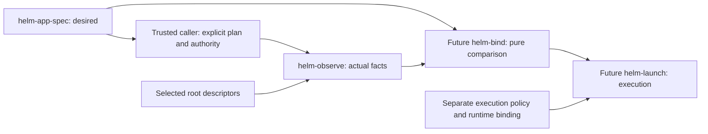
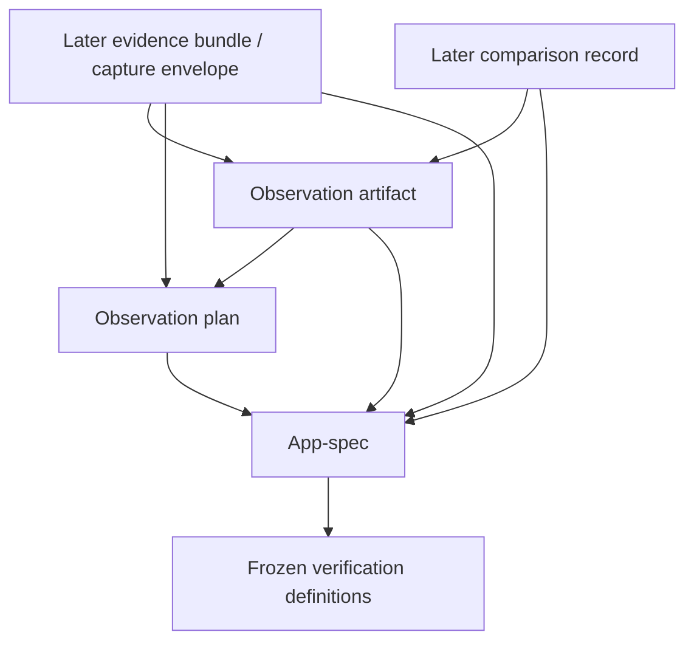
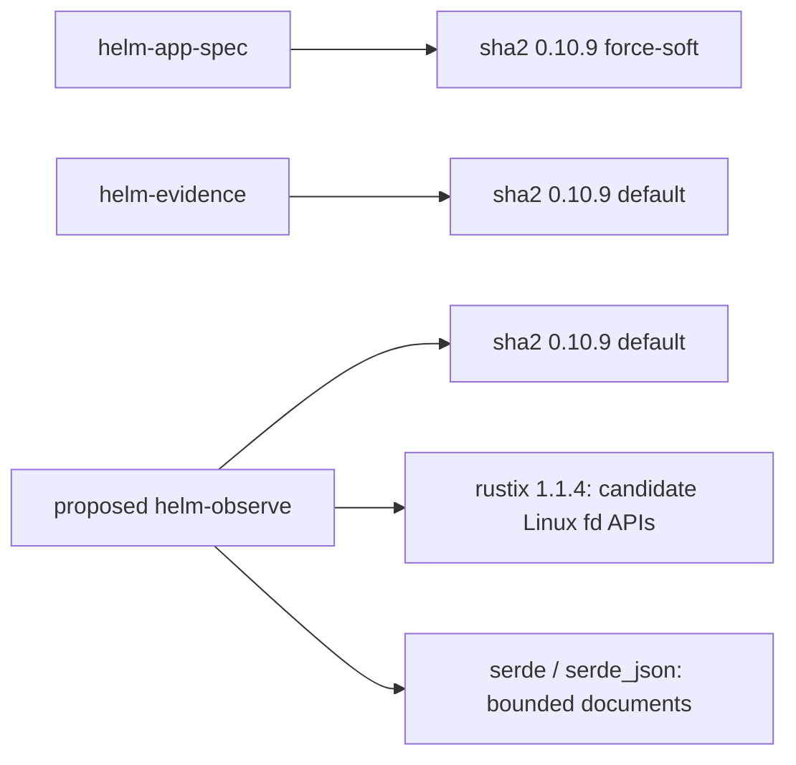

# helm-observe: explicit observation authority

**Status:** design proposal; awaits owner review. No implementation or experiment authorised.\
**Date:** 2026-09-08.\
**Authoritative base:** `e69abdfc55646dff6073befaeb843a18d6c7975f`.\
**Branch:** `docs/helm-observe-architecture`.\
**Recommendation:** B, an explicit-target observer, one Linux-only experimental library.

[ADR-0022](../adr/ADR-0022-observation-authority.md) records the Proposed decision.
This report is the detailed design and falsification definition for that proposal;
its API, wire spelling, numerical limits and implementation estimate are proposals,
not existing commands, implemented guarantees, or accepted architecture.

## 1. Reconstructed state and evidence discipline

`git fetch --prune origin` succeeded. `git rev-parse HEAD main origin/main` returned
the base above three times; `git status --porcelain=v1` was empty before creating
the dedicated branch. Only `origin`, the existing Djomla83/helm-os remote, was
configured. No main reset, merge, force-push or remote publication is part of this task.

Read the repository [instructions](../../AGENTS.md), [starter](../../AGENT_STARTER.md),
[master plan](../../HELM_MASTER_PLAN.md), [project state](../PROJECT_STATE.md),
[decision index](../DECISIONS.md), [ADR-0021](../adr/ADR-0021-second-product-module.md),
[selection analysis](SECOND-PRODUCT-MODULE-SELECTION.md), both crate READMEs,
all product source, both authoring and independent reviews, the complete
[A0 report](../experiments/EXP-009-APP-BASELINE-REPORT.md),
[EXP-009](../experiments/EXP-009.md), and relevant Gate 0, registry, snapshot and
A0 records cited below. The starter's initial EXP-001 assignment is historical;
the current owner instruction authorises this architecture task only.

| Classification | Verified source or preserved artifact; implication |
|---|---|
| Accepted | ADR-0020: documentation language. ADR-0021: pure non-executable application specification before observation/execution, with bounded owner refinements. Source status lines agree with the index. |
| Proposed | ADR-0001 through ADR-0019 remain Proposed. This new ADR-0022 is also Proposed. Runtime distribution, sandbox, recovery, product track, licence and launch are not accepted through either product merge. |
| Implemented/owner accepted | Two Cargo members, helm-app-spec and helm-evidence, experimental 0.1. Module acceptance is separately recorded in PROJECT_STATE. No helm-observe or binder exists. |
| Recorded execution | A0 experimental FAIL; W1 wrong destination despite correct content, W2 scoped success. G0-2 controlled HRESULT comparison accepted narrowly. Original G0-3 and G0-1/4/5 remain BLOCKED; G0-3a/3b retain separate mechanics results. None was rerun here. |
| Source-derived conclusion | Archive, installed-file and loaded-process identities are different scopes. A prefix locator is not dedication, ownership or continuity. The observer needs narrower authority than a scanner. |
| Hypothesis | B supplies useful reusable facts without desired-state interpretation; the Linux acquisition design can meet the stated limits. The proposed experiment must challenge this. |
| Unknown | Current VM/files/package-cache state, effective DLL configuration, installation provenance closure, cross-file coherence and future launch readiness. No fresh lab access occurred. |

Exact existing contracts:

- [helm-app-spec](../../crates/helm-app-spec/README.md) exposes
  `parse_spec(&[u8]) -> Result<ValidatedAppSpec, SpecErrors>`. Its immutable model
  contains desired source/runtime identities, win64/dedicated-prefix intent,
  disabled DLL requirements, inert entry point and frozen definition references.
  Document identity hashes exact supplied bytes. Parsing has no normal filesystem,
  environment, package, process, network or host-discovery authority. Validity
  establishes no observed state. The [source](../../crates/helm-app-spec/src/lib.rs)
  and [model](../../crates/helm-app-spec/src/model.rs) support this boundary.
- [helm-evidence](../../crates/helm-evidence/README.md) exposes
  `verify(&Path) -> Report` and a thin CLI. It opens a selected bundle, checks
  declared artifact identities, typed workflow/step/destination/restart records,
  and identity-bound recorded content-oracle/control results. COMPLETE,
  INCOMPLETE and INVALID concern the declared evidence contract. It neither
  captures actual machine state nor authenticates arbitrary attached claims,
  establishes freshness, reruns the oracle, or grades general compatibility.
  Its [source](../../crates/helm-evidence/src/lib.rs) preserves experimental FAIL
  independently of evidence completeness.

The [app-spec independent review](../implementation/HELM-APP-SPEC-INDEPENDENT-REVIEW.md)
records corrected parser CPU discovery and separate release builds, with combined
SHA feature coupling still open. The
[evidence independent review](../implementation/HELM-EVIDENCE-INDEPENDENT-REVIEW.md)
records actual symlink/FIFO races and their corrections, not a general filesystem
security proof. Authoring reviews are
[app-spec](../implementation/HELM-APP-SPEC-REVIEW.md) and
[evidence](../implementation/HELM-EVIDENCE-REVIEW.md).

Historical selection section 16 and app-spec README's final future-module paragraph
say observation **and comparison**. Those are advisory future descriptions, not
accepted combined authority. This proposal follows the owner's explicit separation;
it neither rewrites those historical sketches nor treats them as an implemented API.

## 2. Three designs and recommendation

Scores are judgments from 1 to 5; 5 is favourable, including low coupling and low
premature-abstraction risk. They are not measurements and are not averaged into an
automatic choice. All designs are evaluated as observers, without execution.

| Criterion | A: spec-driven | B: explicit targets | C: system scanner |
|---|---|---|---|
| Desired/observed separation | 2: needs desired semantics to select measurements; encourages interpreting requirements as outcomes | 5: receives operations and targets, no expected values | 4: inventory can avoid comparison, but inferred app association is tempting |
| Authority minimisation | 2: inert spec has no root authority; implicit resolution must be invented | 5: approved exact plan plus explicit descriptors | 1: broad enumeration and discovery are the purpose |
| Testability | 3: app-spec semantics and filesystem cases entangled | 5: tiny synthetic plans and independent byte oracles | 2: inventory completeness depends on distribution/layout |
| Security | 2: unsafe or ambiguous requirement-to-path mapping inside reader | 4: limited data reads; difficult Linux races remain | 1: user-data exposure, special objects, mounts and large trees |
| Determinism | 3: identical specs still lack installed locations | 4: fixed target order and rules; actual state can change | 1: ordering, discovery and installation churn enlarge variation |
| Coupling | 1: direct model/schema and Cargo feature dependency | 5: opaque identity and plan only | 2: Wine/distro/package conventions become policy |
| Future usefulness | 3: convenient desired checks, poor independent reuse | 4: binder can consume exact facts and unknowns | 3: eventual diagnostics/inventory could use it, no current requirement |
| Premature abstraction risk | 2: must invent semantics for unobservable desired fields | 4: two observable operations suffice | 1: general inventory/provider model before evidence |

**Choose B.** It makes a real authority boundary reviewable: who granted which root,
which names were attempted, which opened objects supplied which bytes. This choice
would stand even if A had fewer lines of code. A could be prevented from comparing,
but its direct consumption of ValidatedAppSpec still imports interpretation and
coupling that belong in a caller/planner. C has no concrete inventory requirement
that justifies its wider privacy and read-side effects. B has an unresolved backend
proof obligation, not a concrete flaw requiring a fourth architecture.



Arrows here are data/authority flow, not Cargo dependencies. The caller is not a
new product module proposed for implementation now. A human-authored lab plan can
exercise the observer before a spec-to-plan adapter or binder exists.

## 3. Plan and exact authority

**ObservationPlan is required, inside helm-observe.** Its job is to make the read
set explicit and retain evidence of omitted/rejected targets. It is not a workflow.
The smallest proposed closed JSON vocabulary is:

| Field | Meaning |
|---|---|
| `schema`, `version` | `helm-observation-plan`, `0.1`; separate from crate version |
| `subject_spec_sha256` | Exact app-spec document identity supplied as opaque context |
| `roots[]` | Unique logical root IDs only; no absolute locators or descriptors serialized |
| `targets[].id` | Unique logical target ID, without built-in app/runtime role semantics |
| `targets[].root` | One declared root ID |
| `targets[].path` | Exact inert relative spelling for a target; omitted only for the supplied root directory itself |
| `targets[].observable` | `directory_metadata` or `regular_file_sha256`; no recursive or parsed-content operation |

The subject digest is contextual input, **not a direct observation or validation of
the app-spec bytes**. A trusted caller obtains it from the intended exact document
(normally helm-app-spec's returned digest). If a caller attaches the wrong subject,
the observer cannot discover that semantic mistake. No desired artifact digest,
expected size, required DLL value, expected runtime family or pass criterion enters
the plan. “Required observable kind” constrains safe measurement mechanics only.

Plan bytes remain untrusted even when generated from a valid spec. Parse and bound
them before any target access; reject unknown/duplicate decoded fields, duplicate
IDs/root-path requests, unknown versions/operations and unsafe paths. No includes,
globs, URLs, fallback alternatives, search, expressions, environment expansion,
conditions, callbacks or executable fields. Retain declaration order. Empty plans
reject. Target IDs do not secretly select special-case code.

Plan identity is `SHA256(exact accepted input bytes)`; retain those bytes. No
canonicalization, semantic identity or self-hash field. A formatting change creates
a different plan artifact. Roots have logical names, so this identity does **not**
identify the actual root instance. The result separately records the root objects.
Identity values use 32 bytes internally and exactly 64 lowercase hexadecimal
characters in documents; no algorithm negotiation or shared identity crate.

There are three distinct boundaries:

1. **Untrusted plan -> validated inert plan.** Still no read authority.
2. **Trusted caller -> authorised scope.** Caller explicitly approves that exact
   plan identity and binds each root ID to an already-open directory descriptor.
   No extras, unresolved root names or automatic grants. Passing a large prefix
   grants potential access beneath it; approval must include the exact target list,
   not just approve every plan that happens to validate. Replacing a plan requires
   a new caller authorisation, even if its subject digest is unchanged.
3. **Authorised scope -> observation.** Only those targets and required ancestor
   metadata may be accessed. The observer receives no ambient path, HOME/PATH
   lookup, registry service, package-manager API, network or execution capability.

Prefer a prefix descriptor for installed files, a runtime `bin` descriptor for
explicit loader/server targets, and a separate archive-directory descriptor only
when actual archive bodies are deliberately supplied. Never find Wine or search
home/system paths for likely matches. Runtime symlink alternatives are not resolved
automatically; the caller must deliberately choose the real target and root.

For Linux file reopening, the caller additionally supplies a trusted native
**current-process procfs `fd` directory capability**, whose only permitted use is
the internally generated decimal number of a live descriptor pinned by this call.
It is not an observation root, cannot be named by a target, is never enumerated,
and cannot inspect other processes or arbitrary descriptor numbers. Its provenance
and stable mount namespace are trusted setup preconditions. Directory/procfs type
checks can reject obvious mistakes; they cannot authenticate an untrusted broker.
This explicit kernel-interface capability avoids hidden `/proc` acquisition.

Capabilities are in-process contracts enforced by reviewed code and OS handles,
not a new OS sandbox. Compromised code in the same process, a malicious authority
broker, malicious kernel or hostile privileged mount operator is outside that
boundary. Caller setup must not quietly use mutating helper probes or gain rights.

## 4. Complete app-spec 0.1 observability matrix

“Direct” below means only a new successful observation through the approved scope.
No row claims the proposed observer was run. Source for all desired fields is the
[current schema](../../crates/helm-app-spec/README.md#closed-json-schema-01).

| Desired field/concept | Direct in observe 0.1? | Evidence source available to observation | Confidence and limitation; deferred meaning |
|---|---|---|---|
| Root `schema`, `version` | No app-spec parsing | Caller supplies subject digest; optional exact document file target | Spec schema validity stays in app-spec; observer version is its own contract |
| `application.id` | No | Caller subject context | Local label is not installed application identity; not echoed as a discovered fact |
| `application.version` | No | A binary could be hashed; historical PE metadata remains an external record | Product/version parsing and attribution deferred; label equality is not byte equality |
| `application.source.size`, `.sha256` | Yes, **if that exact source body is explicitly supplied** | Opened regular archive/installer bytes, observed count and SHA-256 | Does not prove it installed the current payload; unavailable archive is a gap |
| `application.source.architecture = x86_64` | No semantic inspection | Source bytes can be hashed | PE inspection deferred; installer PE machine alone would not prove payload architecture |
| `runtime.family = wine` | No semantic identification | Explicit loader bytes can be hashed | Filename/version/package label cannot by itself establish family or effective runtime |
| `runtime.artifacts[].role` | No | Caller maps opaque target IDs to roles outside observer | Same role string does not prove same kind of artifact or provenance |
| `runtime.artifacts[].size`, `.sha256` | Yes for explicitly available artifact bodies | One archive/file byte observation per named body | Installed loader is a different object; archive absence cannot be filled by package metadata |
| `runtime.artifacts[].label` (optional) | No | Future metadata adapter, or historical record | Never content identity; package-database interpretation deferred |
| `environment.windows_architecture = win64` | No | Registry file bytes or executable bytes could be hashed if explicitly selected | `#arch=win64` is a saved-file claim, PE machine is per binary; no effective environment certification. Parsing deferred |
| `environment.prefix.role = dedicated` | **No** | Opened root/target directory metadata | Existence, inode or location proves no exclusive application association/ownership; binding mechanism deferred |
| `environment.disabled_dlls[]` | **No effective-configuration observation** | Explicit registry file could be hashed as opaque bytes | Environment overrides, per-app keys and live server state matter; no registry parser/configuration verdict in 0.1 |
| `entry_point.path` | Yes for exact scoped target lookup/type | Directory capability and exact Linux relative spelling | No case-insensitive Wine path resolution, executable-format or runtime-openability claim; path can change later |
| `entry_point.sha256` (optional) | Yes, observe bytes independently | Opened regular file stream | Returns actual hash, never compares; absent desired hash remains unspecified in future binding |
| `verification.definitions[].role` | No semantic identification | Caller mapping only | Roles and chronology need external review |
| `verification.definitions[].size`, `.sha256` | Yes if explicit frozen files are supplied | Hash exact supplied definition files | Does not execute definitions or prove preregistration, chronology, validity or results; Git resolution belongs to caller |
| `ValidatedAppSpec::spec_sha256()` | Context only by default; exact document bytes may separately be targeted | Trusted caller's exact-byte digest; independent file observation if requested | No model reserialization; context echo is not attestation. No I/O to locate a same-named spec |

This is deliberately incomplete semantic coverage. Directory metadata and regular
file hashing suffice to challenge the authority boundary without inventing a Wine
environment inventory or parsing binary formats.

## 5. Runtime identity and provenance gap

| Statement | Classification | What a future binder may conclude |
|---|---|---|
| Supplied archive body was read, length N, SHA-256 X | Direct byte observation under stated consistency limits | Equality to a desired archive's size/hash; nothing yet about installation |
| Supplied loader/server file was read, length M, SHA-256 Y | Direct byte observation | Equality to a separately pinned installed-file identity, if one exists |
| Package database reports Wine version Z | Observation of metadata/claim, if a future narrowly reviewed decoder collects it | Label recorded in that database; not archive/content identity. 0.1 does not decode it |
| Provisioning receipt says archive X produced installed manifest Y | Claim/receipt with its own exact-byte identity | Only as strong as independent issuer/process trust, coverage and binding; hashing a receipt does not authenticate its claim |
| A past process mapped runtime path P | Historical process observation | Path association at that time; not full mapped-byte identity, current state or future execution |

`package version == desired artifact hash` and
`installed loader hash == original package archive identity` are invalid relations.
Even possessing the correct four A0 archives does not establish that the current
installation derives from them, that every dependency is unchanged, or that a
future process will use them. No observer output upgrades those gaps automatically.

Stronger future binding needs a reviewed provisioning record linking exact input
archive identities to a scoped installed-file manifest and installation/root
generation, with transformations, omissions and later mutations accounted for.
It also needs a trust basis for that capture. This report defines no receipt schema,
signatures, installation procedure or universal package model. Without that evidence,
archive-to-installation provenance stays **unestablished** in the later binder.

## 6. Prefix dedication, DLLs and data boundaries

A supplied directory descriptor establishes an opened directory object. Observing
its metadata does not prove the original pathname still names it. A relative
`prefix` directory target under a supplied parent can instead establish lookup
presence/absence at that particular attempt. Neither establishes dedication.
Missing root acquisition is a caller/admission error; it cannot be fabricated as
an observer-measured absence. Use the bounded parent-directory target when that
negative observation is needed.

No ownership marker is created, no prefix is adopted, no inode becomes a durable
environment ID, and no cleanup/restore rights follow. A future independently
established creation/adoption generation and ownership/binding mechanism would be
needed for an exclusive application association.

**DLL decision: unsupported semantically in 0.1.** Source checked at Wine tag
`wine-11.17`: `parse_load_order` treats an empty order as disabled;
`init_load_order` reads process `WINEDLLOVERRIDES`;
`get_load_order_value` considers environment, application defaults, then standard
overrides. Module lookup also has path/basename/wildcard handling. Therefore a
prefix hive alone cannot determine a future process's effective DLL policy.
[Wine load-order source](https://raw.githubusercontent.com/wine-mirror/wine/wine-11.17/dlls/ntdll/unix/loadorder.c).

Wine's `server/registry.c` persists `system.reg`, `userdef.reg` and `user.reg`,
writes architecture markers, and contains deferred save and in-place/temporary-file
save paths. A saved hive is a representation of persisted state, not necessarily
the live server's current view. Reading the bytes safely would still not establish
effective application configuration.
[Wine registry source](https://raw.githubusercontent.com/wine-mirror/wine/wine-11.17/server/registry.c).

A0's [prefix initialization record](../experiments/evidence/app-baseline-execution-2026-09-07/guest/records/prefix-initialization.json)
contains `WINEDLLOVERRIDES=mscoree,mshtml=` as an invocation input. The
[installed-file observer record](../experiments/evidence/app-baseline-execution-2026-09-07/guest/records/installed-before.json)
has null Wine variables in its own SSH/tty environment. Neither is an independent
measurement of the GUI process's complete effective DLL load order. G0-3b measured
registry copy behavior, not DLL-disable semantics.

Optional later DLL experiment, **not a prerequisite for this file-only observer**:
after separate execution approval, use a fresh synthetic Wine prefix and pinned
11.17, alternate conflicting process/global/per-application settings for one
harmless test DLL, compare actual load outcomes to separately captured persisted
state before/after verified shutdown. Include missing/stale hive and basename/path
cases. No A0 prefix, generic registry parser, or configuration receipt implementation.
Preserve mismatches. Its purpose would be to falsify a later narrower configuration
claim, not to certify registry text as complete truth.

The preserved [G0-3b record](../experiments/evidence/G0-3b-wine-registry-wsl2.json)
reports `survived_whole_prefix_restore: false` for a synthetic post-copy document,
and hardlink-copy contamination. It used Wine 11.17 and WSL2 kernel
6.6.87.2-microsoft-standard-WSL2; it was not A0 recovery. The
[ext-family](../experiments/evidence/G0-3-snapshot-semantics-ext4.json) and
[drvfs](../experiments/evidence/G0-3-snapshot-semantics-drvfs.json) synthetic probes
also distinguish in-place modification, replacement and an empty-write window.
These results do not prove actual corruption or a coherent application snapshot.

| Data class | Observer treatment |
|---|---|
| Runtime/application payload | Only explicit artifacts; identity conveys no disposal, redistribution or execution rights |
| Prefix/configuration | Mixed mutable state; no inference that all prefix files belong to the application |
| User documents | Excluded by default, including documents physically inside a prefix; exact observation needs separate caller intent |
| External/server-side state | Unobserved; local facts cannot establish account state or reverse remote operations |

No recursive enumeration, archive expansion or automatic registry dump. Hashes can
reveal private content through known-file matching even without file bodies. Logical
IDs and relative paths also need privacy review. Human diagnostics use target index/
validated logical ID and fixed codes, never raw OS errors or private absolute paths.
Core records omit paths already bound by the exact plan; the plan remains sensitive
local material. Publication/redaction is an external decision; redaction creates a
new artifact identity.

## 7. Linux filesystem design and reuse assessment

**Proposed platform:** Linux-only observation API/implementation, initially tested
on Linux x86_64 with local ext4. Require working `openat2`, handle metadata including
mount ID, and native current-process procfs. A candidate minimum is Linux 5.8
(openat2 plus STATX_MNT_ID); probe feature availability and fail closed instead of
relying on version strings. Other local filesystems and architectures need their
own evidence; Windows semantics are not promised.
The trusted caller establishes the local ext4 setup; a filesystem-type magic value
alone cannot authenticate the storage stack. Handle metadata must use returned
statx masks, not assume that requested fields were supplied. Even fields from one
metadata call need not describe one atomic instant.
[Linux statx](https://man7.org/linux/man-pages/man2/statx.2.html).

Linux provides `O_PATH` handles that do not open objects for data access.
`O_PATH|O_NOFOLLOW` can return the link object itself, so handle type checking is
still mandatory. Nonblocking mode alone does not make every special-object open
harmless. These primitives inform the following **proposed** policy; they do not
prove the implementation exists. [Linux open](https://man7.org/linux/man-pages/man2/open.2.html).

`openat2` supplies resolution constraints for all path components. The proposal
requires BENEATH, NO_SYMLINKS, NO_MAGICLINKS and NO_XDEV for every target lookup;
NO_XDEV rejects bind-mount crossings too. If the kernel cannot establish the
constraints during a race, return an unresolved observation rather than weakening
flags or repeatedly searching. [Linux openat2](https://man7.org/linux/man-pages/man2/openat2.2.html).

Proposed sequence, to be falsified before product implementation:

1. Validate the complete inert plan and its exact authorisation; validate supplied
   root descriptors as directories on the approved local filesystem. Reject
   unsupported pseudo/network/FUSE/automount roots. Capture root object tuples
   through handles. No directory contents are listed. No `AT_FDCWD` path lookup.
2. Resolve each full relative target from its pinned root with the required
   openat2 flags and `O_PATH|O_NOFOLLOW|O_CLOEXEC`. Pin the returned object. A
   directory operation stops at metadata; a file operation requires S_IFREG before
   **any data-open or read**. Reject links, FIFO, sockets, block/character devices
   and wrong kinds. A missing component under enforced lookup is a negative fact.
3. For a regular file only, reopen the held O_PATH object through the supplied
   native procfs-fd capability using its **internally generated live FD number**,
   read-only, CLOEXEC, NONBLOCK and NOCTTY. This single intentional kernel magic-link
   traversal is confined to that pinned descriptor; arbitrary plan links remain
   forbidden. Do not `readlink` it to a pathname and open that pathname. Hold the
   O_PATH descriptor until the read finishes so its number/object cannot be reused
   by normal descriptor lifetime management. The current-process context must not
   be reused across fork or namespace changes.
4. Check the returned read handle's type and device/inode/mount identity against
   the pinned object before reading. Unsupported reopening or identity disagreement
   means failure, never fallback. Kernel procfs and a trusted, stable process/
   mount context are preconditions; a hostile broker is not protected by a post-open
   identity comparison. Procfs reopening may independently deny permission.
   [Linux procfs FD semantics](https://man7.org/linux/man-pages/man5/proc_pid_fd.5.html).
5. Bound metadata length; stream from offset zero through that one read handle,
   with fixed buffer and actual-byte accounting. No memory map, entire-file buffer,
   sparse-hole skipping, decompression or later path reopen for hashing. Hash the
   logical bytes returned, including zeros from sparse regions. Check EOF after
   the initial length within the read budget, and compare handle metadata before/
   after. A size/mtime/ctime/link-count change or short/growing stream makes the
   digest unavailable with `changed_during_read` (or resource failure).
6. Close target handles after that target, retaining the immutable result. Retain
   root handles for the batch. Do not reopen targets to pretend the whole batch
   was simultaneous. Internal mtime/ctime samples are change indicators, not core
   timestamps or durable version IDs.

The record's successful hash means **digest of the observed stream from one opened
object, with no change detected by these checks**. It is not a proof that the stream
existed as a complete file version at one instant. Concurrent in-place writers can
evade sampling or cause mixed bytes. This qualification is part of the data model,
not an optional warning a consumer may silently drop.

| Threat | Required behavior and limit |
|---|---|
| Static/swap symlink, including parent and magic link | No target-link traversal; O_PATH link metadata can identify rejection without reading its destination |
| Windows reparse-like indirection | No Windows backend. On Linux reject links and mount crossings; no assertion that a Windows reparse tag is understood |
| FIFO/socket/block/character device | Metadata-only pin then rejection; no stream read or data-open; absence of writer cannot stall a FIFO open |
| Directory where file expected | Wrong-kind rejection, possibly recorded observed kind; no content enumeration |
| Huge/sparse/growing file | Metadata and actual logical-byte limits; incremental stream/EOF checks; no allocation from declared/file length |
| File replacement before pin | New regular object's actual bytes may legitimately be observed; no expected hash to judge them |
| Replacement/unlink after pin | Old retained object may be read; detected metadata changes can instead yield changed_during_read. Never assert current pathname contents |
| Directory replacement/rename | Root is a retained capability. Each full path resolves under it; different attempts may reach old/new descendants. No live-path-ancestry claim after capture |
| Mount changes | Target resolution forbids crossings; already-open handles retain their objects. Privileged tampering/native procfs substitution is excluded by trusted setup, not solved by hashing |
| Hardlinks | Record sampled link count; allow a named regular hardlink with explicit `origin_unestablished` semantics. No scan for aliases, no exclusive-ownership inference. Rejecting nlink > 1 would still miss an outside link unlinked before inspection and would not solve origin |
| Concurrent writes | Detected mutation yields no complete digest; undetected mutation remains a consistency limitation, requiring an external coherent root for stronger use |

**Reuse before new wrappers.** Current cached/locked sources were inspected:

| Upstream candidate | Source finding and decision |
|---|---|
| cap-std 4.0.2 / cap-fs-ext 4.0.2 | Existing evidence reader correctly reuses no-follow component opens and nonblocking leaf opens. Its accepted contract excludes mounts and general hostile filesystems. It does not implement this proposal's metadata-first data-open rule |
| cap-fs-ext `Reopen` -> cap-primitives 4.0.3 | `fs/reopen.rs` checks permission subset and later object equality; `rustix/fs/reopen_impl.rs` calls `file_path` then `open_unchecked` on that pathname. This is unsuitable as an assumed pinned-object reopen; checking identity after a pathname open does not prevent special-device open side effects |
| rustix-linux-procfs 0.1.1 | `check_proc_root/subdir -> is_mountpoint` uses a deliberately failing `renameat` and panics on unexpected errors. Do not invoke this helper in the proposed no-mutation-syscall observation path or quietly move it into setup under a read-only label |
| rustix 1.1.4 | Already locked; safe public `fs::openat2` returns OwnedFd and exposes resolution flags. Candidate low-level binding for a small private Linux adapter, with standard metadata/read APIs; no copied syscall/crypto implementation or authored unsafe Rust proposed |

Primary pinned source links:
[cap-primitives reopen](https://docs.rs/crate/cap-primitives/4.0.3/source/src/rustix/fs/reopen_impl.rs),
[procfs helper](https://docs.rs/crate/rustix-linux-procfs/0.1.1/source/src/lib.rs),
[rustix openat2](https://docs.rs/crate/rustix/1.1.4/source/src/fs/openat2.rs).
The implementation experiment must verify the safe Rust APIs and procfs capability
contract end to end. If they cannot express it without a broader security subsystem,
revisit scope; do not accept an unsafe fallback for convenience.

## 8. Read-side effects and consistency

“Read-only” guarantees no intentional target-content/namespace mutation: no write,
create, truncate, rename, unlink, chmod/chown, mount, registry change, lock/lease
acquisition, process execution, network API, package query command, or automatic
quiescing/snapshotting. Results are returned in memory; the caller writes artifacts.
Even deliberately failing mutation probes are excluded.

It does **not** mean zero effects. Reads may update access times, fill/evict page
cache, induce storage I/O, affect timing/power and emit audit events. Metadata/path
resolution can involve automount or remote servers before rejection in environments
outside the approved local-root assumptions. Malicious or failed filesystems can
block or lie. NONBLOCK, finite bytes and a deadline checked between reads cannot
guarantee interruption of a blocking kernel operation. No host-remount/noatime,
privilege gain, storage sandbox or hard wall-clock guarantee is implied. External
lab watchdogs bound ordinary test hangs, not all kernel failure modes.

**0.1 consistency: sequential per-object stream capture; no environment snapshot.**
Target order is plan order. A missing file means the constrained lookup reported
absence during that attempt, not that it never existed or stayed absent. Permission,
unsafe-object, I/O and resource failures do not become absence. Changes between
targets do not restart earlier targets or erase successful observations. One batch
may describe a mixture of times; its schema fixes `consistency: sequential_objects`.

For a coherent environment the caller must supply a separately established
quiesced/snapshotted root with writers excluded and record the mechanism's evidence
outside the observation. A read-only mount alone may still have writable aliases.
Multiple supplied roots need a shared coherence claim if cross-root consistency
matters. The observer neither proves quiescence nor upgrades consistency because a
caller sets a label. Every returned root/object tuple is local capture context,
not a portable identity across boot, inode reuse, clone, restore or mount namespace.

Determinism means fixed parsing, target order, codes and serialization for equal
inputs **and equal observed syscall results**. Repeating a plan on a changing
filesystem is not promised to produce the same result bytes.

## 9. Minimal immutable record and error taxonomy

One immutable batch artifact contains the context once and one result per target.
It is the smallest standalone artifact; target entries inherit its subject/plan/
root context and are not independently addressable identity records in 0.1.

| Record field | Proposed content |
|---|---|
| `schema`, `version` | `helm-observation`, `0.1` |
| `subject_spec_sha256`, `plan_sha256` | Context supplied by caller; exact plan bytes bind all target spellings and requested operations |
| `consistency` | `sequential_objects`, with per-file stream semantics fixed by version |
| `roots[]` | Logical ID and sampled device major/minor, inode and mount ID from held root; no absolute path, ownership flag or durable instance ID |
| `targets[]` | Exactly one entry per plan target in order: target ID, outcome and narrowly applicable fields |
| Observed directory | Kind directory and local object tuple; no digest or inventory |
| Observed regular file | Kind regular, local object tuple, sampled link count, bytes read, SHA-256, `change_check: no_change_detected`; origin remains unestablished |
| Other outcomes | Code and bounded operation stage, optional observed kind/partial byte count when actually obtained; no complete-file digest on partial/error/mutation |

Object tuples justify the handle association inside the capture; SHA-256 identifies
the stream bytes. Neither is sufficient as a persistent prefix binding. Byte count
zero and the real SHA-256 of an empty file are valid observations, although an
app-spec artifact size cannot be zero. No expected values or policy conclusions
are copied into the result.

| Category | Example/code | Meaning |
|---|---|---|
| Valid negative observation | `absent` from constrained ENOENT | Target lookup found no entry or a missing ancestor within the supplied root at that attempt; not a machine-wide search |
| Observed directory/file | `observed_directory`, `observed_file` | Mechanically collected scoped facts, no requirement verdict |
| Rejected target | `symlink_forbidden`, `special_file`, `wrong_kind`, `mount_crossing` | Policy refused observation; kind included only if actually established. EXDEV does not invent the destination |
| Incomplete attempt | `permission_denied` | Access not available. An O_PATH metadata pin may succeed while read reopening fails; bytes remain unknown |
| Failed attempt | `io_failure`, `resolution_race`, `changed_during_read`, `reopen_unavailable` | No complete byte observation; prior independent target records retained |
| Bounded attempt | `file_limit`, `total_limit` | Required observation could not complete within read budget; not absent |
| Unattempted target | `not_attempted_total_limit` | Total budget exhausted; preserve the declared target instead of silently omitting it |
| Admission failure | Invalid plan, scope/plan mismatch, missing root binding, unsupported kernel/filesystem/proc capability | No batch claimed; no target reads. Bounded separate error returned to caller |

ENOTDIR is wrong-kind/path-resolution failure, not absence. Permission-denied and
EIO are not collapsed to ENOENT. Unknown errno maps to bounded I/O failure, with no
raw OS-message echo. A live race may produce different legitimate OS errors; tests
must assert on forbidden access and honest category, not force invented certainty.
No unbounded resolution/read retries: an interrupted read may end the attempt with
`io_failure` and its actual partial byte count, without a complete digest.
No PASS, SATISFIED, COMPATIBLE, INSTALLED_CORRECTLY or global compatibility boolean.
There is no aggregate evidence-completeness verdict either.

Plan validation/admission errors occur before target access. After admission,
target-local failures continue to the next target within budget. Losing the native
reopen facility is recorded as a failure for affected file attempts; directory
metadata targets remain meaningful. Process crash/OOM cannot return a fabricated
finished batch; an external capture record must report the failed invocation.

## 10. Record identity and acyclic evidence relationship

**Exact-byte identity is needed; semantic identity is not.** The producer returns
one bounded immutable serialized byte buffer and SHA-256 of those exact bytes.
Store that buffer unchanged. Fixed field order is a serialization choice, not a
canonicalization standard or promise to accept/reserialize arbitrary equivalent
JSON. Reformatting makes another artifact identity. No record self-hash field,
signature, timestamp, UUID generator or canonical semantic digest is added.

Wall time, producer source/build identity, lab/boot context, operator, quiescence
evidence and authority-grant provenance belong in an external capture envelope that
references the exact observation and plan artifacts. They matter for later trust
and freshness, but do not turn record identity into an event identifier. Identical
observations can produce identical bytes on separate occasions. No signed/fresh
capture is asserted merely because that envelope exists.

Arrows below mean **references exact artifact identity** (opposite to some data-flow
arrows in section 2). They are acyclic:



A future bundle can list observation, plan, exact subject document and capture
envelope as ordinary hashed artifacts using helm-evidence's existing artifact
mechanics. That alone checks their declared bytes, not the new record schema,
subject/plan linkage, trust or comparison semantics. Current evidence 0.1 has
workflow requirements and no observation-only bundle mode; do not invent a dummy
workflow/PASS to package observations. Use an external artifact/envelope until a
legitimate later bundle/adapter exists. No helm-evidence changes in this task.

The producer does not decide bundle completeness or author expected values from
observed successes. The spec never references its future observation/evidence.
The plan never references its result. Capture envelopes are referenced by later
bundles, never recursively by the observation they describe.

## 11. Future binder and launch requirements

The later **pure binder** needs the independently validated exact subject spec,
exact plan and record, a reviewed mapping of target IDs to requirement roles,
captured root scope and consistency/trust context. It must validate all references
and preserve unsupported/missing/error outcomes. It must distinguish archive-body
observations from installed-file observations; opaque target names alone cannot
supply that interpretation.

| Desired versus actual question | Facts supplied; what remains outside observer |
|---|---|
| Desired runtime archive X versus supplied archive Y | Actual byte length/hash plus exact target/root mapping; comparison belongs to binder |
| Desired runtime archive X versus installed loader Y | Both identities can be represented, but comparable provenance is absent without a reviewed provisioning link; binder must not equate them |
| Desired entry digest X versus observed digest Y | Actual file bytes/type/scope; binder may compare if expected hash exists, otherwise desired identity is unspecified |
| Desired dedication/DLL policy/Windows architecture | No direct semantic observation in 0.1; binder preserves unestablished/unsupported rather than guessing |

The future **launcher** additionally needs execution authorisation and containment,
a concrete prefix/root generation, runtime installation/receipt coverage, validated
entry-point bytes, session/arguments/environment policy, existing-wineserver
association and a way to bind observation to actual use. A stored observation is
not a launch capability. Files can change after hashing; merely reopening a path
and comparing again moves the race. Wine may reopen an executable and load DLLs
and shared dependencies later. A separate launch design must define retained
handles or an immutable/coherent environment and execution-time capture to bridge
that gap. No processes, `/proc` process inventory, wine --version, wineboot,
winecfg, registry queries or launch code are proposed here.

## 12. Cargo dependencies, platform and minimal crate

**One crate: helm-observe**, library only, experimental 0.1, `publish = false`.
Internal plan/model/validation, Linux filesystem adapter, streaming capture and
serialization are enough. No observer-core/backend/plan/receipt crates, shared-utils,
CLI, daemon, async runtime, plugins, RPC, database or process supervisor.



No Cargo edges between the three HELM crates, including proposed tests/dev
dependencies. A future adapter can transfer primitive digest bytes/text or artifacts
without importing private app-spec types. Small duplicated digest/ID grammar is
acceptable; a shared crate has no independent consumer requirement yet.

| Dependency choice | Assessment |
|---|---|
| Direct helm-app-spec dependency | Reject: imports a desired model the observer does not need, schema/type churn and force-soft feature coupling |
| Direct helm-evidence dependency | Reject: imports bundle/result semantics and unnecessary I/O graph; observer is not a verifier |
| Neither | Choose: identity artifacts are the relationship; no combined product executable introduced |

Candidate direct pins reuse locked serde 1.0.228, serde_json 1.0.149, sha2 0.10.9 and
rustix 1.1.4 with the minimum reviewed Linux features. This is a suitability proposal,
not a dependency/feature edit or licence acceptance. The cached Rust bindings avoid
writing unsafe syscalls; retaining the existing workspace unsafe-code prohibition
is a prerequisite. Do not silently rely on the rejected reopen/procfs helpers.

“Neither” does not magically isolate Cargo features. A workspace build selecting
app-spec and observe would still unify the same sha2 package's `force-soft` feature;
any executable linking all modules has the same issue. Dependency aliases and
resolver 3 do not isolate it. Standalone evidence/observe invocations preserve their
selected default backends; combined-graph correctness and performance must be
tested explicitly later. [Cargo feature unification](https://doc.rust-lang.org/cargo/reference/features.html#feature-unification).
The existing review measured substantial combined hashing cost; this task adds no
benchmark or claim that the cost is fixed. No crypto refactor or broad workspace
change is authorised. Observer impurity already includes filesystem facts, so
normal SHA CPU dispatch would not contradict an app-spec-like purity claim.

Windows development/CI can check documentation, frozen fixture identities and the
existing crates. It cannot execute/prove Linux openat2, procfs reopening, mount,
FIFO, socket or race semantics. Future Linux-only observer builds must be explicitly
selected for Linux; an empty cfg-disabled Windows build is not a passing observer
test. Portable artifact spelling is not a cross-platform I/O API promise.

Proposed internal files: `lib.rs`, `plan.rs`, `model.rs`, `linux.rs`, `observe.rs`;
tests for input/identity, static objects, syscall-boundary races and authority.
No files or modules are scaffolded by this report.

**Estimated physical Rust LOC**, including docs/comments/blank lines but excluding
fixtures, generated files, lockfile and reports: 1,200–1,800 product, 1,000–1,600
tests; total 2,200–3,400. A disposable pre-implementation syscall experiment may
need 200–400 Rust/C LOC plus 250–500 Python harness LOC, separately authorised and
not product code. These estimates account for the previous app-spec estimate's
understatement of bounded parsing/private views; they are not measured work or a
deadline. A need for registry parsers, scanners, process supervision or a new
filesystem library is a redesign signal, not permission to exceed scope.

## 13. A0-7ZIP paper mapping, without lab access

Desired input is the current **retrospective**
[A0 app-spec fixture](../../crates/helm-app-spec/tests/fixtures/a0-7zip.json), not a
document authored before A0. Its desired entry-point digest is omitted. Original
source/package pins and frozen definitions precede A0; installed-file hashes do not.
Fixture provenance identifies definition commit
`5a83f8cb2fbb5a3597ddff6b5cae9cb813f1c5ae` and exact Git blob references.
The fixture's exact working-tree bytes were hashed during this documentation task:
`b60672385dc371a79b78f90636206bc1a0a7e0f5e017c4bdec323c545b74521e`.
This is a fresh document-byte check, not a fresh A0 observation. A later caller must
use the identity of the actual bytes it supplies, including any newline changes.

The lab's historical configuration is Ubuntu 24.04.4, Linux 7.0.0-31-generic,
ext4, WineHQ 11.17~noble-1, 7-Zip 26.03 x64, 4 vCPUs, fixed 8 GiB, on the recorded
Ryzen 9 5950X Windows host. The existing evidence review later recorded Rust/Cargo
1.95.0 and GCC 13.3.0 there. Its then-final state was Off. These are historical
records, not a new VM state/hardware interrogation.

In the table, `prefix-root` maps privately to the known lab prefix;
`runtime-bin` to the deliberately chosen `/opt/wine-devel/bin`; `archive-root`
would require a separately supplied known archive directory. These aliases are
illustrations of explicit grants, not discovery rules in the product.

| Exact target / contextual item | Could be directly re-observed after separate approval | Historical evidence or desired-only limit |
|---|---|---|
| `prefix-root`, directory metadata | Type and local handle tuple; or `prefix` under a selected parent for pathname presence/absence | Historical creation/reuse; no persistent generation or dedication proof |
| `drive_c/Program Files/7-Zip/7zFM.exe` | Actual regular-file stream length/hash | Before/after records: 1,003,520 bytes, `7f7067b2264fbf8cbd1348cf7f41a0e35c928de750d53533c963ebe334dbd612` |
| `drive_c/Program Files/7-Zip/7z.exe` | Same operation, explicit extra target | 577,536 bytes, `6ee3c0ed0b27663c1b948ae85a7c0bb073aed1498983182f3f0df1f6a8c30b2f`; not the GUI launcher |
| `drive_c/Program Files/7-Zip/7z.dll` | Same operation, explicit extra target | 1,906,688 bytes, `65e4c1f855f9ef6e8f0f5df8e3f27d9eb5f07311408639da0a1ca0b8f4871b0d` |
| `runtime-bin/wine` | Actual regular file if permitted by type/mount policy | Provisioning hash `d96472c8c5e6567bb9d800b1c2261c764a1588d7913d50ef3474357e5f549f33`; no fresh size/hash or loaded-closure assertion |
| `runtime-bin/wineserver` | Actual regular file if supplied | Provisioning hash `a1be56803e28a53108e51bad14006c05bac220961bf52aa1462166158680d079`; post-restart rehash not established |
| Four named Wine package archives | Actual bodies if still present and accessible; otherwise absence/access gap | Historical download verification and desired hashes agree; cache retention/current readability unknown |
| `7z2603-x64.exe` under a supplied source root | Source body if still available | Desired/historical 1,661,239 bytes, `0859c524b8a63551848f0c246abddcb1d0b7b656b0fbfe879f8d85e61a9e6edd`; not installed-file identity |
| Three frozen definition files in an explicitly prepared root | Exact file hashes, no interpretation/execution | Caller must materialize original Git blobs, not substitute today's annotated EXP-009 |
| Package versions, PE 0x8664/version 26.03, Wine family | No semantic parser in 0.1 | Historical package/PE records only; not invented fresh facts |
| win64, dedicated, mscoree/mshtml disabled | No effective-state verdict | Desired declarations and historical invocation inputs; configuration/dedication gaps retained |
| Boot IDs, GUI XWayland mapping, W1/W2 and ZIP content results | No process/GUI/boot capture in 0.1 | Historical recorded evidence only; observing files now cannot establish those past executions |

Sources for the three application identities:
[installed-before](../experiments/evidence/app-baseline-execution-2026-09-07/guest/records/installed-before.json),
[installed-after](../experiments/evidence/app-baseline-execution-2026-09-07/guest/records/installed-after.json).
Runtime sources:
[download verification](../experiments/evidence/app-baseline-execution-2026-09-07/guest-verified-wine-downloads.json),
[provisioning capture](../experiments/evidence/app-baseline-execution-2026-09-07/guest-wine-provision.json),
[provisioning script](../experiments/evidence/app-baseline-execution-2026-09-07/scripts/provision-wine.sh),
[before mappings](../experiments/evidence/app-baseline-execution-2026-09-07/guest/records/wine-backend-before.json),
[after mappings](../experiments/evidence/app-baseline-execution-2026-09-07/guest/records/wine-backend-after.json).
Mapped paths have no corresponding complete mapped-byte digest collection.

Root presence and targeted file bytes are **boot-independent kinds of fact**, not
facts guaranteed unchanged across boots. Their values may change at any time.
Historical same-file hashes across R1 are evidence only for the two captures.
The [W1 deviation](../experiments/evidence/app-baseline-execution-2026-09-07/workflow-w1-deviation.json)
and [result summary](../experiments/evidence/app-baseline-execution-2026-09-07/result-summary.json)
remain FAIL. Nothing in this mapping imports those outcomes as new observation
records or changes evidence verdicts.

## 14. Proposed pre-implementation falsification experiment

**OBS-FS-01: NOT_RUN; requires a separate owner authorisation.** No experiment
program, Rust product code, synthetic filesystem attack, VM boot or A0 read is
created/executed by this task. Authorising this experiment would still not authorise
helm-observe implementation, A0 rerun, DLL execution or launch.

Smallest useful experiment: a disposable Linux syscall/API spike for the exact
O_PATH -> native procfs FD reopen -> bounded read sequence, plus a parent harness
that creates and mutates only synthetic files. It need not implement JSON, an app
model, evidence integration or the proposed full API. A paper-only regular-file
example cannot settle the security boundary demonstrated by the prior race review.

**Preferred lab if separately approved:** existing `helm-lab-desktop-7zip` Ubuntu VM,
because it has recorded native ext4, the same Linux target, compiler/Rust setup and
prior unprivileged syscall-boundary testing. Windows NTFS is not that backend and
the WSL registry lab is a different kernel/filesystem arrangement. Verify current
tools/kernel/permissions when the new task starts; past records are not fresh proof.
Use UID/GID 1001, no supplementary privilege. No new packages or host privileges
are assumed. Missing tools/access mean BLOCKED with a concrete reason.

Proposed permitted changes: owner-approved normal boot/access/shutdown of this one
VM if necessary; one new private lab directory outside the A0 tree, bounded source/
build/test/log files there, and synthetic sibling canaries. The harness may create,
replace, chmod, hardlink and unlink **only its own disposable fixtures**. The observer
spike itself performs only the read/metadata path. This distinction is explicit:
the experiment setup is not read-only, even though the operation under test is.
Leave A0 prefix, artifacts, outputs and other labs untouched; no Wine/7-Zip process,
runtime change, checkpoint, host folder sharing or private-data inventory. No
recursive A0 preservation scan is required for a synthetic-only experiment.

Freeze the spike source, fixture byte recipes, scheduling method and expected
outcomes before execution; an independent reviewer must approve the reference
expectations. Use independent Python hashlib over the known synthetic bytes, not
the observer's output to define the expected identity. Keep failures and all seeds.

| Case | Predeclared outcome/property |
|---|---|
| Regular nonempty and empty file | Exact independent length/hash; no comparison vocabulary |
| Missing leaf and missing parent | `absent` from constrained lookup; do not search sibling paths |
| Wrong file identity with same name | Return its different actual hash successfully; no mismatch/PASS judgment inside observer |
| Static internal/escaping/dangling symlink | Rejected; no destination data-open/read |
| Leaf and parent symlink swap | Force swap at target syscall boundary; rejected or pinned prior regular object, never followed link |
| FIFO, including swap with no writer | Metadata-only rejection; no data-open/read and no wait for writer |
| Unix socket | Metadata-only rejection; no connect/read |
| Directory in file position; regular file in parent position | Wrong-kind/resolution rejection, not absence |
| Concurrent file replacement | Before pin: new bytes; after pin: old stream or documented detected-change failure; never claim persistent pathname binding |
| Directory/root replacement after pin | Retained-root semantics; later descendant lookups may differ. No escape or atomic-batch assertion |
| Growing and truncating file | Bounded reads; detected growth/short read gives changed/resource failure and no complete digest |
| In-place same-length overwrite | Scheduled visible mutation rejected where samples detect it; demonstrate that samples do not prove snapshot consistency |
| Hardlink to synthetic outside canary | May hash named inode and reports sampled nlink; no outside path enumeration or ownership claim. Mutating alias challenges consistency |
| Permission denied | chmod synthetic file or deny parent search as unprivileged UID; no root retry, absence or guessed digest |
| Sparse and over-limit file | Bounded logical-byte accounting, no huge allocation; one small sparse case plus metadata-over-limit case |
| Budget exhausted/partial I/O failure | Actual bytes charged, previous results retained, all later target statuses explicit |
| Procfs context unavailable/wrong | Admission or reopen failure; never path fallback. Reject synthetic fake proc directory without target reads |
| Native device nodes | Production root admission rejects /dev's unsupported filesystem. Separately approved metadata-only classifier subtest may pin /dev/null and /dev/zero to challenge type rejection; it is not an admitted production plan/root. Never data-open/read, mknod or block-device access |
| Nested bind mount/mount replacement | Reject crossing and preserve pinned handles. Only if separately approved isolated namespace fixture is available; otherwise BLOCKED, not passed or bypassed by requesting root |
| Two-file changing environment | Mixed sequential observations remain representable; no snapshot/consistency promotion |
| Private marker and unlisted file | No unlisted-file access, recursive listing, body/path leak or arbitrary FD number from plan |

Use deterministic parent-to-child syscall-boundary scheduling where available,
following the existing [Linux probe's method](../../tools/helm_evidence_linux_probe.py),
without changing child syscall results. Record injected schedule, syscall flags,
actual opened descriptor identity, all data-open/read attempts and byte accounting,
not only the final digest. An injection that did not occur is an invalid trial,
never a pass. The current probe cannot simply be assumed to recognize a new spike's
O_PATH/procfd sequence; adapt only under the future experiment authority.

Proposed budget: one run per static case, one forced run per defined race schedule,
at most 20 preregistered stress repetitions per race, no retry-until-green. Five
seconds per small child, 10 minutes execution total, 1 GiB fixture allocation and
5 GiB including build cache, no download or spend. An external supervisor may kill/
reap ordinary stalled children; an uninterruptible kernel wait invalidates any hard
deadline claim. No performance benchmark is inferred from watchdog timings.

Required artifacts: exact source/definition SHA, toolchain/kernel/filesystem/CPU/
memory/UID and mount setup, byte recipes, complete case list with PASS/FAIL/
INCONCLUSIVE/BLOCKED/NOT_RUN **experiment** outcomes, syscall traces, independent
hash expectations, stdout/stderr, resource accounting and preservation scope.
This vocabulary belongs to the experiment report, not observer product records.

Success prerequisite for product authorisation: independently reviewed evidence
that no target symlink/mount escape or special-file data-open/read occurred,
correct bytes/errors and limits, honest concurrent-state semantics, and sufficient
coverage of the mandatory mount/procfs assumptions. A blocked mandatory case leaves
that claim unverified and implementation approval pending; it cannot be waived by
changing the acceptance expectation after execution. Actual block devices, FUSE/
network failures, arbitrary privileged mounts and Windows remain untested unless
separately approved. No running-process or effective DLL experiment is bundled in.

## 15. Candidate Rust API, not implementation

Conceptual signatures only; abbreviated opaque types and methods below do not
exist and are not a compilable patch. Validation, authority and actual results
remain different types. No blanket public Deserialize/unchecked constructors for
validated plans, authorised scopes or successful observations.

```rust
// Untrusted bytes -> inert validated plan. No I/O.
pub fn parse_plan(bytes: &[u8]) -> Result<ValidatedPlan, PlanErrors>;

impl ValidatedPlan {
    pub fn exact_bytes(&self) -> &[u8];
    pub fn sha256(&self) -> &Digest;
    pub fn subject_spec_sha256(&self) -> &Digest;
    pub fn targets(&self) -> &[Target]; // private fields, borrowed views
}

// Linux-only trusted caller boundary, with read/metadata admission checks.
// No Path constructor or implicit /proc, HOME or PATH acquisition.
pub fn root_from_fd(fd: OwnedFd) -> Result<RootCapability, AdmissionError>;
pub fn proc_fd_from_trusted_current_process(
    fd: OwnedFd,
) -> Result<ProcFdCapability, AdmissionError>;

// Calling this is the trusted caller's deliberate grant for this exact plan.
// Match root IDs/counts and retain descriptors and the approved plan identity.
pub fn authorize(
    plan: &ValidatedPlan,
    roots: Vec<RootBinding>,
    reopen: ProcFdCapability,
) -> Result<AuthorizedScope, AdmissionErrors>;

pub fn observe(
    plan: &ValidatedPlan,
    scope: &AuthorizedScope,
) -> Result<ObservationArtifact, AdmissionErrors>;

impl ObservationArtifact {
    pub fn exact_bytes(&self) -> &[u8];
    pub fn sha256(&self) -> &Digest; // hashes exactly exact_bytes()
    pub fn record(&self) -> &ObservationRecord;
}

// Illustrative internal/result vocabulary; successful fields are private.
pub enum TargetOutcome {
    ObservedFile(FileFacts),
    ObservedDirectory(DirectoryFacts),
    Absent(AbsenceFacts),
    Rejected(RejectionFacts),
    Unavailable(FailureFacts),
    NotAttempted(BudgetReason),
}
```

`OwnedFd` here denotes the standard Linux descriptor ownership type, supplied by a
trusted caller; a numeric FD in JSON is never authority. `RootBinding` associates
one validated logical root ID with its capability, without recording an absolute
path. `authorize` is not a permission oracle, signature check or human approval UI:
the trusted caller is responsible for deliberate grants and procfs provenance.
`observe` verifies scope/plan identity before reads. Private fields prevent ordinary
callers from manufacturing an observation through this collection API, but serialized
records from another process remain untrusted data requiring separate validation.

No `Read` callback supplied by an untrusted caller, async interface, lifetime-spanning
watcher, capture daemon, plan executor, package receipt class or binder function.
Returned artifacts do not retain executable capabilities for a future launch.

## 16. Proposed resource ceilings

| Limit | Initial proposal | Abuse/failure prevented |
|---|---:|---|
| Exact plan bytes | 128 KiB | Bounded parsing/hash/scratch; checked before decoding |
| Roots / targets | 1–8 / 1–64 | Limits descriptors, lookup work, output and privacy exposure; no huge inventory |
| Relative path | 1,024 ASCII bytes, 32 components, 255 bytes/component | Bounds traversal and diagnostics; accommodates current app-spec paths |
| IDs | 1–80 lowercase ASCII letters/digits/dot/underscore/hyphen; alphanumeric first | No raw path/control text as an ID; separate root/target uniqueness |
| File bytes hashed | 512 MiB | Covers A0 archive bodies while rejecting giant/sparse work |
| Total bytes read | 1 GiB, including partial/failed reads and growth sentinel bytes | Bounds cumulative I/O across repeated aliases and failures; no reset per target |
| Read buffer | 64 KiB | No allocation from observed file length; fixed streaming memory |
| Observation artifact | 256 KiB, at most 64 entries, bounded numeric fields/codes | Bounded serialization/retention; fits current evidence artifact size limit |
| Plan/admission diagnostics | At most 64 fixed-code entries | Error amplification/privacy control |

Relative spelling uses the current app-spec portable component subset, without
requiring `drive_c/` for every target: no absolute paths, drive/UNC/backslash/ADS,
empty/dot/parent components, controls, Unicode, shell expansion, trailing dots/
spaces, leading spaces or DOS device stems. Preserve exact case; no Wine case
lookup or aliases. Omitted path denotes only the root-directory metadata operation.
Duplicate root/path requests reject; different hardlinked paths are different
attempts and charge bytes separately. Root handle aliasing confers no ownership.

The file ceiling applies to hashed payload; at most one additional byte may be
read to detect growth, and that byte is charged to the **strict** aggregate read
ceiling. Reserve initial length plus one against remaining aggregate budget before
starting a file; if it cannot fit, return the appropriate limit outcome. Hash only
the complete permitted stream, never emit a partial digest as a complete identity.
Zero-length files still need the bounded EOF check. No read limit comes from a
desired artifact size, which could otherwise bias or truncate the observation.

Parser proposal: duplicate-aware closed objects, depth at most 8, 1,024 value nodes,
16 fields/object, arrays bounded by their declared type (targets 64, roots 8), strings
at most 1,024 bytes. Ignore untrusted allocation hints. Keep parser recursion
protection. These bounds comfortably admit 64 maximum-path targets in 128 KiB;
implementation tests must verify combined limits and record-output size bounds.
They are not permanent constants, peak-memory measurements or hard time limits.

## 17. Falsifiers and owner decision boundary

Reject or redesign if any of the following is required or observed:

1. The observer interprets desired requirements or emits a satisfaction/compatibility
   result, including reporting a “wrong expected hash” instead of actual bytes.
2. A package version or loader hash is used as package archive provenance; receipt
   bytes are promoted to trusted installation history without independent binding.
3. Directory/path existence, inode or link count establishes prefix dedication,
   ownership, continuity, deletion or recovery authority.
4. Useful 0.1 needs whole-machine/Wine discovery or recursive user-data inventory.
5. Absence, permission denial, unsafe object, unattempted target and I/O failure
   collapse into one boolean or cause silent target omission.
6. One handle, matching metadata or a sequential batch is called an atomic file/
   environment snapshot, or stale records silently authorize later execution.
7. Collection requires Wine/application execution, package-manager commands,
   registry writes, quiescing, mount operations or mutation-style probes.
8. Spec/plan/result/evidence identity arrows become cyclic; post-run observations
   become retrospective pre-run desired pins.
9. Cross-crate types/features require an uncontrolled combined dependency graph,
   or combined software SHA cost is hidden rather than measured/scoped later.
10. A0 needs hardcoded application names, paths, package versions or GUI behavior.
11. Any target symlink is followed, a target lookup crosses a mount, or a special object
    is data-opened/read before its regular-file identity is pinned.
12. Hashing reopens an untrusted pathname, uses an untrusted procfs broker, allows
    attacker-selected FD numbers, or weakens constraints when a primitive fails.
13. Concurrent replacement/growth violates byte budgets, emits a complete digest
    after a known partial read, or makes diagnostics leak private paths/content.
14. Passing validation automatically grants an untrusted plan the caller's entire
    root capability, or a smaller/substituted plan is misrepresented as full coverage.
15. The Linux experiment cannot substantiate the procfs/mount/type assumptions
    without new unsafe code, privilege, scanning or a general filesystem subsystem.

Owner decisions still required: review/accept or revise ADR-0022; explicitly approve
the bounded Linux/procfs/local-filesystem contract and semantic deferrals; appoint
an independent reviewer of the experiment's expected outcomes; separately authorise
OBS-FS-01 access/mutations and its mandatory mount-case setup. Product implementation
comes only after that evidence and a further instruction. Signing, publication,
licence, binder, launch, runtime receipts and recovery remain separate decisions.

**One recommended next decision:** review this Proposed boundary and authorise only
OBS-FS-01 after independent review of its expectations. No background continuation.

## 18. Documentation validation and limitations

This section records documentation/source checks only, not observer validation.
The patch is limited to this report, Proposed ADR-0022, its decision-index row and a PROJECT_STATE pointer
that the analysis exists and awaits owner review. Product source, manifests,
lockfile, fixtures, historical evidence, CI, accepted ADRs and permissions are unchanged.

Executed on Windows 11 `10.0.26200`, AMD64, Python 3.14.3. Hardware is the historical
host configuration in section 13; no new hardware inventory was collected. The
local raw command receipt is `target/helm-observe-design/checks.json` (ignored,
not part of the committed artifacts). Repeat these checks from the repository root:

| Command/check | Actual result and scope |
|---|---|
| `git fetch --prune origin`; `git rev-parse HEAD main origin/main` at task start | Success; all three refs equal authoritative base; initial porcelain status empty |
| `python -m unittest discover -s tools/tests -v` | 37 tests passed: existing documentation, archive-oracle and frozen projection regressions; no observer or application run |
| `python tools/validate_docs.py` | Passed: local Markdown/link and JSON structural checks; not remote URL, evidence-truth or security validation |
| `python tools/helm_app_spec_fixture.py` | 3 fixture files match independently frozen inputs, including the original three definition blob identities |
| `python tools/helm_evidence_fixture.py` | 22 fixture files / 40,366 bytes match published projections; 0 application executions and 0 historical file modifications |
| `git diff --check` | Passed for tracked documentation edits; final staged check also covers the two newly added Markdown files |
| `Get-FileHash -Algorithm SHA256 -LiteralPath crates/helm-app-spec/tests/fixtures/a0-7zip.json` | Exact digest in section 13, independently repeated with Python hashlib in the local receipt |

Existing missing-link/anchor tests catch documentation-reference mistakes; fixture
regressions catch accidental reinterpretation of preserved evidence. These checks
do not exercise the proposed architecture. No new product test, Cargo build or
benchmark was needed for this four-document patch; no Linux/Windows observer CI
exists. Final diff review limits the data/permission impact to local documentation
and ignored check receipts, with no permission or policy changes.

Source-access date for the primary Linux/Wine/Cargo references is 2026-09-08.
Wine references use tag wine-11.17; they do not prove the package build's complete
source/patch identity. Locally cached dependency versions are pinned in Cargo.lock;
the source checks are not an advisory audit or backend execution result.

Reading failures retained: an initial broad file listing included a nonexistent
`docs/reviews` directory; `rg --files` located reviews under `docs/implementation`.
Several large reads exceeded display budgets and were narrowed to complete files/
relevant sections. One ad hoc line-level provisioning JSON extraction failed;
parsing the whole JSON object and then selecting stdout corrected it without any
source/evidence change. None is an experimental run or an altered A0 result.

Unverified: the proposed API/backend, syscall experiment, live A0/VM state, runtime
provenance closure, effective DLL/architecture state, file/environment snapshots,
privacy under arbitrary hostile filesystems, Windows observation, launch and
recovery. Documentation can finish without filling those gaps; implementation is
gated on owner review and the missing experiment evidence.
