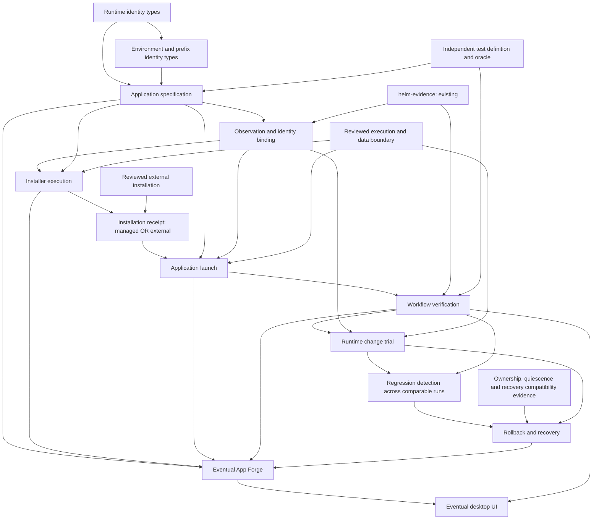

# Second HELM product module — architecture selection

**Status:** bounded module selection accepted by owner; schema/API remain proposed and implementation is not authorised.\
**Analysis date:** 2026-09-08.\
**Owner acceptance/refinement date:** 2026-09-08, repository owner Djomla83.\
**Authoritative starting main:** `0b72e14f5d6101c281a8d9823168407da3e71b9a`.\
**Original analysis commit:** `08f29c53095a51947e9662ad2d0d7931ccb606ae`, preserved without rewriting history.\
**Refinement branch:** `docs/app-spec-owner-acceptance`.\
**Recommendation:** A, **`helm-app-spec`**, a pure, non-executable application contract with small runtime/environment identity types inside the same crate.

This is the **selection analysis**, not an implemented specification.
[ADR-0021](../adr/ADR-0021-second-product-module.md) is authoritative for the accepted boundary:

> Build a pure, non-executable application specification/validation library before observation or lifecycle execution.

Acceptance does not stabilise the eventual schema/API or authorise implementation. The concrete
schema, API, internal type placement, numeric parser limits and later-module sequence below remain
design sketches, constrained by the owner's requirements. Neither document accepts another ADR, chooses
HELM's product track, authorises the larger Evidence Loop PoC, or authorises module implementation.

## 1. Reconstructed state and evidence classes at the original main

Executed `git fetch origin main`; `git rev-parse HEAD main origin/main` returned the starting SHA
above three times. `git status --porcelain=v1` was empty. Work then branched from that exact commit.
That original selection task made no main edit or remote publication. The later owner-authorised
documentation publication is recorded separately in section 18; the original history is preserved.
The table below describes the starting main, before the bounded ADR-0021 acceptance above.

| Class | Authoritative material and conclusion |
|---|---|
| Accepted decisions | [ADR-0020](../adr/ADR-0020-documentation-language.md) alone is Accepted: documentation language. The [owner acceptance record](../PROJECT_STATE.md#helm-evidence-owner-acceptance) accepts the corrected experimental `helm-evidence` module, not an architecture, licence or production release. G0-2 was accepted only as a controlled HRESULT comparison. A0 was accepted as a completed experimental baseline retaining FAIL. |
| Implemented, inspected source | [Cargo workspace](../../Cargo.toml) has one member, `helm-evidence`. Its [README](../../crates/helm-evidence/README.md), [model](../../crates/helm-evidence/src/model.rs), [verifier](../../crates/helm-evidence/src/lib.rs), [filesystem access](../../crates/helm-evidence/src/bundle.rs), [oracle adapter](../../crates/helm-evidence/src/oracle.rs) and [CLI](../../crates/helm-evidence/src/main.rs) define experimental 0.1. There is no application specification, runtime selector, installer or launcher product module. |
| Recorded execution, with artifacts | [A0 report](../experiments/EXP-009-APP-BASELINE-REPORT.md#current-assessment): installation and installed identities recorded, W1/V1 failed the required destination, R1 occurred, W2/V2 passed narrowly. [Gate 0 report](../experiments/EXP-009-GATE0-REPORT.md#current-assessment): G0-2 controlled comparison PASS; original G0-3 and G0-1/4/5 BLOCKED; separate G0-3a/3b mechanics observations remain valid within their stated limits. These are historical executions, not executions performed for this selection. |
| Independent review | [Independent review](../implementation/HELM-EVIDENCE-INDEPENDENT-REVIEW.md) reproduced and corrected symlink-open races, blocking FIFO-open races, duplicate decoded expectations and reserved section IDs. Its Windows/Linux checks are recorded evidence. It expressly does not establish truthful capture, freshness, atomic snapshots, hardlink origin or general hostile-filesystem safety. |
| Proposals | [Decision index](../DECISIONS.md): ADR-0001 through ADR-0019 are Proposed. [RFC-0001](../rfc/RFC-0001-app-evidence-model.md) and [RFC-0002](../rfc/RFC-0002-threat-model.md) are Draft. The [master plan](../../HELM_MASTER_PLAN.md) is originating requirements and proposals, not proof of subsystems. Its old implementation/status snapshots are superseded by current project state. |
| Hypotheses | A small shared contract will reduce ambiguity before capture/execution; runtime pinning will reduce some regressions; reviewed data ownership will permit safe recovery. None is a measured HELM product benefit. The motivating communication-app failure, Track A/Track B choice and comparative operating cost remain unresolved. |
| Future ideas | App Forge, catalogue, desktop UI, recovery product, own runtime builds, OS image and SDK remain future work. A module-selection recommendation does not accept their architecture. |

Read [AGENTS.md](../../AGENTS.md), [AGENT_STARTER.md](../../AGENT_STARTER.md), the master plan,
project state, decision index, [EXP-009](../experiments/EXP-009.md), both reports, the source and
reviews above. AGENT_STARTER's EXP-001 assignment is historical; the current owner instruction
bounds this task to selection and documentation.

Relevant proposal tensions are preserved rather than resolved by assumption:

- [ADR-0013](../adr/ADR-0013-pinned-wine-runtime.md) proposes HELM-built runtimes and `WINEARCH=wow64`.
  A0 actually used upstream WineHQ packages and `WINEARCH=win64`. Neither own builds nor that
  proposed architecture value is required by the observed result.
- [ADR-0014](../adr/ADR-0014-version-scoped-profiles.md) proposes application/substrate applicability
  ranges and a catalogue identity. An exact local contract does not require either ranges or a
  global identity namespace.
- [ADR-0015](../adr/ADR-0015-evidence-expiry.md) contains explicit corrections to its novelty and
  automation claims. `helm-evidence` implements declared-evidence verification, not that ADR's
  expiry, gating, capture or catalogue proposal.
- [ADR-0004](../adr/ADR-0004-appforge-orchestration.md), [ADR-0006](../adr/ADR-0006-versioned-runtime-lifecycle.md)
  and master chapters 14–18 discuss preparation, packaging and maintenance. Their larger pipeline
  does not determine the next crate's scope.
- [ADR-0005](../adr/ADR-0005-sandbox-boundary.md), [ADR-0016](../adr/ADR-0016-host-side-sandbox.md)
  and [ADR-0017](../adr/ADR-0017-data-safety-rules.md) separate confinement and data recovery.
  G0-3b supports a specific data-loss counterexample, not acceptance of their mechanisms.
- [ADR-0019](../adr/ADR-0019-scope-boundary.md) leaves the broader product choice open. This analysis
  chooses an enabling module for the current bounded work, not a replacement product mission.

## 2. Precisely bounded candidates

The comparison uses the smallest useful form of each candidate. “Module” does not imply a service
or a separate crate for every domain concept.

| Contract dimension | A — declarative application specification | B — runtime/environment identity model | C — minimal lifecycle runner |
|---|---|---|---|
| Exact responsibility | Validate an immutable desired application contract: source identity, requested runtime artifact set, small environment declaration, entry-point reference and independent verification-definition references. | Represent runtime artifact sets and environment instances/observations, and compare separately supplied requirements and observations within an explicit measured scope. | Execute one explicitly selected install or launch request in a supplied lab environment, record its attempt and bounded completion, and preserve failure evidence. No autonomous workflow loop. |
| Inputs | Bounded UTF-8 JSON bytes; no inferred machine defaults. | Typed desired identity and independently supplied observation records, including provenance and unknown fields as explicit unknown states. | Reviewed app contract, concrete runtime/prefix binding, explicit argv/cwd/environment, execution permission, operation limits and capture destination. |
| Outputs | Validated specification with exact document digest, or bounded field-specific errors. Validation means only that the declaration is coherent. | Per-field MATCH / MISMATCH / UNKNOWN / NOT_REQUIRED with measurement scope; never a compatibility or execution-success verdict. | Attempt record: selected inputs, observed process identity where obtainable, output streams, termination/timeout, mutations and capture limitations; records consumable by evidence tooling. |
| Side effects | None in the library. | None for a pure model/comparator. A filesystem observer is an additional responsibility and is not smuggled into this candidate. | Starts processes; installer and application can write prefix/user/external state, use display/network and create descendants. Writing capture files is also a side effect. |
| Data model | `AppSpec`, `ArtifactIdentity`, `RuntimeRequirement`, `EnvironmentRequirement`, `EntryPointRef`, `VerificationRef`. Desired state only. | `RuntimeRequirement`, `RuntimeObservation`, `EnvironmentInstanceRef`, `EnvironmentObservation`, `ObservationScope`, `IdentityComparison`. Mutable instance is distinct from immutable record revision. | `InstallRequest` or `LaunchRequest`, `BoundEnvironment`, `AttemptId`, `CaptureRecord`; no claim that a process exit establishes workflow completion. |
| Relationship to helm-evidence | References its schema/version as an evidence format; does not replace its contract or generate verdicts. No production crate dependency is necessary. | Can be used by an adapter interpreting identity records whose bytes helm-evidence checks. helm-evidence 0.1 itself has no typed runtime/environment comparison. | Produces records/attachments; independent verification consumes them. Does not author the expected result from its actual output. |
| Wine/Linux dependency | None at runtime; represents a small Wine-oriented declaration as data on any supported Rust host. | None for parsing/comparison. Probing Linux files, package state or `/proc` would need a separately reviewed observer. Running `wine --version` is execution, not a pure read. | Actual Linux/Wine execution, process/session handling and prefix semantics. A desktop GUI operation also needs the selected desktop/capture boundary. |
| Security boundary | Untrusted bytes → strict inert types; no paths or URLs are opened, no capability granted. | Untrusted observation → scoped comparison; provenance is not authentication. No filesystem or process authority in the pure version. | Crosses into application authority. An unprivileged Wine process can still access what its host account can access. A prefix is not containment. |
| Later dependents | Observation/binding, install/launch requests, profile revisions, regression comparison; eventual packaging/App Forge/UI. | Specification, observation/binding, runtime-change comparison and recovery attribution. | Workflow capture, verification of new runs, controlled runtime trials; eventual orchestration/UI. |
| Deliberate exclusions | Execution, installation recipes, workflow language, observation/capture, catalogue, compatibility verdicts and recovery. | Acquisition/build/selection/activation of a runtime; prefix creation/snapshot; app workflows and global catalogue. | Package acquisition, runtime switching, rollback, arbitrary shell, daemon, GUI automation language, automatic retries and compatibility certification. |

**A includes the identity vocabulary B needs; it does not include B's observation/comparison
subsystem.** Identity concepts come first in design order, but a separate crate need not come first
in implementation order. If B were just a `RuntimeId(String)` plus `PrefixPath`, it would prevent
neither version-label collisions nor path reuse and would not be a useful second product module.

## 3. Dependency DAG and stability requirements

Arrows mean “requires this contract or its evidence before safe use”, not necessarily Cargo
dependencies. Runtime and environment boxes are initially types **inside A**. Existing experimental
`helm-evidence` remains independent. Installation sources form an explicit **OR**: later managed
installation or a reviewed external installation receipt, as in the historical A0 baseline.



This is a partial order for the likely product path. Runtime change trials use fresh isolated
state and explicit data boundaries; they must not modify an active user environment merely to
obtain a regression signal. Historical A0 can be verified now without a HELM runner. Likewise a
future launch module can use a reviewed preinstalled application without first shipping an
installer. The UI need not wait for every App Forge feature, but any operation it exposes must
already have a tested underlying contract.

| Before | Concepts that must be stable enough for that bounded use |
|---|---|
| Application specification | Digest semantics, declared versus observed identity, local app label versus artifact, environment requirement versus mutable instance, independent test-definition reference. No global ABI stability required. |
| Observation/binding | How a requested artifact set is compared with measured files; incomplete measurement stays UNKNOWN; observation source/time/run scope; path is a locator, not instance continuity. |
| Installer execution | Explicit source and runtime binding, fresh-prefix/adoption policy, unprivileged containment boundary, data ownership defaults, process/timeout/capture contract and failure preservation. |
| Application launch | Entry-point identity from a reviewed install receipt, concrete environment binding, execution policy, arguments/session inputs, and no implicit prefix creation or runtime fallback. |
| Workflow verification | Independently frozen oracle/definition, operation records, output namespace, required destination, controls and restart semantics; evidence completeness separate from experiment outcome. |
| Runtime change | Old/new identities, what remains fixed, fresh-state or activation semantics, quiescence and data compatibility evidence. A version-string change alone is not a controlled trial. |
| Regression detection | Comparable app/build, test contract, observations and evidence scope across runs. Detect changed outcomes before attributing a cause; unrelated host changes can make comparison inconclusive. |
| Recovery | Separate ownership of application/runtime, prefix/configuration, documents and external state; independent recoverable copy and explicit safe recovery scope. An earlier COMPLETE report is insufficient. |
| App Forge and UI | Consume tested contracts; cannot become the authoritative source of identity, permission, expected result or recovery guarantees. |

### Circular-design risks

1. **Spec ↔ evidence digest:** an app spec cannot hash the future bundle while that bundle hashes
   the spec. Reference an independent test definition from the spec; a later detached run record
   references spec, observations and evidence manifest in one direction.
2. **Pre-run contract ↔ result:** helm-evidence 0.1's `bundle.json` includes recorded verdicts and
   artifact/output digests. It is not an executable pre-run test plan. The A0 adapter is explicitly
   post-experiment. Do not generate a supposed preregistration from an observed successful output.
3. **Installer ↔ expected installed files:** installed bytes are unknown before a first install.
   They belong to the installation observation. A later reviewed spec revision may adopt measured
   hashes as expectations for a future run; it cannot retroactively make them pre-run A0 pins.
4. **Runtime identity ↔ prefix contents:** runtime packages may be shared; the prefix changes when
   the application writes. A whole-prefix hash cannot identify the runtime or act as a stable
   application identifier. Separate artifact set, environment instance and observation revision.
5. **Runner ↔ spec/workflow language:** implementing execution first encourages encoding the
   current capture script and 7-Zip dialog actions into the app contract. Keep application intent,
   operation requests and independent workflow definitions separate.
6. **Recovery ↔ ownership:** rollback cannot infer disposable state from “inside this prefix”,
   and an installer cannot assume every file it sees is installer-owned. Unknown ownership blocks
   destructive operations; it need not block inert contract validation.
7. **Evidence verifier ↔ producer:** making helm-evidence depend on the selected spec crate would
   couple all old evidence to a changing producer. Leave 0.1 intact; downstream adapters compose
   validation and evidence checks and retain each result's scope.

### Identity-reference DAG required by the owner

Unlike the dependency DAG above, these arrows mean **references the exact identity of**:

```text
app-spec -> frozen verification definition (including oracle/fixture definitions)
later execution/evidence -> exact app-spec byte identity
later execution/evidence -> observed outputs/results
```

There is no edge from the spec to its resulting evidence bundle. Definition references identify
pre-execution contracts, never a result manifest. A future evidence adapter may bind the exact spec
bytes alongside results; this proposes no change to helm-evidence 0.1. Raw document hashing requires
neither resolving references nor generating evidence, so there is no spec/evidence identity cycle.

## 4. Actual A0 identities and observations

The [registered A0 definition](../experiments/EXP-009.md#application-baseline), its
[pins](../experiments/evidence/app-baseline-2026-09-07/artifact-pins.json), the
[execution index](../experiments/evidence/app-baseline-execution-2026-09-07/INDEX.md) and the
[published result](../experiments/evidence/app-baseline-execution-2026-09-07/result-summary.json)
supply the example. No application or runtime artifact was downloaded or re-executed here.

### Source and runtime

| Object | Identity actually recorded | Scope of knowledge |
|---|---|---|
| Installer | `7z2603-x64.exe`, 7-Zip 26.03, 1,661,239 bytes, SHA-256 `0859c524b8a63551848f0c246abddcb1d0b7b656b0fbfe879f8d85e61a9e6edd` | Original pre-run pin and historical guest verification; not a current local rehash of installer bytes. |
| `wine-devel`, amd64 | `11.17~noble-1`; 11,586,578 bytes; `eb42cc830c0e0582ecb1c5cf94cbfefe5d0a0235caae771035077b5e7b8ddd8f` | Package archive identity, not the installed runtime tree. |
| `wine-devel-amd64`, amd64 | `11.17~noble-1`; 150,150,970 bytes; `9184a81f0848003460526f30a66bd470a997fa0bd43c0d59efcacce0a12adb63` | Package archive identity. |
| `winehq-devel`, amd64 | `11.17~noble-1`; 1,320 bytes; `62873c6d7c5b05710064bc5fa3d9e2be0595edd77bc94c2ed3ea7896fdcb7869` | Meta-package archive identity; not proof of installed dependency bytes. |
| `wine-devel-i386`, i386 | `11.17~noble-1`; 142,140,490 bytes; `599a34d04fd3443a55f5700c3a919f177cdc4ab77b5ee7d6ebcfb87de03cc966` | The x64 application's runtime package set includes this i386 package. Do not collapse application architecture into package architecture. |
| `/opt/wine-devel/bin/wine` | SHA-256 `d96472c8c5e6567bb9d800b1c2261c764a1588d7913d50ef3474357e5f549f33` | Loader-file hash in the provisioning capture. |
| `/opt/wine-devel/bin/wineserver` | SHA-256 `a1be56803e28a53108e51bad14006c05bac220961bf52aa1462166158680d079` | Server-file hash in the same provisioning capture. |

The four archive hashes appear in
[guest download verification](../experiments/evidence/app-baseline-execution-2026-09-07/guest-verified-wine-downloads.json);
loader/server hashes appear in
[provisioning stdout](../experiments/evidence/app-baseline-execution-2026-09-07/guest-wine-provision.json).
All package names/versions and both before/after `wine --version` outputs are recorded, but they
are different observations from hashing a running process's mapped bytes.

[Before](../experiments/evidence/app-baseline-execution-2026-09-07/guest/records/wine-backend-before.json)
and [after](../experiments/evidence/app-baseline-execution-2026-09-07/guest/records/wine-backend-after.json)
process records associate `7zFM.exe` with paths under `/opt/wine-devel`, including
`lib/wine/x86_64-unix/wine`, `winex11.so` and `winex11.drv`. They do **not** give hashes of that
mapped runtime closure. The `/bin/wine` hash is not a hash of all of these files. A0 therefore
supports the recorded package/loader/path observations, not complete attestation that immutable
runtime bytes X executed throughout both workflows. Post-restart loader/server rehashes, full
runtime-tree identity, build compiler/source/patch inventory and atomic capture are not established
by those records. The package-set pin is an explicit partial identity, not a hermetic environment.

### Application environment, installed files and restart

| Object | Recorded fact |
|---|---|
| Prefix | `/home/helmlab/exp009-a0-7zip/prefix`, fresh at initialisation and reused across R1; associated with this application in this lab. No A0 persistent HELM environment UUID, creation-generation token or full prefix-state digest was collected. |
| Declaration and capture | `WINEARCH=win64`, `WINEDLLOVERRIDES=mscoree,mshtml=`, explicit loader path. No winetricks verbs or runtime fallback. These do not assert that every effective registry/DLL policy was independently measured. |
| `7zFM.exe` | Prefix-relative `drive_c/Program Files/7-Zip/7zFM.exe`; 1,003,520 bytes; `7f7067b2264fbf8cbd1348cf7f41a0e35c928de750d53533c963ebe334dbd612`. |
| `7z.exe` | Prefix-relative `drive_c/Program Files/7-Zip/7z.exe`; 577,536 bytes; `6ee3c0ed0b27663c1b948ae85a7c0bb073aed1498983182f3f0df1f6a8c30b2f`. Identified, not used for either GUI archive creation. |
| `7z.dll` | Prefix-relative `drive_c/Program Files/7-Zip/7z.dll`; 1,906,688 bytes; `65e4c1f855f9ef6e8f0f5df8e3f27d9eb5f07311408639da0a1ca0b8f4871b0d`. A DLL identity, not an additional launch command. |
| Installed metadata | All three `0x8664`, file/product version `26.03`; byte identities equal in [before](../experiments/evidence/app-baseline-execution-2026-09-07/guest/records/installed-before.json) and [after](../experiments/evidence/app-baseline-execution-2026-09-07/guest/records/installed-after.json). |
| R1 | Normal guest restart, boot IDs `2d64c822-205d-4bfc-bdaa-f21e50cd38bc` → `77fc6b8f-d5c2-4fec-ba14-d3c680d2e0cb`; not a host restart, checkpoint or recovery. |

The [environment-before](../experiments/evidence/app-baseline-execution-2026-09-07/guest/records/environment-before.json)
and [environment-after](../experiments/evidence/app-baseline-execution-2026-09-07/guest/records/environment-after.json)
records describe Ubuntu 24.04.4, kernel `7.0.0-31-generic`, ext4, GNOME 46 Wayland console;
the application used XWayland and llvmpipe (LLVM 20.1.2), Mesa `25.2.8-0ubuntu0.24.04.2`,
1024×768, scale 1.0. Before-restart colour depth was not separately captured. Host: Windows 11 Pro
10.0.26200, Ryzen 9 5950X, about 64 GiB RAM; guest: 4 vCPUs and fixed 8 GiB RAM.
Wine Windows-compatibility version was not independently established for A0; G0-2's registry
observations are from different prefixes and cannot fill that gap.

The installed-file observer's own environment says `tty` with null Wine variables. The GUI
environment and process records are separate sources. A future importer must identify **whose**
environment was captured, not silently use the SSH helper's environment as the GUI process's.

### Workflows and helm-evidence contract

| Requirement | Preserved A0 observation |
|---|---|
| W1 before R1 | GUI Add operation created `inputs/fixture.zip`; required `outputs/before-restart/workflow.zip` was absent. [Deviation](../experiments/evidence/app-baseline-execution-2026-09-07/workflow-w1-deviation.json) and the failed required-destination verifier are retained. No retry or relocation. |
| V1 supplementary content | Accidental ZIP contents matched the independent frozen tree. This does not complete the required W1/V1 destination. |
| R1 evidence | Different boot IDs and recorded restart command; workflow records identify their corresponding boot. |
| W2/V2 after R1 | Same installed application/prefix; GUI output at `outputs/after-restart/workflow.zip`, independent content check PASS, valid good/broken guest controls. |
| Byte versus content identity | Both observed ZIPs: 2,282 bytes, `8f7b7192808b03275239785bc561127e4a1e3cee5edb8471bfff1d33703356e9`. Content oracle checks decompressed file paths/bytes and required directories; equal ZIP digests alone are insufficient. ZIP bodies are not in the public fixture. |
| Current evidence adapter | [A0 bundle](../../crates/helm-evidence/tests/fixtures/a0-7zip/bundle.json), schema `helm-evidence` 0.1, experiment `EXP-009-A0-7ZIP`, application `7zip-x64`, experimental FAIL. Evidence INCOMPLETE, W1 INCOMPLETE with content PASS, W2 COMPLETE within recorded-evidence scope. |
| Provenance boundary | [Adapter provenance](../../crates/helm-evidence/tests/fixtures/a0-7zip/provenance.json) names publication `ae3f012fb1bfd7b20018c3faf6c71a6740a041fe`. Bundle SHA-256 at the reviewed base, recomputed here: `4f83235c3e782727f9e55a3818db4cdeeca5abf77a09cd8f5ede86f5f4566c19`. This is the post-experiment manifest identity, not the preregistered test contract or private ZIP bytes. |

**What each candidate would represent, without manufacturing missing A0 evidence:**

| A0 element | A: app specification | B: runtime/environment model | C: runner |
|---|---|---|---|
| 26.03 installer | Desired exact source digest; version is metadata. | External application-subject reference; source identity cannot be inferred from runtime. | Explicit install input bound to its verified source, with capture of selection/use. |
| Wine 11.17 | Desired four-artifact set, explicitly limited to archive identities. | Separately supplied package, loader/server and mapping observations; missing loaded-byte binding stays UNKNOWN. | Must resolve the exact runtime without PATH fallback and capture what actually executes. Historical provisioning is imported, never regenerated as a new run. |
| App-specific prefix | Desired application-scoped prefix role, no machine path or invented UUID. | Historical lab-scoped locator plus source record; durable instance/generation unknown. A new opaque ID could identify an imported record, not claim an A0-assigned prefix identity. | Must receive/create an explicitly owned instance through a reviewed lifecycle contract. A0 cannot supply an uncollected creation token. |
| Three installed identities | Entry-point reference; measured hashes stay in installation evidence. Optional future expected entry-point hash needs a reviewed spec revision. | App-file observations can be attached as context; B should not expand into an installer or universal application model. | Records installed files and selected launch executable; only `7zFM.exe` is the A0 GUI entry point. |
| W1 before restart | Reference independent A0 definition; no workflow program in spec. | Associates observations with W1/boot; does not decide destination/content success. | Records the original failed attempt and its actual destination, not a retry-until-green transition. |
| Restart | Defined by the external test contract, not an app setting. | Distinct boot observations, same recorded locator, unknown stronger instance continuity. | Receives an externally performed restart boundary; no authority to reboot the host or guest inferred from app data. |
| W2 after restart | Same desired spec; new observed run. | Separate post-restart observation; equal measured app hashes do not freeze prefix contents. | New explicit launch attempt; W2 cannot replace W1's result. |
| Evidence | Names independent test definition and evidence format. | Supplies typed identity evidence to a downstream adapter; cannot promote opaque records checked by helm-evidence to runtime proof. | Produces capture records for the existing verifier; independent oracle and protocol determine expectations. |

## 5. Desired, declared, observed and verified are different

**Hard architectural boundary:** `helm-app-spec` describes desired/declared state only. It must
never treat declarations as evidence that a runtime was installed, a particular loader executed,
a prefix exists, installation succeeded, an entry point exists, or verification ran. Observed
state belongs to a later module, currently expected to be `helm-observe`. Its observations cannot
be manufactured by copying spec values, even when labels and digests happen to agree. In particular,
A0's observed installed-loader hash is not proof of desired runtime state or a retrospective
pre-run requirement. A later reviewed requirement would still need separate observation evidence.

Keep four layers, even when their values happen to match:

1. **Desired:** an app spec requests particular artifact identities and typed configuration.
2. **Declared observation:** a producer says it measured a file or executed a process; includes
   source record, run/boot context and measurement scope.
3. **Verified record bytes:** helm-evidence opens/hash-checks the declared record artifacts and
   checks its supported contract semantics. It does not authenticate the producer or all claims
   contained in an arbitrary JSON attachment.
4. **Execution binding:** evidence relates the intended runtime, selected loader/server, installed
   payload and actual process at the relevant time. The required scope must be stated; missing
   measurements cannot be filled with desired values. A0 has partial observations, not complete
   immutable execution binding.

A therefore returns **SPEC_VALID**, conceptually, never `runtime_verified` or `ready_to_run`.
B can compare already supplied observations but must report UNKNOWN when bytes or provenance are
missing; MATCH means only “equal within the compared fields”. C must obtain observations as a
separate capture result, not construct them by copying its input request.

Example falsifying input: retain label `Wine 11.17` but change one artifact digest. These are different
requested runtimes. A must preserve the difference; B must detect a mismatch against the old
measured archive; C must not select the old runtime just because its version string matches.
Even all four archive matches do not prove that unmodified installed files actually executed.

## 6. Immutable identity versus metadata

No global catalogue is proposed. Digest equality identifies the stated bytes under the usual
SHA-256 assumption; it does not establish publisher trust, safety, licensing or freshness.

| Object | Immutable identity needed | Human metadata / locator | Mutation and unknown handling |
|---|---|---|---|
| Source installer | SHA-256 of exact source bytes; expected size checked when bytes are supplied later. | Filename, product/version/vendor, origin URL, retrieval time. | Same name/version with different digest is a different source. Module 2 only validates the declaration. |
| Application version/build | Source identity plus observed installed payload identities when known. | `7zip-x64`, `7-Zip`, `26.03`, PE version resource. | Local app ID groups records; it is neither global uniqueness nor a build digest. Self-update creates a new observed build, even if the label is unchanged. |
| Installed executables/DLLs | Per-file digest, recorded scope and time; a complete payload manifest only if actually captured. | Prefix-relative paths, PE architecture and version. | A0 has three file identities, not a complete installation ownership manifest. A DLL and GUI entry point have different roles. |
| Wine runtime; Proton deferred | Desired bounded artifact set, each with role/ID, size and digest. Installed-file observations require separately measured scope. | Wine label/version and artifact labels; observed loader path belongs to later records. | Four WineHQ archives are a partial runtime requirement, not proof of execution. Proton remains outside the initial schema; future support requires evidence and versioned review, not fields added now. |
| Runtime packages in A0 | Archive byte size and digest, attached to a local artifact role/ID. | Package name/version/architecture, repository/suite and URL are metadata. | No cross-distribution package model or acquisition is proposed. Package metadata is not installed/loaded-file identity; transitive dependencies remain a separate measurement question. |
| Prefix/environment instance | Eventually a local namespace + opaque instance ID + creation/adoption generation bound by a receipt, separate from state revision. | Lab/machine identity and path. | An ID identifies a mutable instance, not immutable contents. Same path after deletion is a new generation; a clone needs new identity. A0's durable token remains unknown. |
| Prefix/configuration state | Immutable observation or snapshot manifest revision only for the files/properties actually measured. | Prefix locator and capture time. | No single full-prefix digest, snapshot or state equivalence is asserted for A0. A hash would not prove ownership or recovery safety. |
| Configuration/profile | Exact app-spec document digest; later a separately defined config projection if a consumer needs it. | Profile name, author and revision label. | Initially changing any document byte creates a new spec revision. Labels do not establish equivalent configuration. Applicability ranges/precedence are deferred. |
| Test contract | Independent definition revision and content digest, oracle source identity and fixture expectation identity. | Experiment ID and explanatory path. | A changed definition creates a new test contract. Evidence result manifest is a different artifact; neither may rewrite history. |
| Evidence bundle | Exact `bundle.json` bytes plus the declared artifact digests it binds; scope excludes unlisted files. | Directory path, run label and publication timestamp. | Relocation does not change bytes. Redaction creates different public bytes; raw/public identities remain distinct. This is not authentication or a global run registry. |

The small digest/requirement types belong inside `helm-app-spec` initially. Extract a separate crate
only after at least two real consumers require the same nontrivial semantics and independent
versioning avoids duplicated validation. The concrete bugs such a shared component could prevent
are same-label/different-build aliasing, distinct artifact roles collapsing into one version label,
and path-reuse being mistaken for prefix continuity. A type-only crate without those semantics prevents none of them. Conversely,
filesystem observation is a substantial independent responsibility and can justify a later crate.

## 7. Smallest environment model justified now

An **application environment** is the association of a runtime requirement, a mutable prefix
instance, and explicitly requested configuration. A desired declaration describes the association;
a later binding supplies the concrete instance and observations. It is not a VM image, sandbox,
entire home directory, immutable filesystem tree, or complete reproducible Linux installation.

| Dimension | Include now? | Desired / observed boundary and reason |
|---|---|---|
| Runtime | Yes: explicit Wine artifact-set requirement. | Four separately identified archives are evidenced. Runtime implementation/build policy remains open. |
| Architecture | Yes: app `x86_64` and requested `winearch: win64`; archive architecture labels remain metadata. | Represents A0 exactly; does not normalize it to ADR-0013's proposed `wow64`. Other creation modes need evidence and schema review. |
| Prefix | Yes: application-scoped role in spec; locator/instance in observations later. | A0 uses one fresh application prefix. “Application-scoped” means association, not exclusive ownership or containment. |
| Windows compatibility version | Defer as a setting; A0 observation is unknown. | Do not invent Windows 10 from a different G0 prefix or from Wine defaults. Add only when a preregistered experiment requires setting/measuring it. |
| Dependency set | Bounded runtime artifact list now; further application dependencies deferred. | A0 used no winetricks additions. Retain the guest package inventory as evidence, not a resolver input or proof of a fully hashed closure. |
| Environment variables | No arbitrary map. | `WINEARCH` and DLL policy have typed fields; `WINEPREFIX` is supplied by binding. Display/session variables are ephemeral observation/request inputs for a later runner, not baked-in app identity. No inherited-environment policy is silently selected. |
| DLL overrides | Small typed list of DLL names with disabled mode, sufficient for `mscoree,mshtml=`. | Requested suppression is distinct from an independently observed effective override. No registry editing engine or full winetricks vocabulary. |
| Graphics backend | Observation metadata only. | A0 distinguishes desktop Wayland from application XWayland. No DXVK/VKD3D/GPU selection knobs or portable backend promise follow from a ZIP workflow. |
| Host/kernel/filesystem/display | Preserve in external observation records. | Relevant to interpretation/comparison, not all frozen into a universal app-spec hash. None is discovered by module 2. |

These are deliberate limits, not defaults for every application Wine could run. Unknown/unsupported
required settings must reject the proposed 0.1 spec rather than be silently ignored or approximated.

## 8. Data and future recovery boundary

| State domain | Ownership at this stage | Consequence for later operations |
|---|---|---|
| Application/runtime payload | Source/package identities and selected installed-file observations. | Replacement needs its own receipt; identifying bytes does not authorise uninstall, mutation or redistribution. |
| Prefix/configuration | Mutable and potentially mixed; ownership unclassified. | Do not mark the entire prefix disposable. Configuration can contain activation, databases or documents. No automatic restore/delete policy follows from the spec. |
| User documents | User-owned even when physically inside the prefix. A0's synthetic inputs/outputs are outside it. | Preserve by default. Known A0 fixture locations do not establish all write locations of 7-Zip or another app. |
| External/server state | Outside the local filesystem model and unassessed here. | Local rollback cannot undo server changes. Credentials, synchronisation and licence activation require separate evidence; A0 tested none of them. |

In [G0-3b's actual record](../experiments/evidence/G0-3b-wine-registry-wsl2.json),
`checks.Q3_post_copy_document_survives_restore.survived_whole_prefix_restore` is **false**.
A synthetic document created after the independent full copy was absent after restoring that copy.
This was Wine 11.17 on WSL2 kernel `6.6.87.2-microsoft-standard-WSL2`; it was not an A0/7-Zip
recovery experiment. It demonstrates loss of post-snapshot data, not successful application recovery
or induced registry corruption. The same record distinguishes hardlink contamination from full-copy
independence. Those properties do not make whole-prefix restoration safe for user work.

The next module must expose no restore/delete API, must treat prefix ownership as unclassified,
and must keep immutable requirements separate from mutable instance references. This leaves room
for later measured ownership and safe recovery without committing to snapshots, manifests, tier
migrations or a rollback implementation now. No “safe_to_rollback” boolean is accepted.

## 9. Security comparison

**Owner-required pure boundary:** normal validation is bytes-to-validated-model only. It performs
no filesystem access, network access, process execution, Wine/runtime discovery, environment
inspection, package lookup or prefix creation. Any relative paths are inert validated data.

A's library can remain **pure, deterministic, local and unprivileged**, with no filesystem reads
at all: input bytes and output values only. File selection/read is a caller responsibility; even
an inert path in the spec is not permission to open it. B's model can meet the same properties;
an actual observer is read-only but no longer pure and needs explicit read capabilities. C is
local/unprivileged only in a bounded sense: its child process acquires filesystem, session and
possibly network authority. It cannot be pure or read-only.

Untrusted entry points include spec JSON, version labels, path strings, downloaded artifacts,
installer output, observation records, GUI/capture text and externally authored test definitions.
The selected library interprets only its closed schema. It does not execute a referenced test,
follow URLs, expand variables, inspect PE files, read secrets or honour instructions inside text.
Diagnostics must use bounded field IDs/codes instead of echoing raw input or local private paths.

The [independent evidence review](../implementation/HELM-EVIDENCE-INDEPENDENT-REVIEW.md#hostile-filesystem-outcomes-and-limits)
is a reason to postpone a second filesystem reader until it has a real observation contract.
Copying a canonicalize/check/open sequence would recreate a reviewed class of error. This proposal
uses no filesystem helper, and does not claim immunity from parser/dependency defects.

## 10. Scoring, with explanations

Every score is 1–5, **5 is favourable**. For coupling risk and premature abstraction, 5 means
*least* risk. Scores are engineering judgments, not measurements. A is the restricted version in
this report; a universal install/launch/workflow specification would score much worse.

| Criterion | A | B | C |
|---|---|---|---|
| Dependency-order correctness | **5:** supplies the missing app boundary, with prerequisite identity types developed internally before consumers. | **4:** identity precedes execution, but a standalone component still needs an app subject and environment ownership context to constrain its useful contract. | **1:** execution currently lacks reviewed specification, instance binding, lifecycle and capture contracts. This is blocking. |
| Testability | **5:** bounded bytes → typed declaration/errors; A0 and hostile synthetic declarations need no Wine. | **5:** scoped identity comparisons are pure with independent recorded/synthetic inputs. | **2:** process tests are possible, but useful confidence also needs a Linux/session/containment lab and failure capture. |
| Reversibility | **5:** experimental documents/types, no installation state or data migration. | **5:** pure records/comparator can be revised without changing a prefix. | **2:** failed installers and applications can alter files and external state; process termination does not reverse those effects. |
| Security simplicity | **5:** no execution, network or filesystem authority. | **5:** equally simple only while confined to supplied records; a scanner changes this score. | **1:** child authority, inherited environment, writes and process descendants introduce unresolved boundaries. |
| Coupling risk | **4:** reference-only links and internal types keep consumers separate; a risk remains of growing the spec into recipes. | **3:** extracting identity now risks a shared “all environments” abstraction and parallel app-subject types without a second consumer. | **1:** likely to freeze experimental capture, Wine paths and GUI assumptions into the core. |
| Immediate usefulness | **4:** validates a reviewable desired subject and exact runtime inputs instead of scattered script constants; does not yet prove their use. | **3:** clarifies identity and unknowns, but helm-evidence 0.1 has no typed consumer and capture remains external. | **3:** could automate setup/launch effort, but does not solve W1's destination error without independent verification and GUI actuation. |
| Leverage for next modules | **5:** common input for observation/binding and later explicit operation requests. | **4:** reusable for runtime comparison and recovery attribution, but install/launch still need app/verification intent. | **3:** supplies new records, but consumers inherit an unsettled contract if built now. |
| Risk of premature abstraction | **4:** exact pins, one entry point, inert references; no applicability ranges or workflow DSL. | **3:** a types-only crate may be unnecessary; a meaningful identity engine can overgrow into a runtime catalogue or whole-environment fingerprint. | **1:** choosing process supervision, prefix ownership, workflow and runtime selection together is premature. |

No arithmetic average chooses the winner. C's missing execution and identity contracts block it
regardless of convenience. A and pure B are close on safety; **A wins because it gives the identity
types one concrete consumer and a small falsifiable boundary without creating a shared crate in
advance**. B's concepts are not postponed; its separate component and observer are.

## 11. Recommended module and public API sketch

**Name:** `helm-app-spec`, experimental 0.1, library only, `publish = false`.

**Single responsibility:** validate and identify a bounded, non-executable declaration of one
application's desired source, runtime, environment, entry point and independent verification references.

Proposed API only; none of these functions or types exists in product code:

```rust
pub fn parse_spec(json: &[u8]) -> Result<ValidatedAppSpec, SpecErrors>;

impl ValidatedAppSpec {
    pub fn document_id(&self) -> SpecDocumentId;
    pub fn application(&self) -> &ApplicationRequirement;
    pub fn runtime(&self) -> &RuntimeRequirement;
    pub fn environment(&self) -> &EnvironmentRequirement;
    pub fn entry_point(&self) -> &EntryPointRef;
    pub fn verification(&self) -> &VerificationRef;
}

// Private constructors preserve validation invariants.
// SpecDocumentId identifies exactly the input document bytes, not its truth.
// SpecErrors contains bounded field/code diagnostics, never an execution verdict.
```

No CLI is needed to falsify this contract. No `install`, `launch`, `ensure_environment`,
`verify_runtime`, `restore`, `resolve_latest` or observer API is included. Proposed internal layout:

```text
crates/helm-app-spec/
  Cargo.toml             experimental library; workspace lints
  README.md              authoritative implemented contract if later authorised
  src/lib.rs             public entry and validated views
  src/model.rs           strict desired-state records
  src/identity.rs        digest and reference domain types, not a new crate
  src/validate.rs        bounded semantic rules and diagnostics
  tests/contract.rs      A0 representation and independent negative cases
  tests/boundaries.rs    malformed input, determinism and authority constraints
```

This layout is a sketch, not a request to scaffold files. The existing crate, schema, tools,
lockfile and workflow stay unchanged in this documentation task.

### Minimal proposed schema, illustrated with A0

The following JSON is a **new design example assembled after A0**. The source/runtime requirements
come from its pre-run pins, and the test references identify its original definition commit.
It is not an A0-authored app spec, a collected observation or an already supported file format.
The entry point is named by the registered workflow; its expected installed digest remains null
because the first-run definition did not know it. The real measured installed hashes remain above.

```json
{
  "schema": "helm-app-spec",
  "version": "0.1",
  "application": {
    "id": "7zip-x64",
    "name": "7-Zip",
    "version_label": "26.03",
    "architecture": "x86_64",
    "source": {
      "sha256": "0859c524b8a63551848f0c246abddcb1d0b7b656b0fbfe879f8d85e61a9e6edd",
      "bytes": 1661239
    }
  },
  "runtime": {
    "kind": "wine",
    "label": "Wine 11.17",
    "identity_scope": "declared_artifacts",
    "artifacts": [
      {
        "id": "wine-devel-amd64-archive",
        "label": "wine-devel 11.17~noble-1 (amd64)",
        "sha256": "eb42cc830c0e0582ecb1c5cf94cbfefe5d0a0235caae771035077b5e7b8ddd8f",
        "bytes": 11586578
      },
      {
        "id": "wine-loader-amd64-archive",
        "label": "wine-devel-amd64 11.17~noble-1 (amd64)",
        "sha256": "9184a81f0848003460526f30a66bd470a997fa0bd43c0d59efcacce0a12adb63",
        "bytes": 150150970
      },
      {
        "id": "winehq-devel-amd64-archive",
        "label": "winehq-devel 11.17~noble-1 (amd64)",
        "sha256": "62873c6d7c5b05710064bc5fa3d9e2be0595edd77bc94c2ed3ea7896fdcb7869",
        "bytes": 1320
      },
      {
        "id": "wine-loader-i386-archive",
        "label": "wine-devel-i386 11.17~noble-1 (i386)",
        "sha256": "599a34d04fd3443a55f5700c3a919f177cdc4ab77b5ee7d6ebcfb87de03cc966",
        "bytes": 142140490
      }
    ]
  },
  "environment": {
    "prefix_scope": "application",
    "winearch": "win64",
    "dll_overrides": [
      {"dll": "mscoree", "mode": "disabled"},
      {"dll": "mshtml", "mode": "disabled"}
    ],
    "data_ownership": "unclassified"
  },
  "entry_point": {
    "prefix_relative_path": "drive_c/Program Files/7-Zip/7zFM.exe",
    "expected_sha256": null
  },
  "verification": {
    "experiment": "EXP-009-A0-7ZIP",
    "definition_commit": "5a83f8cb2fbb5a3597ddff6b5cae9cb813f1c5ae",
    "definition": {
      "path": "docs/experiments/EXP-009.md",
      "sha256": "bd55677cc1724d078ee25dfbcbbc966350b20c129475bdcad28d2603785a2240"
    },
    "oracle": {
      "path": "tools/app_baseline.py",
      "sha256": "2ffec610149ad7aee94ed891af48c2c6623062937d3a5087449523a6d81e57e2"
    },
    "content_manifest": {
      "path": "tools/fixtures/exp009-7zip.json",
      "sha256": "75d78bc6bc0f539df5ca8d54df34f406e44f2aa5ceb8a07bf3d856ce72747c8f"
    },
    "evidence_schema": "helm-evidence",
    "evidence_version": "0.1"
  }
}
```

The three verification digests were computed from exact Git blob bytes at the stated commit,
not from the subsequently annotated working-tree EXP-009 document. `definition_commit` scopes all
three paths to the caller's selected repository; this module does not discover, clone or read it.
Their hash syntax is validated, but their referenced bytes and semantic contents are not validated
by `parse_spec`. A future consumer must resolve and check them explicitly before use.

### Schema semantics and deliberately small rules

- Each runtime artifact requires a local role/identifier (`id` in this sketch), byte size and
  SHA-256, with optional bounded human label/version metadata. Required source/artifact digests
  are exactly 64 lowercase hex characters; byte lengths are positive bounded integers. Labels such
  as `Wine 11.17` alone are invalid runtime identity. An unchanged label with a different digest
  remains a different requirement. IDs identify roles within this document, not a global catalogue.
  A0's archive package names/versions/architectures appear only as explanatory labels; validation
  performs no package acquisition, lookup, cross-distribution modelling or dependency resolution.
- All nested objects reject unknown and duplicate decoded fields. Duplicate artifact identifiers,
  duplicate DLL names (ASCII case-insensitive), malformed UTF-8, unsupported schema versions and
  unsupported runtime kinds/settings are errors. No extensions map, JSON expressions or includes.
- Initial supported domain is an x86_64 app with a declared Wine artifact set and `win64` prefix
  requirement. Proton, native apps and other architecture/settings support require later schema
  review; no generic runtime-provider abstraction is included. Artifact declarations identify bytes,
  not a package format or extraction method. The example's four archives do not freeze a Debian
  package model. A non-archive declaration would still neither install nor attest to installed state.
- Proposed bounds: 64 KiB document, 1–16 runtime artifacts, 0–8 disabled DLL declarations, 1–80 ASCII ID
  characters, 256-byte metadata labels, 1,024-byte/32-component relative references; no NUL/control
  text. Entry-point and repository paths use a documented narrow portable spelling, rejecting
  absolute paths, traversal, URL/drive/device spellings and expansion syntax. They are never opened.
  This limit covers A0, not every legitimate Windows filename. Keep the JSON parser's recursion bound.
- Enforce the input byte bound before parsing. Unknown mandatory schema versions and ambiguous
  declarations must reject; identifiers, digests and path spelling must validate deterministically.
  Malformed untrusted input must not panic. Specify stable error codes and deterministic validation
  and error ordering, including multiple invalid fields. These are requirements for implementation,
  not a claim that the proposed parser exists or that its safety has been tested.
- `expected_sha256: null` means no expected installed-entry-point bytes are specified, **not** that
  an executable is verified. A future execution gate needs an independently reviewed installation
  identity or a new spec revision with a pin. No installed identities can be invented to satisfy it.
- `data_ownership: unclassified` is the only initial ownership declaration; it grants no access or
  disposal right. A future classifier must not interpret this as empty/no user data. `prefix_scope`
  is a role, not an absolute path, persistent ID, ownership proof or sandbox claim.
- The definition/oracle/content references describe the bounded existing ZIP verification case.
  They are inert, independently versioned resources, not tasks. A second oracle type should first
  expose a concrete limitation; do not build a generic test-provider/plugin protocol now.
- `SpecDocumentId = SHA256(exact input bytes)`; there is no new canonical-JSON algorithm or semantic
  canonicalisation in 0.1. Semantically equivalent but byte-different specifications may therefore
  have distinct document identities. Hash the original input, never a parsed/re-serialized model.
  Formatting or label changes produce a new document revision while individual artifact digests
  retain their meaning. Artifact order is not execution order;
  deterministic diagnostics can retain declaration order. Consumers must not compare document IDs
  as proof of runtime equality.

### Why install/launch instructions wait

Include application identity, desired runtime, environment declaration, an inert entry-point
reference and verification references. **Do not include an executable install definition now.**
A0's ordinary installer procedure stays in the independent experiment document. Likewise the
entry-point path supplies identification, not arguments, working directory, session handles,
shell text, conditional steps, GUI coordinates or an inherited-environment policy.

No `install: [commands...]`, post-install hook or arbitrary launch command is accepted by 0.1.
A later operation request can add explicit typed executable/argv/cwd and permission/capture inputs
after evidence fixes their semantics. That is a bounded contract revision before runner work,
not a reason to freeze a universal installer language now.

### Dependencies, scale and security assumptions

Reuse existing locked `serde 1.0.228`, `serde_json 1.0.149` and `sha2 0.10.9`; existing Rust 1.95,
edition 2024 and workspace safety lints. No `cap-std`, async runtime, database, network, CLI framework
or production dependency on `helm-evidence` is necessary. Test tooling may inspect existing local
fixtures; that authority is not exposed by the library. No dependency upgrade or HELM licence
choice is implied. Recheck dependency suitability when implementation is separately authorised.

**Estimated implementation:** 400–700 physical Rust LOC under `src`, plus 400–650 meaningful test
LOC: **800–1,350 total**, excluding fixture data, README, generated/build files and lockfile.
This is a planning estimate, not a measurement or deadline. It assumes library-only strict parsing,
validation and document hashing. If implementation needs over about 800 product LOC because of
execution, generic providers, canonicalisation or discovery, revisit scope rather than adding them.

Assume an uncompromised process/toolchain and ordinary SHA-256 collision resistance. No input is
trusted merely because it parses. There is no capture authentication, atomic snapshot, executable
verification, runtime selection, permission enforcement or recovery guarantee. Determinism is over
the same input bytes and pinned implementation; no clock, host environment or filesystem enters it.

## 12. Why alternatives wait, and minimum conditions for execution

**B as a separate crate:** postpone extraction until there are consumers and stable comparison
semantics. A needs a handful of domain types now, so build them there. An observation component is
more useful next than a package called “runtime manager” that merely stores version strings.
If independent review establishes that a useful pure identity comparator is the real missing
consumer and A adds only wrappers around it, reverse the selection; that is a falsifier below.

**C:** enough is known to record a single experiment script, but not enough to ship a generic
product runner without taking unreviewed policy decisions. Concrete missing contracts:

| Missing contract | Why A0 plus helm-evidence does not settle it |
|---|---|
| Runnable request | No app-spec or typed install/launch operation exists; capture scripts contain lab-specific setup and GUI/session choices. The inert path in A is not a runnable request. |
| Runtime selection and binding | Exact archives are known, but no product interface binds a requested runtime to installed/loaded files at execution time, defines missing evidence, or handles selection races and existing wineserver reuse. |
| Prefix lifecycle and ownership | No product creation/adoption token, generation, locking/concurrency rule, data classification or safe failure cleanup contract. Path reuse and automatic `wineboot` must not decide these implicitly. |
| Capture/evidence interface | `helm-evidence::verify(&Path)` is consumer I/O. It does not capture processes, define an independently frozen pre-run plan, bind a report to its selected root digest, or make output observation truthful. |
| Execution authority | G0-5 remains BLOCKED. A0's trusted-software VM and unprivileged account are one lab arrangement, not a demonstrated arbitrary-app host sandbox. |

A minimum later runner would accept exactly one operation and explicit capabilities; use absolute
resolved runtime entry points without PATH fallback; bind the prefix/installed entry point to a
reviewed receipt; supply an explicit environment/session policy; bound output, time and descendants;
record every failure; and retain resulting state for inspection. No automatic retries, recursive
cleanup, runtime fallback, host reboot or rollback. Installer execution needs a fresh/adopted prefix
policy and mutation receipt; launch of a reviewed existing installation can be evaluated first.
No 7-Zip-specific conditionals, ZIP validation or dialog actions belong in that runner's core.

Existing tools must be considered before execution work. The primary
[Lutris installer documentation](https://github.com/lutris/lutris/blob/master/docs/installers.rst)
was read on 2026-09-08: it already describes acquisition, configuration, variable substitution and
executable/shell operations. This supports reusing/evaluating a mature execution layer later; it
does not establish that its existing interface meets HELM's evidence/authority contract. Its moving
master revision was not pinned here, so no version-specific implementation or negative capability
claim rests on it. The Bottles documentation route was attempted but did not yield a substantive
page body; it supplies no new verified comparison. No upstream tool was installed or benchmarked.

## 13. Explicit non-goals and deferred architecture

1. No installer execution, application launch, prefix creation/adoption, runtime switching or process supervision.
2. No general package manager, dependency resolver, new `.happ` format, package distribution or universal installer/workflow language.
3. No own Wine build, Proton/VM abstraction, compatibility backend replacement, or automatic runtime acquisition/selection.
4. No App Forge or automatic AI configuration generation; no novel static-analysis claim.
5. No compatibility catalogue, global application namespace, signing/expiry/revocation service or compatibility rating.
6. No daemon, event bus, RPC, database, cloud service or network access.
7. No GUI, desktop shell/compositor or custom desktop integration.
8. No new programming language, plugin ecosystem, executable extensions or arbitrary hooks.
9. No data ownership classifier, rollback/recovery, snapshot, migration, uninstall or deletion policy implementation.
10. No replacement of helm-evidence, independent ZIP oracle, lab capture tools or historical A0 records; no claim of truthful capture from declarative data.

## 14. Tests and acceptance criteria for a later implementation

These are proposed future tests, **not executed tests of a new module**. Expectations must be
derived/reviewed independently of the implementation. The author must not be the sole author of
reference expectations or the final release approver.

| Test family | Independent expectation and useful failure caught |
|---|---|
| A0 representation | Parse the example without inventing a prefix ID, Windows version, installed hash or runtime attestation. Compare embedded pins and original Git-blob references to the existing records. This is an explicitly retrospective spec fixture. |
| Identity mutation | Change a source/artifact digest while keeping labels: distinct requirements; missing/malformed digest rejected. Duplicate artifact IDs, including conflicting digests for one role, reject. Two semantically equivalent valid documents differing only in whitespace/key order have their own exact-byte hashes; no canonicalization occurs. |
| Desired/observed separation | Observation/status fields in an app spec reject. Null entry-point expectation remains unconstrained, never “verified”. Declaration validity must not yield an execution-readiness or compatibility result. |
| Application independence | A clearly synthetic second app with different names, versions, paths and artifact counts uses the same code path; no real second-app compatibility claim. Prevent hardcoded `7zip`, Wine release or experiment-ID branches. |
| Closed schema and parser | Duplicate decoded/escaped fields, malformed UTF-8, overflowing lengths, excessive lists, unsupported mandatory versions/kinds, arbitrary hooks, environment maps, unknown fields/DLL modes and recursion/byte bounds reject deterministically without panic. Boundary and adversarial malformed-input cases must check stable errors and ordering. |
| Reference boundaries | Absolute/traversal/device/URL/expansion spellings reject. Hashes/paths are inert; nonexistent external resources cannot trigger discovery or execution. Definition bytes later resolved at a different commit must not be substituted just because the path matches. |
| Data and instance boundary | Cannot declare a prefix safe to erase/restore, turn a path into a durable environment ID, or represent unknown ownership as no user data. No global state is created by validation. |
| Evidence coexistence | Existing A0 evidence fixture remains byte-identical. Existing verifier still reports W1 INCOMPLETE with content PASS, W2 COMPLETE in recorded scope, overall INCOMPLETE and experimental FAIL. The new spec does not patch old verdicts or retrofit a pre-run bundle hash. |
| Determinism/authority | Same bytes produce identical typed views, ID and error ordering under the pinned build on Windows/Linux, irrespective of cwd, environment, clock or unavailable network. Source/dependency review establishes no runtime I/O/execution path; no broad security proof is claimed. |

Acceptance requires all of the following:

- One experimental library implementing only the declared responsibility, with documented bounds,
  exact byte identity semantics and no public unchecked constructor for validated values.
- All tests above have independent expected outcomes and pass; initial A0 fixture is labelled
  retrospective, and the second-app fixture synthetic. Preserve any failing regression before fixes.
- `cargo fmt`, Clippy, relevant Rust tests and locked builds pass on the declared Windows/Linux
  platforms using existing approved facilities; a failed/missing platform remains reported.
- Existing documentation/Python/fixture checks pass. No historical artifact, registered criterion,
  licence, accepted ADR or evidence schema is changed just to support the new module.
- Independent review confirms that no input can cause process execution, filesystem discovery,
  network access, privilege request or silent expansion to install/launch recipes.
- Validation reports only declarative validity. Missing observation and unclassified data remain
  visible limits. The future runtime observer/executor gates are documented, not presented as solved.
- Scope and implementation results return to owner review. An accepted implementation would not
  automatically accept ADR-0013/14/15/16/17/19 or authorise module 3.

## 15. Falsification before implementation approval

Reject or redesign this proposal if a paper/fixture walkthrough already shows any of these;
if discovered during a later authorised implementation, stop expanding the module and report it:

1. A0 needs core conditionals on application name, Wine version, workflow ID or a special 7-Zip path.
2. A0 cannot be represented without fabricating a prefix UUID, whole-runtime digest, Windows
   compatibility value, preregistered installed-file hash or missing output.
3. A valid declaration can be presented as proof the requested runtime executed; or a changed
   digest with unchanged labels aliases to the old identity.
4. The spec must embed the future evidence-bundle digest, or a producer must use its actual result
   to create the independent expected workflow. Either produces a circular or dishonest contract.
5. The schema needs network/database/daemon/catalogue, arbitrary environment templates or
   executable install/launch instructions to provide its claimed immediate value.
6. Identical bytes require host-dependent defaults, timestamps, filesystem case discovery or
   floating version selection to validate, preventing deterministic interpretation.
7. `prefix_scope: application` implies exclusive ownership, or unknown state can authorise deletion
   or restoration of user documents. The G0-3b counterexample must remain representable.
8. Independent review finds that even this restricted A is only boilerplate and B has a concrete
   reusable comparison contract needed first. Prefer B then; do not defend crate count for its own sake.
9. Useful application-independent representation needs more than the stated small domain, or a
   second legitimate case requires arbitrary hooks. Narrow the supported claim or reconsider reuse;
   do not silently turn 0.1 into a universal package/workflow language.
10. A0's immutable evidence/verdicts or the existing verifier must be changed to make the selected
    model look consistent. Change the proposal, not the historical result.

## 16. Tentative next-three-module sequence

```text
Module 2: helm-app-spec — inert desired contract, internal identity types
    ↓
Module 3: helm-observe — bounded read-only runtime/environment observation and comparison
    ↓
Module 4: helm-launch — one bounded launch of an explicitly bound existing installation
```

Module 2 is selected, but its implementation is not authorised. Names/scopes beyond module 2 are
advisory, **not authorisation**. Installer execution,
runtime change, regression product, recovery, App Forge and UI remain beyond this three-module
sequence. Module 4 can consume a separately reviewed external installation receipt; it does not
smuggle installation into launch.

**2 → 3 gate:** owner review of the app contract and independent acceptance tests; demonstrated
representation of A0 and one synthetic different application; exact identity/unknown semantics;
a preregistered observer question such as “same version, changed loader bytes must be detected”.
Specify caller-supplied read capabilities and record origins first. File/package observation can
remain read-only and unprivileged; do not call `wine --version`, `winecfg` or `wineboot` under that
label. A0 can be imported as historical records but does not become a new observation.

**3 → 4 gate:** an approved Linux experiment demonstrates mismatch and missing-observation handling,
separate package/installed/loaded scope, and explicit prefix identity/adoption and path-reuse rules.
A reviewed installed-entry-point receipt, typed launch request, execution/session/containment policy,
timeout/descendant handling and capture adapter must exist before runner implementation. The owner
must separately authorise that execution experiment. Read-only inspection alone cannot establish
which bytes a future process will load; module 4's capture must address selection/use races and
existing wineserver association, or narrow the claim explicitly. No global sandbox claim is allowed.

If these gates need an additional bounded experiment or contract revision, pause the sequence;
three boxes are not a commitment to force execution next. Recovery still needs its independent
ownership/quiescence/data-preservation evidence even after all three modules exist.

## 17. Historical checks for the original analysis commit

This section records the original selection task at `08f29c53095a51947e9662ad2d0d7931ccb606ae`.
Its pending-review status and checks are historical; section 18 records the later owner refinement.

**Changed:** this selection report, one Proposed ADR and its index entry; project state receives
only a pointer saying the analysis exists and awaits owner review. No product source, manifest,
lockfile, test, fixture, tool, CI, experiment criterion, existing ADR status or licence changes.

**Actually checked:** repository fetch/state and source/record inspection described above, followed
by these local checks on Windows 11 10.0.26200, Python 3.14.3, Rust/Cargo 1.95.0,
`x86_64-pc-windows-msvc`, LLVM 22.1.2. The recorded Ryzen 9 5950X host was used; hardware was not
re-benchmarked. These validate this patch and existing evidence behavior, not module 2.

| Command/check | Actual result |
|---|---|
| `python tools/validate_docs.py` | PASS: 86 Markdown files, 225 JSON files; local links and structural invariants only. |
| `python -m unittest discover -s tools/tests -v` | 36 tests PASS. No new product tests were written for this documentation patch. |
| `python tools/helm_evidence_fixture.py` | PASS: 22 files, 40,366 bytes; no historical file changes or application executions. |
| `cargo run --release --locked --offline -p helm-evidence -- verify crates/helm-evidence/tests/fixtures/a0-7zip --json` | Expected exit **1**: INCOMPLETE; W1 INCOMPLETE with CONTENT_RESULT_PASS satisfied and OUTPUT_DESTINATION incomplete; W2 COMPLETE; experimental FAIL retained. Existing product source only. |
| Embedded example/source audit | Source plus four package pins match original records; all three definition/oracle/fixture digests match original Git blob bytes; all 15 displayed distinct SHA-256 values match recorded or recomputed identities. No private installer/runtime/ZIP bytes were rehashed. |
| DAG and scope inspection | 18 nodes / 33 edges, acyclic; exactly the four documentation files described above changed. |
| `git diff --check` and `git diff --cached --check` | PASS after replacing four Markdown two-space line breaks flagged by the first staged whitespace check. |

Local receipts are retained under ignored `target/architecture-selection/`:
`documentation-checks.json`, `a0-report.json`, `a0-check.json`, `report-audit.json` and command
stdout/stderr files. They are local review artifacts, not published experiment evidence. The first
ad hoc digest audit returned exit 1 because its word-boundary search inspected raw JSON escapes
and missed the loader/server hashes embedded after escaped newlines. The corrected audit decoded
JSON string values and passed without changing either hash or any source record. That tooling
failure is retained in `report-audit-initial-failure.json`; it is not an A0 failure or retry.

**Reproducible identity commands:** `git rev-parse HEAD main origin/main`,
`git status --porcelain=v1`; SHA-256 over bytes returned by
`git show 5a83f8cb2fbb5a3597ddff6b5cae9cb813f1c5ae:docs/experiments/EXP-009.md`,
and the corresponding `tools/app_baseline.py` and `tools/fixtures/exp009-7zip.json` blobs.
Use binary capture, not shell text re-encoding: the definition blob is 34,585 bytes, oracle
9,093 bytes, content manifest 1,290 bytes. The current A0 bundle is 5,976 bytes.

**Not checked:** no proposed API/schema implementation, live Wine/application/VM/WSL execution,
runtime byte attestation, second real application, recovery, security certification, deployment or
new CI run. Historical Linux/Rust test results remain attributed to their recorded independent
review, not claimed as rerun here. Upstream comparison was a bounded source check, not a benchmark.

**Blockers:** none for completing this documentation analysis. Implementation awaits an owner
decision; execution additionally has the missing contracts in section 12. Missing A0 observations
are explicit evidence limits, not values to invent.

**One recommended next decision:** review A / `helm-app-spec` as the bounded second-module proposal
and decide whether to authorise its implementation. This task stops at the documentation commit.

## 18. Owner refinement and publication review, 2026-09-08

**Owner decision:** repository owner Djomla83 explicitly accepted only the decision quoted at the
top and in ADR-0021, on 2026-09-08. This supersedes the original pending selection status, not its
evidence, failures or analysis history. Implementation still needs separate authorisation; exact
schema/API design remains unsettled. No other architecture ADR is accepted.

**Repository verification:** `git fetch origin main` confirmed local `main` and `origin/main` at
`0b72e14f5d6101c281a8d9823168407da3e71b9a`. The clean analysis branch pointed to
`08f29c53095a51947e9662ad2d0d7931ccb606ae`, a direct child changing only the four documentation
files listed in section 17. Refinement uses its descendant branch `docs/app-spec-owner-acceptance`;
no amendment, squash or history rewrite is needed. The owner authorises publication through a
normal fast-forward workflow only, never force-push.

**Refinements:** exact-byte document hashing with explicitly distinct identities for semantically
equivalent byte-different documents; hard desired/observed separation; small runtime artifact
requirements with role/ID, size, digest and optional labels; acyclic frozen verification references;
pure bytes-to-model validation; bounded typed environment vocabulary; initial Wine-only scope;
and explicit parser bounds, closed schema, duplicate rejection, deterministic errors and no-panic
requirements. The A0 example now uses artifact identities with package details as metadata rather
than package-resolution fields. Historical pins, observations, W1 failure and W2 scope are unchanged.

**Documentation scope:** this report, ADR-0021, DECISIONS, documentation INDEX, PROJECT_STATE and
CHANGELOG. No product source, manifests, lockfile, tests, fixtures, tools, CI or historical evidence
is modified. The original analysis commit is retained, including its recorded validation limits.

**Actually checked:** Windows 11 build 26200, Python 3.14.3, Rust/Cargo 1.95.0,
`x86_64-pc-windows-msvc`, LLVM 22.1.2. These checks do not test an implementation of
`helm-app-spec`, which does not exist.

| Command/check | Result for this refinement |
|---|---|
| `python tools/validate_docs.py` | PASS: 86 Markdown files, 225 JSON files, 854 local link targets; structure only. |
| `python -m unittest discover -s tools/tests -v` | All 36 existing tests PASS. |
| `cargo test --workspace --locked --offline` | All 45 applicable Windows Rust tests PASS; Linux-only tests do not execute on this host. |
| `python tools/helm_evidence_fixture.py` | PASS: 22 files, 40,366 bytes, zero historical file changes or application executions. |
| `cargo run --release --locked --offline -p helm-evidence -- verify crates/helm-evidence/tests/fixtures/a0-7zip --json` | Expected exit 1: overall INCOMPLETE, experimental FAIL; W1 INCOMPLETE with content PASS and missing destination; W2 COMPLETE in its recorded scope. |
| Refinement identity/scope audit | PASS: four runtime artifact sizes/digests and all 15 displayed SHA-256 values preserved from the original analysis; three frozen definition blobs rehashed from Git; application/environment/entry-point/verification example data and original dependency DAG unchanged. Exactly six documentation files differ from starting main. |
| `git diff --check` | PASS; staged whitespace and scope are checked again before commit. |

Local command receipts and full stdout/stderr are retained under ignored
`target/architecture-acceptance/`, separate from the original analysis receipts. The refinement
audit checks documentation data and existing evidence; parsing the embedded JSON does not validate
the proposed product schema. No new product tests or implementation were written. No blocking
test failure was found. The A0 verifier's expected exit 1 remains part of its preserved failure evidence.

**Not checked:** no fresh Wine/application/VM/WSL experiment, runtime observation, second application,
recovery, Linux rerun or new module implementation. Earlier Linux evidence remains attributed to
its original review. No claim of new compatibility or runtime attestation follows from these edits.

**Next owner decision:** whether to authorise implementation within the accepted boundary after
reviewing the proposed schema/API, independent test expectations and falsification criteria.
This documentation task stops after fast-forward publication and remote SHA verification.
